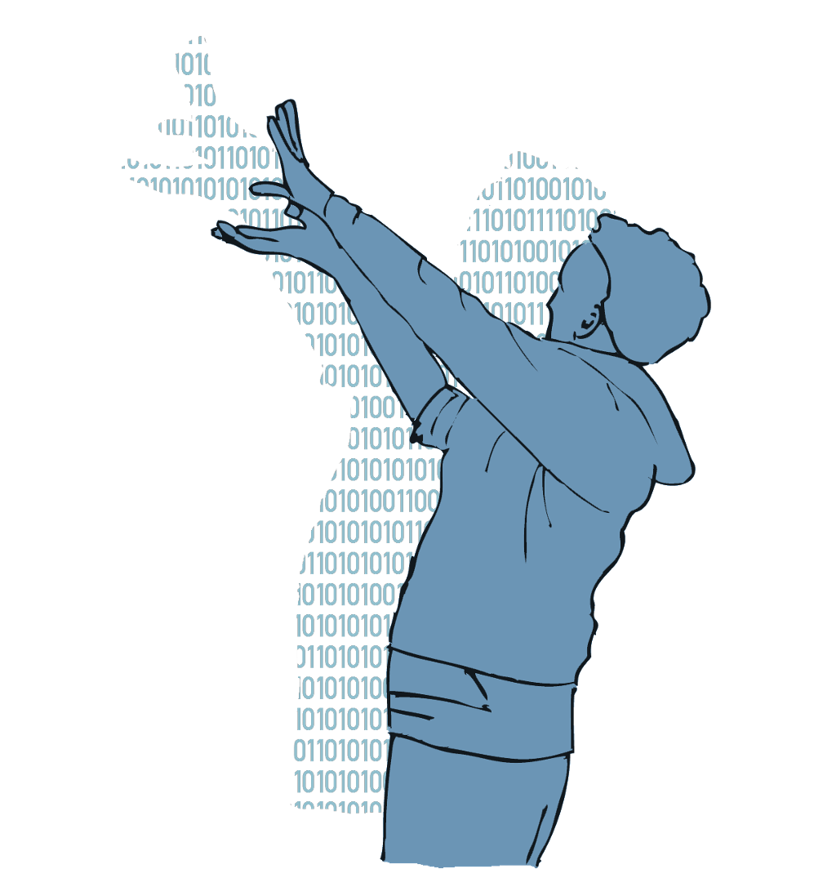

# Digitale Medienbildung

*(Autor&ast;innen: Christoph Richter & Heidrun Allert, 2022)*

Digitale Technologien sind zu einem integralen **Bestandteil unseres Alltags** geworden. Egal ob wir im Internet nach einem Kochrezept suchen, uns mit Hilfe unseres Smartphones zu einer Sehenswürdigkeit oder zum nächsten Bahnhof navigieren lassen, unseren Freund\*innen eine Kurznachricht zukommen lassen oder mit unseren Kolleg\*innen in der ›Cloud‹ arbeiten, überall haben wir es mit digitalen Technologien zu tun. Und auch dort, wo wir nicht direkt mit ihnen interagieren, mischen sie sich ein. Etwa indem sie Verkehrs-, Energie- und Warenflüsse steuern, Wetter- und Klimaprognosen erstellen, Fachwissen synthetisieren, Texte produzieren, zur Entwicklung neuer Medikamente oder auch von Waffentechnik verwendet werden.

In dem Maße, in dem uns digitale Technologien nicht mehr nur als ›bloße‹ Werkzeuge und Kommunikationsmedien dienen, sondern in immer umfassenderer Weise unsere individuellen Handlungs- und Erfahrungsspielräume prägen, werfen sie sowohl grundlegende bildungstheoretische wie auch bildungspraktische Fragen auf. Im Folgenden geht es um eine erste Annäherung an die **Begriffe der Digitalisierung und Digitalität** und die hieran anknüpfende Idee einer **›digitalen Medienbildung‹**.

```{r fig1,fig.cap="Schattenspieler.", echo=FALSE, fig.align='center', dev='png'}

```

## Digitalisierung und Digitalität

Trotz seiner weiten Verbreitung ist der Begriff der ›Digitalisierung‹ mit verschiedenen Assoziationen behaftet. So verweist Digitalisierung in einem sehr engen Sinn auf die Überführung analoger Daten in ein von Computern verarbeitbares Format, wie etwa beim Scannen eines Textes oder der digitalen Aufzeichnung eines Musikstückes. Unter Digitalisierung wird aber auch die Delegation von Aufgaben und Entscheidungsprozessen an Computer verstanden, wie etwa bei der Verwendung eines Bankterminals zur Abwicklung von Überweisungen oder auch der Orientierung mittels eines digitalen Navigationsgeräts. Schließlich wird mit dem Begriff der Digitalisierung auf die tiefgreifende Veränderung sozialer, politischer und gesellschaftlicher Gefüge hingewiesen, etwa wenn sich durch den Einsatz von Informations- und Kommunikationstechnologien Arbeits- und Lebensbedingungen, Partizipationsmöglichkeiten oder Machverhältnisse transformieren [@brindaFrankfurtDreieckZurBildung2019].

Für die aktuelle (medien-)pädagogische Diskussion ist insbesondere dieses letzte, sehr weit gefasste Begriffsverständnis von Interesse, da es Digitalisierung als einen kulturellen Transformationsprozess auffasst, der aufs engste mit unseren gemeinsamen Lebens- und Handlungsweisen wie auch unseren individuellen und kollektiven Selbstverständnissen verknüpft ist. Digitale Technologien sind aus dieser Perspektive nicht bloße Werkzeuge oder Instrumente, die wir zielgerichtet nutzen, sondern Kulturtechniken, die durch soziale Prozesse entstehen und zugleich unser soziales Miteinander nachhaltig prägen. So hat etwa die Entwicklung internetbasierter Suchmaschinen nicht nur unseren Zugang zu Informationen erweitert, sondern auch unsere Art des Suchens und den Umgang mit Informationen transformiert, während Social Media Plattformen es nicht nur möglich machen mit unseren Freunden, Bekannten und Verwandten in Kontakt zu bleiben, sondern auch neue Erwartungen und Interaktionsformen mit sich gebracht haben. Digitalisierung impliziert entsprechend immer auch die Veränderung unserer Lebenswelt, in dem sie »tief in die ökonomischen, aber auch in die politischen und kulturellen Verhältnisse ein[greift]« [@coyKulturenNichtBetreten2008, S. 33].

Um der sozialen und kulturellen Tragweite dieser Veränderungen Rechnung zu tragen und deutlich zu machen, dass der Prozess der Digitalisierung »so weit abgeschlossen ist, dass das Digitale eine omnipräsente, ubiquitäre Infrastruktur darstellt« [@jorissenSubjektivationUndAsthetische2018, S. 69], wird auch in der medienpädagogischen Diskussion vermehrt auf das Konzept der ›Digitalität‹ Bezug genommen. Im Unterschied zum Begriff der Digitalisierung, der eng mit technologischen Entwicklungen assoziiert ist, bezieht sich der Begriff der Digitalität auf einen »dominante[n] kulturelle[n] Raum, in dem wir uns bewegen, bzw. die dominante Bedingung, unter der wir uns bewegen« [@stalderWasIstDigitalitaet2021, S. 4]. Das Konzept der Digitalität betont den Umstand, dass digitale Technologien zu einem integralen Bestandteil unser Lebenswelten geworden sind, die sich in unsere Routinen, Normen, Strukturen und Selbstverständnisse eingewoben haben.


## Digitalisierung als Frage der (Medien-)Bildung

Das Verständnis von digitalen Technologien als kulturelle Produkte und der Digitalisierung als einen kulturellen Transformationsprozess hat weitreichende Konsequenzen für das Verständnis einer ›digitalen Medienbildung‹. Ausgehend von der Annahme, dass digitale Technologien tiefgreifenden Einfluss darauf nehmen, wie wir uns die Welt erschließen, wie wir uns selbst verstehen und wie wir miteinander leben, reicht es nicht aus, zu wissen, wie man diese Technologien effektiv nutzt oder auf welchen informatischen Grundlagen sie basieren. Aus (medien-)pädagogischer Sicht ist es vielmehr notwendig, sich im Zuge der Digitalisierung, neben Fragen des Kompetenzerwerbs, der Medienerziehung und -sozialisation, damit auseinanderzusetzen, wie sich kulturelle Praktiken und die hiermit verbundenen individuellen und kollektiven Handlungs- und Erfahrungsspielräume unter dem Einfluss digitaler Technologien transformieren [@munte-goussarMedienbildungSchulkulturUnd2016]. Ein (medien)pädagogischer Zugang kann sich aus dieser Perspektive weder auf den instrumentell-praktischen Gebrauch noch auf die informatischen Grundlagen digitaler Technologien beschränken, sondern muss sich in grundlegender Weise mit den sich im Zuge der Digitalisierung wandelnden kulturellen Praktiken und den hieraus resultierenden individuellen und kollektiven Handlungs- und Erfahrungsspielräumen auseinandersetzen. Die Vorbereitung von Schüler\*innen »auf das Leben in der derzeitigen und künftigen Gesellschaft [und ihre Befähigung] zu einer aktiven und verantwortungsvollen Teilhabe am kulturellen, gesellschaftlichen, politischen, beruflichen und wirtschaftlichen Leben« [@kultusministerkonferenzBildungDigitalenWelt2016] erfordert insofern eine Auseinandersetzung mit den aktuellen ›Technologieverhältnissen‹ [@zornSelbstWeltUnd2014] und den mit ihnen einhergehenden Formen der Subjektivierung wie auch die individuellen und kollektiven Möglichkeiten der Einflussnahme und Veränderung.

Im Sinne einer so verstandenen digitalen Medienbildung geht es nicht allein um den Erwerb von Fähigkeiten und Kenntnissen zum kompetenten Umgang mit digitalen Medien oder die Begleitung von Schüler\*innen beim Hineinwachsen in bereits bestehende Strukturen und Praktiken, als vielmehr um die (gemeinsame) Erkundung und Erprobung der Möglichkeiten zur (Weiter-)Entwicklung bzw. (Mit-)Gestaltung unserer Selbst-, Welt-, und Anderenverhältnisse in einem von Digitalität geprägten kulturellen Raum. Das Konzept einer digitalen Medienbildung verweist insofern über den klassischen Gegenstandsbereich der Medienpädagogik hinaus auf grundlegende bildungstheoretische wie praktische Fragen. So vollziehen sich unter der Prämisse einer tiefgreifenden und umfassenden Mediatisierung beziehungsweise Digitalisierung alle Bildungsprozesse »im Horizont von Medialität« [@jorissenMedienbildungBegriffsverstandnisseUnd2011], sodass Bildung letztlich nicht ohne Medien und den mit ihnen verbundenen kulturellen Räumen zu denken ist. Digitale Medienbildung ist damit auch Teil einer Allgemeinbildung, insoweit diese darauf ausgelegt ist, »ein geschichtlich vermitteltes Bewußtsein von zentralen Problemen der Gegenwart und – soweit voraussehbar – der Zukunft zu gewinnen, Einsicht in die Mitverantwortlichkeit aller angesichts solcher Probleme und Bereitschaft,an ihrer Bewältigung mitzuwirken« [@klafkiNeueStudienZur2007, S. 56].


::: {.blackbox data-latex=""}
*Was verbinden Sie mit dem Begriff der ›Digitalisierung‹? Welche Rolle spielt Digitalisierung in ihrem privaten, in ihrem schulischen und/oder in ihrem beruflichen Umfeld?*
:::

## (K)eine Gebrauchsanweisung
Diese vorliegende Materialsammlung ist weniger ein Handbuch, das einen systematischen Überblick über den Stand der Forschung und Theoriebildung vermittelt, als vielmehr eine Art ›Denk und Werkzeugkasten‹, der versucht, Perspektiven zu entwickeln, Fragen aufzuwerfen und verschiedene Zugänge zur eigenständigen Erkundung digitaler Transformationsprozesse aufzuzeigen. Die Materialsammlung ist als Arbeitsmaterial gedacht, das den jeweiligen Erfordernissen entsprechend verwendet, modifiziert und erweitert oder auch mit anderen Materialien kombiniert werden kann, darf und soll.

Die in dieser Materialsammlung zusammengetragenen Überlegungen und Zugänge nähern sich dem Thema der Digitalisierung über das Konzept sozialer Praktiken und betonen die enge Verwobenheit digitaler Technologien mit den praktischen und kulturellen Milieus, in denen sie genutzt werden. Diese Perspektive ist wie jedes Modell nur eine mögliche Art und Weise, sich die Welt zu erschließen. Sie wurde hier gewählt, da sie es erlaubt, Digitalisierung als einen offenen, nicht abgeschlossenen Prozess zu verstehen, mit dem wir uns in aktiver und durchaus auch streitbarer Weise auseinandersetzen können.

**Didaktische Leitgedanken**

- **Exemplarisches Lehren und Lernen:** Auseinandersetzung mit Prozessen der Digitalisierung anhand von Beispielen aus eigenen Erfahrungs- und Handlungsbereich
- **Methodenorientiertes Lernen:** Kennenlernen und praktisches Erproben von Verfahren zur Analyse digitaler Technologien und ihres praktischen Gebrauchs
- **Handlungsorientierter Unterricht:** Reflexion und Dokumentation eigener Nutzungspraktiken, Recherche und Synthese von Informationen
- **Verbindung von sachbezogenem und sozialem Lernen:** Darstellung und Diskussion der eigenen Arbeitsergebnisse in Kleingruppen


## Inhalte der Materialsammlung

**Thematische Kurzeinführungen**

Jedes Kapitel enthält eine thematische Kurzeinführung. Die Kurzeinführungen geben jeweils einen ersten Einblick in verschiedene gegenstandsbezogene Perspektiven, Begriffe, Modelle und Fragestellungen. Zur Vertiefung enthalten die Kurzeinführungen mögliche Diskussionspunkte und/oder Beispiele.

**Impulse**

Die Kapitel 2 und 4 enthalten am Ende jeweils thematische Impulse in Form kreativer oder dokumentarischer Aufgabenstellungen. Die Impulse laden dazu ein, sich vor dem Hintergrund eigener Erfahrungen mit verschiedenen Aspekten digitaler Medienbildung zu befassen. Die daraus resultierenden Beobachtungen und Erkenntnisse können zum Ausgangspunkt weiterführender Diskussionen werden.

**Minimale Leittexte**

Die Kapitel 5 bis 14 enden jeweils mit einem minimalen Leittext. Diese Leittexte ergänzen die thematischen Kurzeinführungen um methodische Zugänge in Form praktischer Handlungsanleitungen. Sie dienen der eigenständigen Aneignung ausgewählter Methoden im Sinne des selbstorganisierten Lernens. 

**Beispiele**

Im [Anhang][Anhang] finden sich zudem zwei Beispiele, die sich anhand der minimalen Leittexte mit der Verwendung von WhatsApp zur Gruppenarbeit im Studium und dem digitalen ›Referatedienst‹ Blinkist befassen. Die von Jamila Becker und Helena Hintz ausgearbeiteten Beispiele veranschaulichen mögliche Zugänge zur eigenen Auseinandersetzung mit digitalen Technologien und den mit ihnen verbundenen Praktiken. Die Beispiele beinhalten zudem Reflexionen ihrer Autorinnen, die als Einsatzpunkte für weiterführende Diskussionen genutzt werden können.

&nbsp;

:::: {.licencebox data-latex="{licencebox}"}

Das Kapitel ›Digitale Medienbildung‹ wurde 2022 von [Christoph Richter](mailto:richter@paedagogik.uni-kiel.de) und [Heidrun Allert](mailto:allert@paedagogik.uni-kiel.de) erstellt und ist unter einer Creative Commons [CC BY-SA 4.0](https://creativecommons.org/licenses/by-sa/4.0/) Lizenz veröffentlicht.

::::


