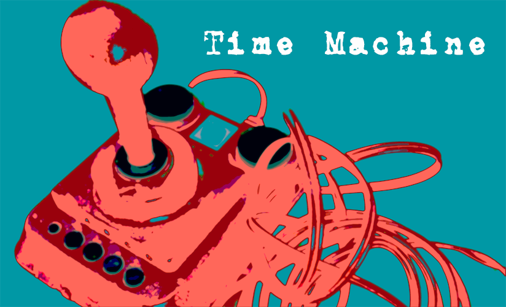

# Digitalisierung als epochaltypisches Schlüsselproblem

Während in den vergangenen zwei Jahrzehnten theoretische Modelle zur Transformation von Selbst-, Welt- und Anderenverhältnissen in der (Medien-)Pädagogik intensiv diskutiert worden sind, gibt es bislang nur vereinzelte Ansätze, die sich den **Möglichkeiten der Medienbildung aus didaktischer Perspektive** nähern [@zornSelbstWeltUnd2014; @munte-goussarMedienbildungSchulkulturUnd2016; @rabe-maticevicMedienbildungHochschuleHandlungsorientierte2020].

Einen möglichen Ansatzpunkt bildet die von Wolfgang Klafki (1985/2007) entworfene **›kritisch-konstruktive Didaktik‹** und das mit ihr verbundene Konzept der **›epochaltypischen Schlüsselprobleme‹**. Dieser Ansatz ist in Bezug auf die Möglichkeiten einer digitalen Medienbildung nicht nur deshalb interessant, da Klafki die »Gefahren und die Möglichkeiten der neuen technischen Steuerungs-, und Informations- und Kommunikationsmedien« [@klafkiNeueStudienZur2007, S. 59] als eben eines jener Schlüsselprobleme versteht, sondern auch, weil er die gesellschaftliche Dimension von Bildungsprozessen betont und ein sehr umfassendes Verständnis einer **›Allgemeinbildung‹** entwirft.

```{r fig2,fig.cap="Digitalisierung als Schlüsselproblem – von der Pandemiebekämpfung mittels digitaler Technologien über Deepfakes wie dem Papst als Fashion-Victim und Memes zum Ukrainekrieg bis zu elektronischem Abfall (Grafik: Helena Hintz, 2023).", echo=FALSE, fig.align='center', dev='png'}
knitr::include_graphics('Figures/02-01-Schlüsselproblem.png')
```

## Allgemeine Bildung und Schlüsselprobleme

In seinem Bemühen um die Entwicklung eines »zeitgemäßen und zukunftsoffenen Bildungsbegriffs« [@klafkiNeueStudienZur2007, S. 49] betont Klafki die gesellschaftliche Dimension von Bildungsprozessen. Anstatt gesellschaftliche Strukturen als einen Rahmen zu verstehen, innerhalb dessen sich individuelle Bildungsprozesse vollziehen, betrachtet Klafki die Entwicklung der Fähigkeit und Bereitschaft zu Mitgestaltung der gesellschaftlichen Verhältnisse und Entwicklungen als zentrales Moment von Bildung. Entsprechend definiert Klafki »Allgemeinbildung […] als Aneignung der die Menschen gemeinsam angehenden Frage- und Problemstellungen ihrer geschichtlich gewordenen Gegenwart und der sich abzeichnenden Zukunft und als Auseinandersetzung mit diesen gemeinsamen Aufgaben, Problemen und Gefahren« [@klafkiNeueStudienZur2007, S. 53].

Im Sinne einer Gesellschaftsfrage setzt Bildung dabei für Klafki, die Erarbeitung der Fähigkeit zur **Selbstbestimmung, Mitbestimmung und Solidarität** voraus. Während sich die Fähigkeit zur Selbstbestimmung hierbei auf die Möglichkeit zur mündigen Ausgestaltung der eigenen Lebensverhältnisse bezieht, verweist die Fähigkeit zur Mitbestimmung auf die »Möglichkeit und Veranwortung für die Gestaltung unserer gemeinsamen kulturellen, gesellschaftlichen und politischen Verhältnisse« [@klafkiNeueStudienZur2007, S. 52]. Die Fähigkeit zur Solidarität verweist schließlich auf die Verantwortung für diejenigen, deren Möglichkeiten zur Selbst- und Mitbestimmungen aufgrund der aktuellen Verhältnisse eingeschränkt sind.

Mit dem so entwickelten Verständnis von ›Allgemeinbildung‹, das nicht nur eine **»Bildung für alle«**, sondern insbesondere eine **»Bildung im Medium des Allgemeinen«** [@klafkiNeueStudienZur2007, S. 53] meint, rücken inhaltlich jene Frage- und und Problemstellungen in den Mittelpunkt, die Klafki als **›epochaltypische Schlüsselprobleme‹** bezeichnet. Hierbei handelt es sich um für eine bestimmte geschichtliche Epoche charakteristische »Strukturprobleme von gesamtgesellschaftlicher, meistens sogar übernationaler bzw. weltumspannender Bedeutung […], die gleichwohl jeden einzelnen betreffen« [@klafkiNeueStudienZur2007, S. 60].

Die Auseinandersetzung mit eben diesen epochaltypischen Schlüsselproblemen versteht Klafki als zentralen inhaltlichen Bezugspunkt zukunftsfähiger Bildungsangebote über alle Altersstufen hinweg. Hierbei geht es jedoch nicht um die Durchsetzung einer bestimmten Perspektive oder eines Lösungsansatzes, sondern darum, anhand exemplarischer Problemstellungen die Bereitschaft zur gemeinsamen, demokratisch fundierten, Auseinandersetzung zu fördern und zu erkennen, wie Antworten und Lösungsversuche in unterschiedlichen Interessen, Positionen und Wertorientierungen begründet sein können [@klafkiNeueStudienZur2007, S. 61f.; s. a. @kollerGrundbegriffeTheorienUnd2021, S. 105f.].

Methodisch gewendet bilden für Klafki (I) das **exemplarische Lernen**, (II) das **methodenorientierte Lernen**, (III) der **handlungsorientierte Unterricht** und (IV) die **Verbindung von sachbezogenem und sozialem Lernen** die vier miteinander verschränkten Prinzipien eines auf Schlüsselprobleme ausgerichteten Unterrichts [@klafkiNeueStudienZur2007, S. 61]. »Den Lernenden sollen demnach nicht fertige Ergebnisse angeboten werden, sondern vielmehr sollen sie sich einen Gegenstand selbsttätig entdeckend, problemlösend oder analytisch-rekonstruktiv erschließen« [@rabe-maticevicMedienbildungHochschuleHandlungsorientierte2020, S. 109].

## Digitalisierung als Schlüsselproblem

Als Beispiele epochaltypischer Schlüsselprobleme benennt Klafki in seinem Aufsatz neben der Friedensfrage, der Umweltfrage, der gesellschaftlich produzierten Ungleichheit und der ›Ich-Du-Beziehungen‹ im Kontext von Liebe, Geschlechtlichkeit und Sexualität auch den Einsatz neuer Steuerungs-, Informations- und Kommunikationsmedien.

In Bezug auf den Einsatz neuer Steuerungs-, Informations- und Kommunikationsmedien, und damit dessen, was wir heute als digitale Technologien kennen, sieht Klafki das Schlüsselproblem insbesondere »im Hinblick auf die Weiterentwicklung des Produktionssystems, der Arbeitsteilung oder aber ihrer schrittweisen Zurücknahme, der möglichen Vernichtung von Arbeitsplätzen durch eine ausschließlich ökonomisch-technisch verstandene ›Rationalisierung‹, der Folgen für veränderte Anforderungen an Basis- und Spezialqualifikationen, für die Veränderung des Freizeitbereichs und der zwischenmenschlichen Kommunikationsbeziehungen« [@klafkiNeueStudienZur2007, S. 59].

Auch wenn Klafki 1985 bereits viele der heute immer noch aktuellen Fragestellungen in Hinblick auf digitale Technologien vorwegnimmt, so lässt sich die von ihm skizzierte Problemlage mittlerweile in unterschiedliche Richtungen ausdifferenzieren. Zu nennen wäre hier beispielsweise die Verbreitung von digitalen Kontroll- und Überwachungsmöglichkeiten, die Entwicklung neuer Kommunikations- und Kollaborationsformen, die Monopolbildung aber auch die Möglichkeiten der Manipulation im Rahmen digitaler Plattformen, die Fernsteuerung, Beschleunigung und Vernetzung von Prozessen, die digitale und automatisierte Kriegsführung oder die Verbreitung von Verfahren des maschinellen Lernens und der künstlichen Intelligenz. Hiermit einher gehen tiefgreifende Fragen nach dem Selbstverständnis des Menschen [z. B. @heintzHerrschaftRegelZur1993] und dem Umgang mit dem Unbestimmten [z. B. @allertBildungAlsProduktive2017].

Im Sinne eines epochaltypischen Schlüsselproblems markiert die Digitalisierung insofern eine Frage- bzw. Problemstellung, die uns sowohl individuell wie auch als Gesellschaft betrifft und sowohl in der Bildungstheorie wie auch -praxis eine gemeinsame, solidarische und zukunftsorientierte Auseinandersetzung erfordert. Im Sinne eines ergebnisoffenen Prozesses gibt es insofern keine definitive Antwort auf die Frage, wie Prozesse der Digitalisierung zu gestalten sind. Die Lehrenden sind folglich notwendigerweise »MitLernende, kritisch Befragte und zu Befragende« [@klafkiNeueStudienZur2007, S. 49]. Gleichzeitig wird aus Sicht einer kritischen Medienbildung aber auch deutlich, dass digitale Technologien kulturelle bzw. gesellschaftliche Produkte darstellen, die einerseits zwar immer auch anders gestaltet werden können, aber andererseits in der Art wie sie jeweils gestaltet sind, tiefgreifenden Einfluss auf unsere Handlungs- und Erfahrungsmöglichkeiten haben.


::: {.blackbox data-latex=""}
*Inwiefern lässt sich aus Ihrer Sicht der Prozess der Digitalisierung als ein Schlüsselproblem oder eine gesellschaftliche Herausforderung verstehen? An welchen Beispielen lässt sich dies veranschaulichen?*
:::

## Time Maschine

Wann sind Sie zum ersten Mal mit einem Computer oder einem anderen digitalen Gerät in Kontakt gekommen? Was war das für ein Gerät und wozu haben Sie es verwendet? Gibt es davon oder zumindest von dem Gerät ein Bild?

**Worum geht‘s?**

Digitale Technologien sind aus unserem Alltag nicht mehr wegzudenken. Egal, ob wir am Computer einen Text schreiben oder an einer Videokonferenz teilnehmen, mit dem Smartphone ein Foto verschicken oder auf der Spielekonsole zocken, die digitalen Technologien sind irgendwie immer schon da. Vermutlich ist es auch schon nicht mehr der erste Computer, das erste Handy oder die erste Konsole, mit der wir es gerade zu tun haben. Aber wann sind wir den digitalen Technologien eigentlich das erste Mal begegnet? Oder vielleicht genauer, wann ist das erste Mal gewesen, an das wir uns bewusst erinnern können?


```{r fig2.2, echo=FALSE, fig.align='center', dev='png'}

```


**Was steckt dahinter?**

Auch wenn es für gewöhnlich Wichtigeres im Leben gibt, als die technischen Dinge, so verändert der Kontakt mit ihnen doch unsere praktischen Handlungs- und Erfahrungsmöglichkeiten. Wir können plötzlich nach Informationen suchen oder uns in den Weiten des Internets verlaufen, wir können unseren Freund\*innen Bilder und Nachrichten schicken, ohne dass es die anderen mitbekommen, oder wir entdecken uns bislang unbekannte Spiel- und Experimentierräume. Gleichzeitig entstehen damit aber auch neue Erwartungen an uns. Digital präsent zu sein wird plötzlich notwendig, um mit \>dabei\< zu sein, wir sollen den Computer nicht nur zum Spaß nutzen, sondern damit auch etwas \>Sinnvolles\< anstellen und bitte auch verantwortungsbewusst damit umgehen.

Wie sich der erste Kontakt mit digitalen Technologien gestaltet, ist dabei einerseits abhängig von unserer persönlichen Situation und dem sozialen Milieu, in der wir aufwachsen. Andererseits ist es aber auch eine Generationenfrage, ob bestimmte digitale Technologien, wie etwa Internet, Smartphone, Mähroboter, Google oder Messenger Dienste eigentlich immer schon da waren.
