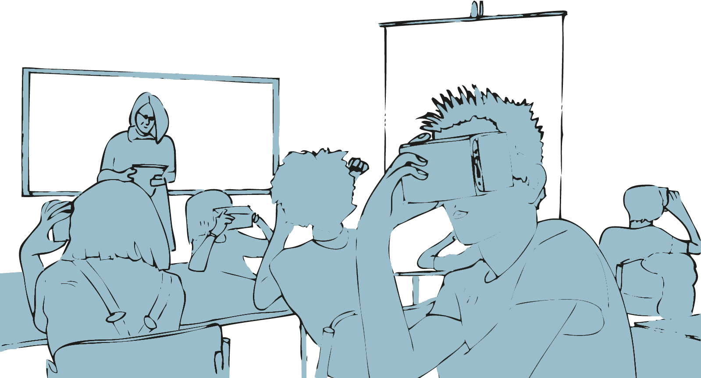
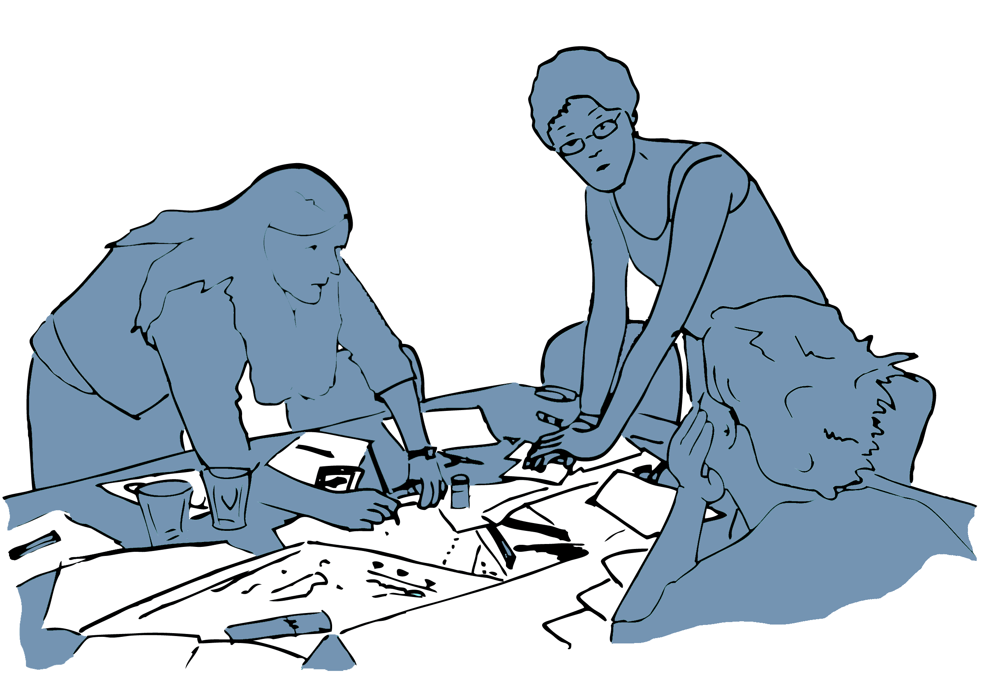

# Digitalisierung von Bildungsprozessen

Im Sinne eines kulturellen Transformationsprozesses hat die Digitalisierung einen tiefgreifenden Einfluss nicht nur auf die Art und Weise, wie wir lernen und uns bilden, sondern auch darauf, was wir unter Begriffen wie Lernen, Bildung, Wissen und Kompetenzen verstehen. In einer ersten Annäherung an die Frage nach der Digitalisierung von Bildungsprozessen geht es im Folgenden darum, einen ersten Überblick über verschiedene Perspektiven zu gewinnen, von dem aus sich entsprechende Transformationsprozesse betrachten und untersuchen lassen.

```{r, echo=FALSE, fig.align='center', dev='png'}

```

## Lernen & Bildung mit, über und durch digitale Medien

In der aktuellen Diskussion um ›Bildung in der Digitalen Welt‹ wird die Frage nach der Digitalisierung von Bildungsprozessen aus verschiedenen Perspektiven verhandelt. Die hierbei vertretenen Positionen unterscheiden sich nicht zuletzt hinsichtlich der Rolle und Funktion, die den digitalen Technologien in Bezug auf Lernen und Bildung zugesprochen wird. Je nach Perspektive steht dabei die Vorstellung von Lernen und Bildung **mit, über oder durch digitale Medien** im Mittelpunkt der Betrachtung [@jorissenMedienbildungSatzen2013; @othmerUndNochPaar2016].

**Lernen & Bildung mit digitalen Medien:**

Im Mittelpunkt dieser Perspektive steht die Vorstellung von digitalen Medien als Mittel, als Werkzeuge, Instrumente und Ressourcen, derer wir uns bedienen, um etwas zu lernen, uns zu bilden oder auch um andere zu unterrichten und Lernprozesse zu organisieren. Im Sinne von (Hilfs-)Mitteln liegt das Hauptaugenmerk aus dieser Perspektive auf dem effektiven und effizienten Einsatz digitaler Technologien und ihrem relativen Mehrwert gegenüber anderen Medien im Kontext von Lern- und Bildungsprozessen. Der gekonnte Umgang mit digitalen Medien und ihre zielgerichtete Verwendung sind entsprechend wesentliche Voraussetzungen für ihren produktiven Einsatz im Rahmen individueller Lernprozesse wie auch der Unterrichtsgestaltung.

**Lernen & Bildung über digitale Medien:**

In Abgrenzung zu einem Lernen mit digitalen Medien richtet diese Perspektive den Blick auf digitale Medien als einen Gegenstand von Lern- und Bildungsprozessen. Digitale Medien treten hier vor allem als etwas in Erscheinung, über das wir etwas lernen können oder sollen. Ein solches Lernen über digitale Medien kann sich dabei sowohl auf deren technische Funktionsweise, ihre Entstehungsgeschichte, ihre soziale Bedeutung und Funktion wie auch Fragen eines angemessenen und in diesem Sinne kompetenten Gebrauchs beziehen. Neben der Befähigung zu einem praktischen Medienhandeln in privaten, öffentlichen und beruflichen Kontexten umfasst diese Perspektive auch den Erwerb der hierfür notwendigen Kenntnisse und Fertigkeiten.

**Lernen & Bildung durch digitale Medien:**

Die dritte Perspektive wendet sich gegen die Vorstellung digitaler Medien als ›bloße‹ Mittel oder Gegenstände des Lernens oder der Bildung und betont stattdessen die mit der Verbreitung digitaler Medien einhergehende Transformation von Lebenswelten. Aus dieser Perspektive sind Digitale Medien ein integraler Bestandteil von Lern- und Bildungsprozessen. Sie bestimmen darüber mit, was unter den entsprechenden Prozessen überhaupt zu verstehen ist. Grundlage dieser Perspektive bildet ein starker Medienbegriff, der davon ausgeht, dass sich Medien »als eine Art Träger oder Stoff [verstehen lassen], in dem sich bestimmte Vorgänge abspielen« [@meyerBildungNeuenMediums2014, S. 91]. Digitale Medien durchdringen in diesem Sinne die Art und Weise, wie wir uns in der Welt bewegen, welche Erfahrungen wir machen, wie wir uns zu uns selbst aber auch zu unseren Mitmenschen verhalten, wie wir mit Wissen umgehen und uns organisieren. Siehe hierzu auch das gleichnamige Strategiepapier der Kultusministerkonferenz aus dem Jahr 2016 [@kultusministerkonferenzBildungDigitalenWelt2016]. Torsten Meyer [@meyerBildungNeuenMediums2014, S. 91] verwendet zur Veranschaulichung das Beispiel der Fische, die im ›Medium‹ des Wassers leben. Medien sind in diesem Sinne etwas, in das wir quasi ›eingetaucht‹ sind und das uns, wie die Luft zum Atmen, oft erst dann bewusst wird, wenn es uns entzogen wird.


## Lernen & Bildung im Kontext von Schule...

**...mit digitalen Medien**

(Weiter-)Entwicklung und Veränderung von Lehrmitteln
bspw. digitale Schul- und Klassenbücher, interaktive Tafeln, intelligente tutorielle Systeme oder digitale Simulations- und Experimentalumgebungen

**...über digitale Medien**

(Weiter-)Entwicklung von Unterrichtsinhalten bspw. in Form einer grundlegenden informatischen Bildung oder Angeboten zur Vermittlung digitaler Medienkompetenz der Digitalisierung als einem spezifischen Gegenstand

**...durch digitale Medien**

regt zum Hinterfragen der Ideen von Lernen und Bildung an, die sich in digitalen Lernszenarien und Anwendungen realisieren und in Form heimlicher Lehrpläne wirksam werden [z. B. @darvinYouthTechnologyHidden2019; @decuypereResearchingEducationalApps2019; @edwardsSoftwareHiddenCurriculum2015].
Bis hin zur Frage wie eine derart umfassende Transformation von Lebenswelten überhaupt thematisiert und ein Verständnis für eine solche ›Kultur der Digitalität‹ [@stalderKulturDigitalitat2016] entwickelt werden kann


::: {.blackbox data-latex=""}
**Mit ›Antolin‹ betreibt der Schulbuchverlag Westermann unter [https ://antolin.westermann.de/](ttps ://antolin.westermann.de/) eine populäre Plattform zur Leseförderung für die Primar- und Sekundarstufe I. Neben einem Überblick über die grundlegenden Funktionen und Zielsetzungen der Plattform durch den Verlag [@westermanngruppeAntolinProgrammZur2022] finden sich in der Literatur hierzu auch verschiedene kritische Analysen [@jornitzsieglindeMitAntolinPunkten2018; @forschlerZurAmbivalentenWirkmachtigkeit2021].**

*Welches Modell, welche Idee von ›Lesen‹ realisiert sich in Antolin?*

*Welche Aspekte des Lesens, der Bücher, der Leser&ast;innen werden ausgeblendet?*
:::


## Minimale Leittexte

**Ziel**

Minimale Leittexte dienen der eigenständigen Aneignung ausgewählter Methoden im Kontext des selbstorganisierten Lernens.

**Leitgedanke**

Minimale Leittexte versuchen die Beschreibung einer Methode auf das Wesentliche zu reduzieren und den Anwender\*innen neue Handlungsmöglichkeiten zu erschließen. Die Methode geht von selbstorganisierten Lerner\*innen aus, die die Verantwortung für ihr Handeln übernehmen, sich gegebenenfalls selbständig mit der Hintergrundliteratur befassen oder sich anderweitige Hilfe erschließen.

**Anwendungskontext**

Minimale Leittexte eignen sich für die Darstellung grundlegender Methoden in verschiedenen Anwendungsbereichen. Sie sind auf einen praxisorientierten Einstieg in die jeweilige Methode ausgerichtet und sollen die Anwender\*nnen bei der Auswahl geeigneter Methoden unterstützen. 

```{r, echo=FALSE, fig.align='center', dev='png'}

```

**Arbeitsschritte**

 1. Die Erstellung minimaler Leittexte erfolgt in der Regel auf Basis einschlägiger Methodenliteratur und/oder auf den Erfahrungen des/der Autor\*innen.
 2. Minimale Leittexte werden entweder als Einzeldokumente oder in gesammelter Form potentiellen Anwender\*innen zur Verfügung gestellt.
 3. Die Leittexte werden auf Basis von Rückmeldungen durch die Anwender\*nnen weiterentwickelt.
 
**Ergebnisformat**
 
Das praktische Ergebnis ist der Minimale Leittext, bzw. ein entsprechender Pool von Leittexten.

**Praktische Tipps**

-   Minimale Leittexte sollten auf das Wesentliche reduziert sein.
-   Die Beschreibung der Methode sollte aus sich heraus verständlich sein, sodass keine Verweise auf andere Dokumente notwendig sind.
-   Es sollten vor allem Methoden beschrieben werden, die sich in der Praxis bereits bewährt haben. Ist dies zum Beispiel bei einer neuen Methode nicht der Fall, so sollte dies im Leittext vermerkt werden.

**»Fallstricke«**

-   Minimale Leittexte sind kein Ersatz für eine fundierte Methodenausbildung. Die methodologischen Grundlagen einer Methode können nur sehr bedingt dargestellt werden.
-   Minimale Leittext sind keine Kochrezepte, sie erfordern die aktive Interpretation und verantwortungsvolle Umsetzung durch den/die Leser\*in.

**Weiterführende Literatur zum Leittext**

Greif, S. (1998)- Minimale Informations- und Leittexte. In: Greif, S., Kurtz H.-J. (Hrsg.). *Handbuch Selbstorganisiertes Lernen* (S. 255-266). 2. Aufl.- Göttingen: Verlag für Angewandte Psychologie.

Richter, C., Allert, H., Nejdl, W. (2005). Minimal Activity Plans: Artifacts for Self-Organized Learning within Organizations. *Proceedings of WM2005*, Kaiserslautern, Germany 2005. Bonn: Gesellschaft für Informatik, S. 166–169.


