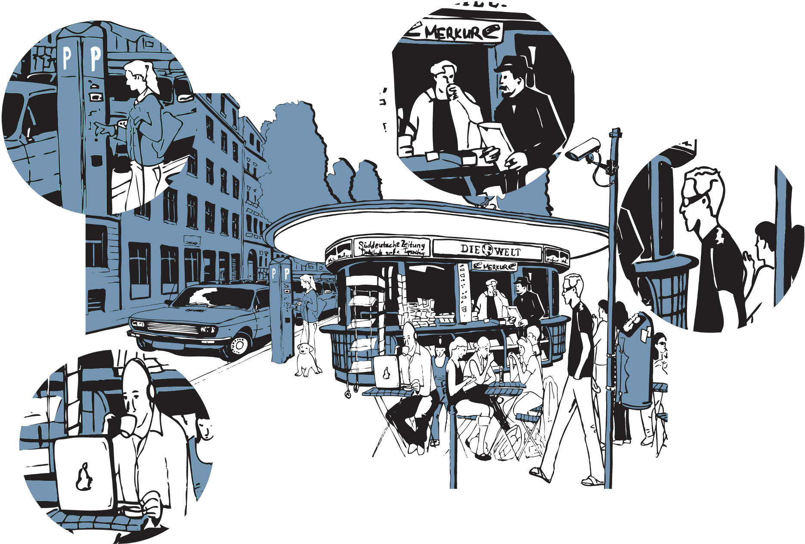

# Soziale Praktiken

Eine der grundlegenden Fragen der Sozial- und Kulturwissenschaften, wie auch der Pädagogik, ist die nach dem Verhältnis von Mensch und Welt. Um dieses Verhältnis analytisch zu fassen, sind sehr unterschiedliche theoretische Positionen entwickelt worden. In Abgrenzung zu strukturtheoretischen, individualistisch-zweckrationalen und normorientierten Ansätzen haben in den letzten Jahrzehnten zunehmend kulturtheoretische Ansätze an Bedeutung gewonnen. Einer dieser Ansätze ist die **Theorie sozialer Praktiken**, die das Konzept **›sozialer Praktiken‹** zum Bezugspunkt theoretischer wie auch empirischer Überlegungen macht.

```{r, echo=FALSE, fig.align='center', dev='png'}

```

## Das Konzept der sozialen Praktik als analytischer Bezugspunkt

Die Begriffe ›Praktik‹ und ›Praxis‹ sind nicht nur im wissenschaftlichen, sondern auch im alltäglichen Sprachgebrauch weit verbreitet. Sie werden aber sehr unterschiedlich verwendet und sind oft nur vage definiert. So wird zum Beispiel der Begriff der Praxis dazu verwendet, um konkretes Handeln von theoretischen Betrachtungen zu unterscheiden. Mit Praxis kann aber auch die gesamte Lebenstätigkeit und die hiermit verbundenen Erfahrungen eines Menschen gemeint sein. Ebenso dient der Begriff der Praktik manchmal als Verweis auf eine allgemeine Methode oder Vorgehensweise, während in anderen Fällen die spezifische Art und Weise gemeint ist, auf die eine Person oder eine Gruppe von Personen etwas tut.

Im Rahmen der Theorie sozialer Praktiken werden Praktiken im Kern als eine organisierte Form menschlichen Tätigseins verstanden, in der sich »[d]urch häufiges und regelmäßiges Miteinandertun […] gemeinsame Handlungsgepflogenheiten heraus[bilden], die sich zu kollektiven Handlungsmustern und Handlungsstilen verdichten und so bestimmte Handlungsvollzüge sozial erwartbar werden lassen« [@horningExpertenAlltags2001]. Soziale Praktiken sind in diesem Sinne kollektive Handlungsformen, die sich im Umgang von Menschen miteinander wie auch mit den Dingen ausbilden und sich im praktischen Tun kontinuierlich transformieren. Von diesem theoretischen Standpunkt aus sind soziale Praktiken der zentrale Bezugspunkt sowohl für soziale Phänomene, wie zum Beispiel Wissen, Macht, Institutionen und gesellschaftlichen Wandel, als auch für individuelle Prozesse, wie etwa des Denkens, der Identität, des Lernens und der Kommunikation [vgl. z.B. @schatzkiPrimerPracticesTheory2012].

Der Rückgriff auf praxistheoretische Positionen hat damit weitreichende Konsequenzen für das (medien-)pädagogische **Verständnis von Sozialisations-, Lern- und Bildungsprozessen**.

Prozesse der Sozialisation, des Lernens oder der Bildung lassen sich vor dem Hintergrund dieser Positionen nicht mehr losgelöst von den jeweiligen Praktiken, den kulturellen und technischen Milieus begreifen, in denen sie stattfinden. Der Fokus verschiebt sich damit **weg von der Annahme eines intentional handelnden und autonomen Subjekts hin zu den sozialen, kulturellen und technischen Beziehungsgefügen, in denen bestimmte menschliche Existenzweisen überhaupt erst ihre Form gewinnen und geformt werden** [vgl. z.B. @fenwickEmergingApproachesEducational2011; @munte-goussarMedienbildungSchulkulturUnd2016; @richterBildungSchnittstelleKultureller2020].

Prozesse der Sozialisation, des Lernens und insbesondere der Bildung lassen sich damit aber auch nicht nur als ›bloße‹ Anpassungen an bestehende soziale Ordnungen verstehen. Vielmehr eröffnen diese Positionen den Raum für eine Form von Subjektivität, in der Menschen die sich aus dem praktischen Handel ergebenden Potentiale nutzen können, um die bestehenden Ordnungen zu transformieren und neue Möglichkeiten für sich und andere zu erschließen [vgl. z.B. @alkemeyerBefahigenPraxistheoretischeUberlegungen2017].

## Wesentliche Ideen

**Praktiken erzeugen soziale Ordnungen** - Praktiken sind keine abstrakten Beschreibungen, sondern ein konkretes Produkt wiederholter Interaktionen und Kommunikationen (Doings und Sayings). Die Ausbildung von Praktiken reduziert die Komplexität sozialer Interaktionen, indem sie bestimmte Handlungsweisen nahelegen beziehungsweise erwartbar machen [vgl. z.B. @bickhardSocialOntologyPersons2003; @bickhardSocialOntologyConvention2008]. Praktiken können dabei in unterschiedlichem Maße institutionalisiert oder formalisiert sein.

**Praktiken setzen ›Know-How‹ und ein praktisches Verständnis der Akteur\*innen voraus** - Jede Praktik folgt ihrer eigenen ›Logik‹. Diese Logik bestimmt nicht nur, welche Formen des praktischen Wissens relevant sind und welche funktionalen Erfordernisse zu beachten sind, sondern auch die normativen und ästhetischen Erwartungen, die an die Akteur\*innen herangetragen werden [vgl. z.B. @alkemeyerBefahigenPraxistheoretischeUberlegungen2017]. Die Logik einer Praxis realisiert sich vor allem im Miteinandertun. Die praktische Kompetenz der Akteur\*innen ist deshalb neben der Kenntnis expliziter Regeln und der Einübung praktischer Vorgehensweisen vor allem die Fähigkeit zur produktiven Interaktion mit anderen Praktiker\*innen.

**Praktisches Handeln ist ein situationsgebundener Prozess** - Praktisches Handeln wird weniger durch unsere Pläne und Ideen bestimmt als durch die Anforderungen und Möglichkeiten, denen die Akteur\*innen begegnen. Praktisches Handeln ist kein in sich abgeschlossener oder wiederholbarer Akt, sondern vielmehr ein fortlaufenderProzess, in dem Menschen sich der ihnen verfügbaren Ressourcen bedienen, um die Situationen, in denen sie sich befinden, zu verstehen und mit ihnen umzugehen [vgl. z.B. @horningSozialePraxisZwischen2004]. Menschliches Handeln vollzieht sich insofern immer im Rahmen praktischer Erwartungs- und Möglichkeitshorizonte.

**Soziale Praktiken sind in der materiellen Welt verankert** - Im Sinne konkreter Aktivitäten nehmen soziale Praktiken immer auch auf die materielle Welt Bezug. Dies gilt sowohl für die Körper der Akteur\*innen, die physischen Umwelten, in denen sie agieren, wie auch für die (technischen) Artefakte, die im Rahmen der Praktiken verwendet oder hergestellt werden. Sowohl die Körper, die physischen Umwelten wie auch die (technischen) Artefakte sind dabei in vielen Fällen sowohl Voraussetzung wie auch das Produkt der jeweiligen sozialen Praktiken [vgl. z.B. @schatzkiPrimerPracticesTheory2012].

**Praktiken existieren in einem eigentümlichen Spannungsverhältnis aus Stabilität und Veränderung** - Indem soziale Praktiken Komplexität reduzieren und Erwartbarkeit schaffen, erzeugen sie immer auch ein bestimmtes Maß an Stabilität. Da sich praktisches Handeln aber in immer wieder neuen Situationen vollzieht, kann sich praktisches Handeln nicht allein in der Wiederholung des schon Dagewesenen erschöpfen. Vielmehr setzt praktisches Handeln immer auch eine produktive Auseinandersetzung und eine Erschließung des noch Unbekannten voraus [vgl. z.B. @horningSozialePraxisZwischen2004].

::: {.blackbox data-latex=""}
*Welche sozialen Praktiken lassen sich im Kontext von Schule ausmachen?*

*Wie lassen sich diese charakterisieren?*
:::


```{r, echo=FALSE, fig.align='center', dev='png'}
knitr::include_graphics('Figures/03-02-praktik.png')
```

## Mein Lernkosmos

*(Autorin: Helena Hintz)*

Wann und wo hast du in deiner Kindheit und Jugend etwas für dich Bedeutsames gelernt? Welche Umgebungen und Bedingungen waren dabei besonders gute Nährböden für diese Lernerfahrungen? Gestalte einen persönlichen Lernkosmos in Form einer Karte, in welchem du für dich wesentliche Lernerfahrungen visualisierst und verortest.

**Worum geht‘s?**

Oft sind es in unserer Kindheit und Jugend Gegebenheiten außerhalb von Schule, die uns zum (schulischen) Lernen animieren. Der Frankreich-Austausch in der 8. Klasse, der die Liebe für die Sprache weckt. Der Besuch im Aquarium, nach dem man mehr über Wasserlebewesen lernen möchte. Die Begeisterung fürs Backen oder die Möglichkeit, sich in Computer zu hacken. Aber auch innerhalb der Schule kann uns die begeisterte Lehrkraft zur Liebe für Gedichte oder die Robotik-AG zur Auseinandersetzung mit Technik animieren.

Verschiedene Kontexte und Impulse können die Begeisterung in uns erwachen lassen und zu bedeutsamen Lernerfahrungen führen. Wann haben wir uns also animiert gefühlt, Neues zu lernen? Wo befinden sich diese Orte in unserem individuellen Lernkosmos?

```{r, echo=FALSE, fig.align='center', dev='png'}

```

**Was steckt dahinter?**

Spätestens mit dem Kontakt zur Schule verbinden viele Lernen mit bestimmten Unterrichtsfächern. Manche Kinder gehen in dem System auf, andere gehen unter. Dabei wird oft vergessen, dass Lernen in vielen Kontexten stattfinden kann, von denen Schule nur einen Teil darstellt. Für viele Schüler*innen kann es ein Unterrichtsfach oder eine Lehrkraft sein, die Begeisterung für Themen entfacht, Lernerfahrungen gehen jedoch zumeist über die Grenze des Schulgeländes hinaus.

Etwas zu lernen kann sich durch Begeisterung, Notwendigkeit oder ganz nebenbei entwickeln – wird oft aber nicht als Lernen wahrgenommen. Eigene Lernerfahrungen zu kartographieren, sich bewusst mit ihnen auseinanderzusetzen, kann dazu führen, dass plötzlich nicht mehr die Schule als Ort des Lernens im Mittelpunkt steht. Was macht das mit dem Verständnis der Schule als primärer Lernort?

&nbsp;

:::: {.licencebox data-latex="{licencebox}"}

Der Impuls ›Mein Lernkosmos‹ wurde 2022 von [Helena Hintz](mailto:hel.hintz@gmail.com) erstellt und ist unter einer Creative Commons [CC BY-SA 4.0](https://creativecommons.org/licenses/by-sa/4.0/) Lizenz veröffentlicht.

::::
