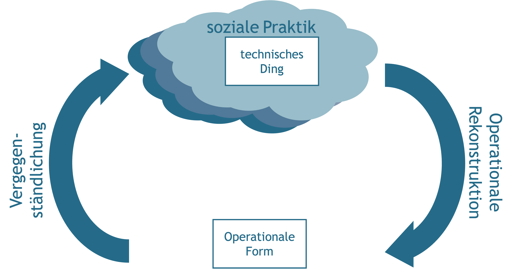
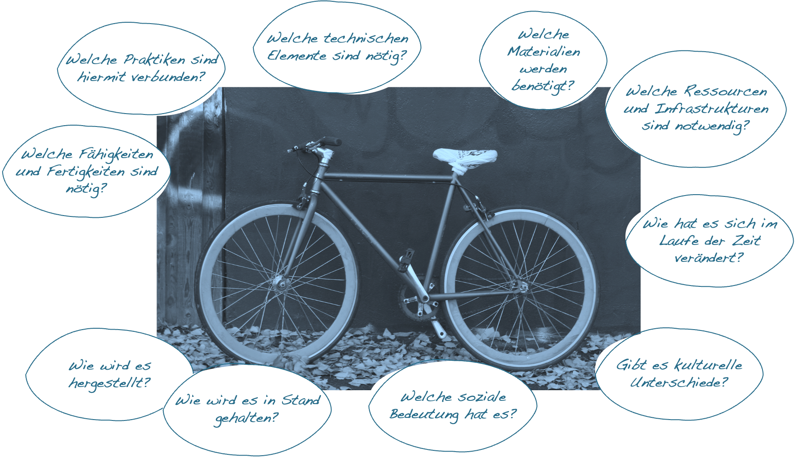
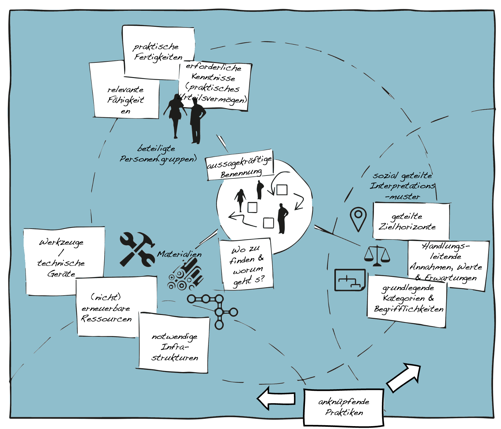

# Soziale Praktik & Technik

Technik ist ein integraler Bestandteil unseres alltäglichen Handelns und damit auch unserer sozialen Praktiken. Egal ob wir mit dem Fahrrad zur Arbeit fahren, am Computer einen Text schreiben, unser Essen in der Mikrowelle aufwärmen oder in unserer Freizeit Klavier spielen, immer wieder haben wir es mit den verschiedensten technischen Geräten, Instrumenten und Maschinen zu tun. Die Frage, was eine Technik eigentlich ist und welche Bedeutung dem Gebrauch technischer Dinge zukommt, wird aber weiterhin kontrovers diskutiert. Diese Diskussion erstreckt sich dabei von der Technikphilosophie über die Techniksoziologie bis hinein in die Kulturwissenschaften. Einen einführenden Überblick über verschiedene theoretische Positionen gibt unter anderem Werner Rammert [@rammertTechnik2010]. Eine ausführliche Darstellung grundlegender technikphilosophischer Diskurse findet sich zum Beispiel bei Carl Mitcham [@mitchamThinkingTechnologyPath1994].

```{r, echo=FALSE, fig.align='center', dev='png'}

```


## Das Konzept der Technik

Die besondere Herausforderung in Bezug auf das Konzept der Technik besteht darin, dass mit dem Begriff der ›Technik‹ mindestens drei verschiedene Bedeutungsebenen verbunden sind [@mitchamThinkingTechnologyPath1994; @horningExpertenAlltags2001]. So verweist der Begriff der Technik einerseits auf eine bestimmte Art von **Gegenständen**, die sich dadurch auszeichnen, dass sie von Menschen erschaffen worden sind und aufgrund ihrer materiellen Beschaffenheit bestimmte Wirkungszusammenhänge absichern. Andererseits bezeichnet der Begriff der Technik aber auch **Verfahren, Prozeduren und Fertigkeiten**, die Menschen (unter Verwendung technischer Dinge) erlernen und ausführen können. Beispiele hierfür sind etwa Moderations-, Unterrichts- oder Rechentechniken. Darüber hinaus kann Technik, im Sinne von ›Technologie‹, aber auch als eine **Form des Wissens** über technische Zusammenhänge verstanden werden.

Während sich die technischen Dinge für gewöhnlich recht einfach identifizieren lassen, da sie uns meist in Form konkreter Gegenstände, wie etwa dem Fahrrad, dem Computer, der Mikrowelle oder dem Klavier begegnen, ist die Frage nach der praktischen Funktion und Bedeutung dieser Dinge deutlich schwieriger zu beantworten. Ist zum Beispiel das Fahrrad ein Transportmittel, ein Sportgerät, ein Bastelobjekt, ein Beitrag zu einer nachhaltigeren Mobilität oder ein Zeichen dafür, dass man sich kein Auto leisten kann?

Während in den Sozial- und Kulturwissenschaften weitgehende Einigkeit darüber herrscht, dass technische Dinge das Ergebnis sozialer beziehungsweise kultureller Prozesse sind, unterscheiden sich die theoretischen Ansätze insbesondere hinsichtlich der Frage, ob die Funktion und Bedeutung der technischen Dinge Ausdruck der Intention derjenigen ist, die die technischen Dinge herstellen, oder ob sich die Funktion und Bedeutung der technischen Dinge erst im Gebrauch entscheidet [@orlikowskiUsingTechnologyConstituting2000].

Vertreter\*innen der Theorie sozialer Praktiken betonen den Umstand, dass technische Dinge keine austauschbaren Werkzeuge sind, sondern vielmehr einen **grundlegenden Bestandteil der jeweiligen Praktiken** darstellen. Technische Dinge sind dabei sowohl Voraussetzung wie auch Produkt sozialer Praktiken. In den technischen Dingen vergegenständlichen sich ›operationale Formen‹ [@floydAutooperationaleFormUnd1997], die sich im Laufe des wiederholten Miteinandertuns herausgebildet haben.

Die Theorie sozialer Praktiken hebt dabei die konstitutive Verschränkung von sozialen Praktiken und technischen Dingen hervor, die sich in einem co-evolutionären Prozess gegenseitig bedingen und kontinuierlich transformieren [@mitchamThinkingTechnologyPath1994; @shoveDynamicsSocialPractice2012]. Die Funktion und Bedeutung technischer Dinge muss dementsprechend immer wieder praktisch hergestellt werden; die technischen Dinge sind nicht schon von sich aus wirksam, sondern müssen ›ins Laufen‹ gebracht und auch ›am Laufen gehalten‹ werden. Hierzu braucht es sowohl die entsprechenden Fertigkeiten wie auch das Wissen der Praktiker\*innen.

## Wesentliche Ideen

**Technische Dinge sind Voraussetzung und Produkt sozialer Praktiken** - Technische Dinge entwickeln ihre Form im Wechselspiel von Konzeption, Herstellung und Gebrauch. Die Vorstellungen der Entwickler\*innen und die Erwartungen der Praktiker\*innen sind dabei wechselseitig aufeinander bezogen. Mit der Einführung neuer technischer Dinge verändern sich die praktischen Handlungsspielräume, gleichzeitig entstehen aber auch neue Handlungsnotwendigkeiten und Erwartungen, die wiederum Anlass geben für die Weiterentwicklung der technischen Dinge [@shoveDynamicsSocialPractice2012].

**Technische Dinge sind praktisch unterbestimmt** - Als Gegenstände können technische Dinge im Rahmen unterschiedlicher Praktiken Verwendung finden. Technische Dinge sind hinsichtlich ihrer praktischen Einsatzmöglichkeiten mehr oder weniger unterbestimmt. Während in einigen Fällen technische Dinge für spezifische Kontexte entwickelt werden, sind viele technische Dinge so konzipiert, dass sie in unterschiedlichen Kontexten Anwendung finden können. Neben einer geplanten Anpassbarkeit besteht dabei immer auch die Möglichkeit praktischer Zweckentfremdungen und Umnutzungen [@brandesNonIntentionalDesign2006; @houkesOntologyArtefactsHard2006].

**Technische Dinge haben eine materielle Form** - Technische Dinge sind keine abstrakten Objekte, sondern konkrete Gegenstände, mit denen im praktischen Gebrauch interagiert und hantiert werden kann. Aufgrund ihrer materiellen Eigenschaften sind die technischen Dinge nicht beliebig (um-)formbar, sondern immer auch eigensinnig beziehungsweise widerständig [@houkesOntologyArtefactsHard2006; @kalthoffEinleitungMaterialitatKultur2016]. Für ihre Herstellung wie auch für ihre Wartung und Reparatur bedarf es bestimmter Fertigkeiten, Kenntnisse und  gegebenenfalls weiterer (technischer) Dinge. Der Einsatz technischer Dinge erfordert zudem für gewöhnlich die Verfügbarkeit bestimmter Ressourcen, die verbraucht, benötigt oder bearbeitet werden, wie auch von Infrastrukturen, die die Verfügbarkeit der Ressourcen sicherstellen [@shoveMattersPractice2017].

**Technische Dinge integrieren technische Elemente** - Technische Dinge setzen sich für gewöhnlich aus unterschiedlichen technischen Elementen zusammen, die zu einem bestimmten Zeitpunkt in einer Kultur verfügbar sind. Technische Elemente sind dabei grundlegende Prinzipien und Verfahren, die in die Konstruktion technischer Dinge einfließen und deren technische Eigenschaften und Funktionsweisen gewährleisten [@simondonExistenzweiseTechnischerObjekte2012]. Die Entwicklung technischer Elemente geht der Konstruktion und Herstellung konkreter technischer Dinge zumeist voraus.

**Technische Dinge bedürfen entsprechender soziotechnischer Milieus** - Damit technische Dinge praktisch einsetzbar werden, bedarf es hierauf abgestimmter sozialer und technischer Milieus. Neben der Verfügbarkeit geeigneter Ressourcen, Infrastrukturen und Produktionsbedingungen bedarf es entsprechender Fertigkeiten und Kenntnisse der beteiligten Akteur\*innen wie auch sozial geteilter Deutungs- und Handlungsmuster, die den Einsatz bestimmter technischer Dinge sinnhaft erscheinen lassen. Die Entwicklung technischer Dinge geht insofern immer auch mit der Ausbildung entsprechender Milieus einher.


::: {.blackbox data-latex=""}
*Welche analogen & digitalen Technologien haben unseren Alltag nachhaltig verändert?*
:::

&nbsp;

```{r, echo=FALSE, fig.align='center', dev='png'}

```

## Kartierung Sozialer Praktiken

**Ziel**

Die Kartierung sozialer Praktiken dient der analytischen Abgrenzung praktischer Handlungszusammenhänge sowie die Identifikation wesentlicher Strukturelemente.

**Leitgedanke**

Die Kartierung sozialer Praktiken versucht organisierte Formen menschlichen Tätigseins zu identifizieren und gegeneinander abzugrenzen. Es geht hierbei darum, sowohl wesentliche Strukturelemente einer Praktik, wie auch Bezüge zu anderen Praktiken, aufzuzeigen. Neben der Benennung und ›Verortung‹ der Praktik gehen hierbei auch die wesentliche Fertigkeiten und Kenntnisse der beteiligten Personen(gruppen), die notwendigen Materialien wie auch die für die Praktik relevanten Interpretationsmuster in die Kartierung mit ein.

**Anwendungskontext**

Die Kartierung sozialer Praktiken eignet sich zum Abstecken eines Gegenstandsbereichs und bietet einen Ausgangspunkt für weiterführende Analysen.

```{r, echo=FALSE, fig.align='center', dev='png'}

```

**Arbeitsschritte**

 1. Auswahl und aussagekräftige Benennung der zu kartierenden Praktik.
 2. ›Verortung‹ der Praktik: In welchem Kontext findet sie statt? Wer ist beteiligt? Worum geht es?
 3. Beschreibung und ggf. Illustration wesentlicher Strukturelemente.
 4. Kartierung angrenzender Praktiken, an denen dieselben Personen(gruppen), Materialien oder Interpretationsmuster beteiligt sind.
 5. Ggf. Überarbeitung oder Erweiterung der Karte.
 
**Ergebnisformat**

Eine grafische evtl. mit Bildern oder Verweisen angereichte Darstellung der wesentlichen Strukturelemente.

**Praktische Tipps**

-   Die Karte sollte Außenstehenden eine Idee vom Sinn und Zweck der Praktik vermitteln und es ihnen ermöglichen, die Praktik zu erkennen, wenn sie ihr begegnen.
-   Die Beschreibung sollte sich an den Begrifflichkeiten der Praktiker*innen orientieren.

**»Fallstricke«**

-   Soziale Praktiken sind keine fixen Einheiten. Die Strukturelemente können sich im Laufe der Zeit stark verändern. Ebenso kann es unterschiedliche ›Spielarten‹ ein und derselben Praktik gegeben. Die Kartierung sollte sich deshalb an den konkreten analytischen Interessen orientieren.
-   Viele Praktiken sind zwar eng mit bestimmten Technologien verknüpft. Der Einsatz einer Technik ist aber nie Selbstzweck. Insofern genügt der Verweis auf eine bestimmte Technologie nie aus, um eine Praktik zu charakterisieren.

**Weiterführende Literatur zum Leittext**

Schatzki, T. R. (2012). A primer on practices: Theory and research. In J. Higgs, R. Barnett, S. Billett, M. Hutchings, & F. Trede (Hrsg.), Practice-based education (S. 13–26). New York: Sense Publisher.

Shove, E., Pantzar, M., & Watson, M. (2012). The Dynamics of Social Practice—Everyday Life and how it Changes. Los Angeles: Sage.


