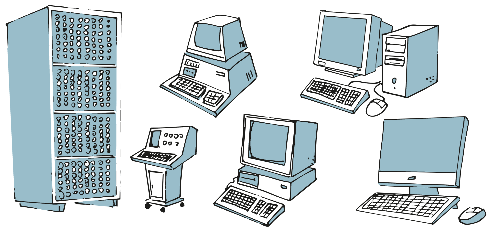
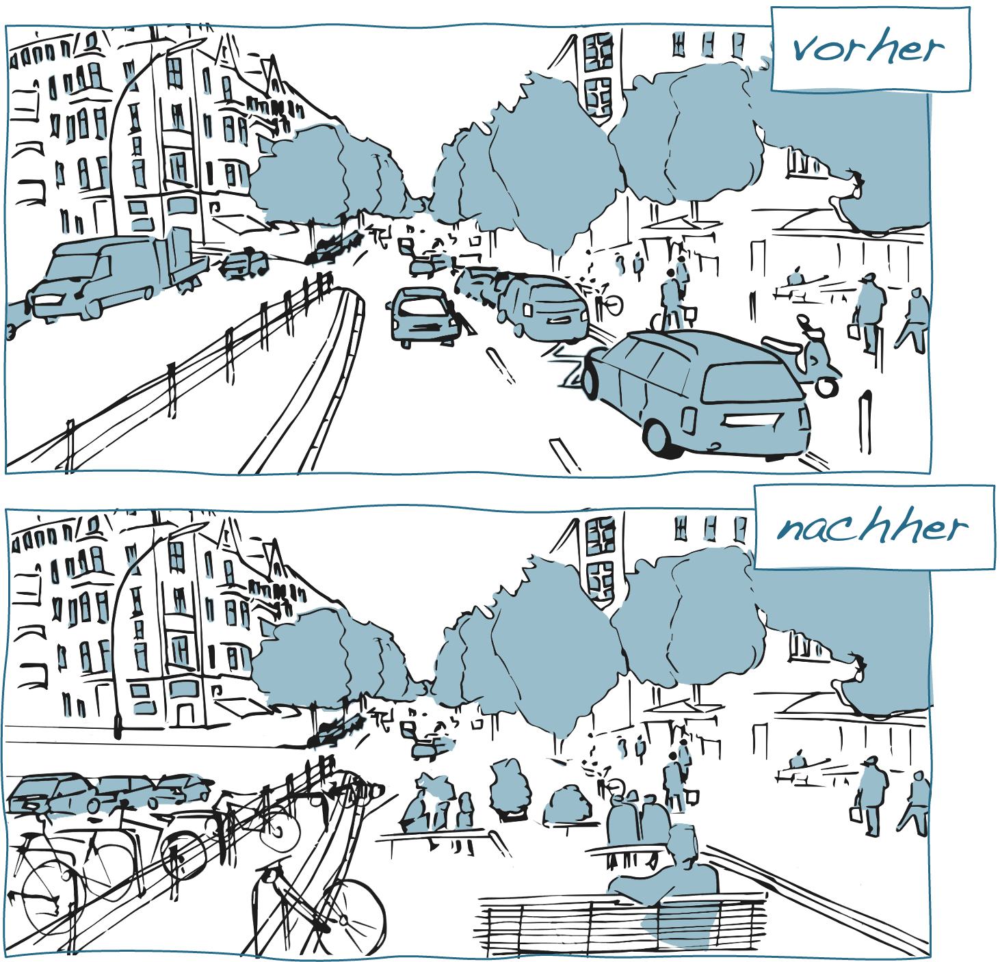

# Technikgenese

Die Entwicklung und der Gebrauch technischer Dinge ist ein kultur- und epochenübergreifendes Phänomen. Dementsprechend haben auch die technischen Dinge, mit denen wir es heute zu tun haben, bereits eine mehr oder weniger lange und abwechslungsreiche Entwicklungsgeschichte hinter sich. Die Entwicklung und Verbreitung bestimmter Technologien ist dabei eng mit der Transformation sozialer Praktiken verknüpft. Der Buchdruck, das Auto wie auch der Computer sind hierfür nur einige sehr augenfällige Beispiele.

Das Konzept der Technikgenese bezieht sich auf die Prozesse der Entstehung, Entwicklung und Gestaltung von Technik. Je nach Erkenntnisinteresse nehmen technikgenetische Untersuchungen dabei zum Beispiel die Entwicklung einzelner technischer Produkte, die Entwicklungslinien einer Technologie oder auch die Gesamtheit technischer Entwicklungen innerhalb einer Epoche und Kultur in den Blick [@rammertTechnik2010].

```{r fig3,fig.cap="Der Computer im Wandel der Zeit (Illustration basierend auf einer Grafik von [Freepik.com](https://www.freepik.com/free-vector/computers-evolution-cartoon-vector-concept-vintage-old-computing-stations-retro-system-units-monitors-modern-desktop-pc-with-keyboard-mouse-illustrations-set-isolated-white-background_4393734.htm#query=computer%20evolution&position=1&from_view=search&track=robertav1_2_sidr)).", echo=FALSE,dev='png'}

```

## Konzepte der Technikgenese (1)

Während in der sozial- und kulturwissenschaftlichen Diskussion die Vorstellung weit verbreitet ist, dass sich die **Entwicklung und der Gebrauch technischer Dinge als kulturell und historisch gerahmte Prozesse** verstehen lassen, besteht weniger Einigkeit hinsichtlich der Frage, wie sich entsprechende Prozesse analytisch fassen lassen. Je nach gewähltem analytischem Zugang verändert sich der Fokus und andere Aspekte treten in den Vordergrund. Das Spektrum technikgenetischer Perspektiven reicht hierbei von Ansätzen, die die Entwicklung technischer Dinge (a) als eine **Form intentionalen Handelns**, (b) als **soziale Aushandlungsprozesse** oder (c) als **koevolutionäre Transformationsprozesse** begreifen, in denen sich technische Dinge und soziale Praktiken gegenseitig bedingen und kontinuierlich verändern [vgl. @fengThinkingDesignCritical2008; @shoveDynamicsSocialPractice2012].

**Technikgenese als intentionaler Prozess**

Modelle, die die Entstehung von Technik als einen intentionalen Prozess verstehen, betonen die Rolle derjenigen, die z.B. als Ingenieure, Designer\*innen oder Softwareentwickler\*innen unmittelbar an der Konzeption und Gestaltung der technischen Dinge beteiligt sind. Diese Modelle gehen davon aus, dass die für die konkreten Gestaltungsentscheidungen verantwortlichen Personen ein hohes Maß an Kontrolle über den Gestaltungsprozess wie auch die Produkte haben. Es sind aus dieser Perspektive die Entwickler\*innen selbst, die aufgrund ihrer Rolle und ihres Know-Hows den Dingen eine Funktion und Bedeutung geben.

Intentionale Modelle widersetzen sich der Vorstellung technischen Fortschritts als einer inneren Notwendigkeit und betonen stattdessen die Rolle menschlicher Akteur\*innen für die Entstehung technischer Dinge. Entsprechende Modelle finden sich insbesondere in den Design- und Ingenieurswissenschaften wieder, da sie einen wichtigen handlungspraktischen Rahmen für die an den entsprechenden Gestaltungsprozessen beteiligten Akteur\*innen bieten [@carvalhoLegitimatingDesignSociology2009]. Die Betonung der intentionalen Seite der Technikgenese blendet aber die soziale und kulturelle Bedingtheit entsprechender Entwicklungen wie auch die Möglichkeiten nicht intendierter (Neben-)Wirkungen weitgehend aus [@ihdeDesignerFallacyTechnological2008].

## Konzepte der Technikgenese (2)

**Technikgenese als sozialer Aushandlungsprozess**

Im Unterschied zu intentionalen Modellen erweitert eine zweite Gruppe technikgenetischer Ansätze den Fokus und schließt die sozialen Rahmenbedingungen und Handlungskontexte mit ein, in denen technische Dinge konzipiert, hergestellt und implementiert werden. Technikgenese ist aus dieser Perspektive in Form sozialer Projekte organisiert, in denen unterschiedliche Interessengruppen über technische Optionen verhandeln und entscheiden welche Technik letztlich realisiert wird [vgl. z.B. @woodhouseDesignSocietyScience2004]. Dementsprechend sind es vor allem die sozialen und politischen Entstehungszusammenhänge, die die Funktionalität und Bedeutung der technischen Artefakte bestimmen.

Die Vorstellung der Technikgenese als einem sozialen Aushandlungsprozess relativiert den Einfluss der Entwickler\*innen und ihrer Intentionen und betont stattdessen die Bedeutung ökonomischer, politischer, institutioneller, sozialer und kultureller Faktoren für technische Entwicklungsvorhaben. Die Technikgenese wird damit zu einem macht- und interessengeladenen Prozess [vgl. @fengThinkingDesignCritical2008]. Ähnlich wie die intentionalen Modelle gehen auch diese Ansätze davon aus, dass die Form, Funktion und Bedeutung technischer Dinge maßgeblich durch den jeweiligen Entstehungszusammenhang bestimmt wird, während sowohl dem Gebrauch wie auch den materiellen Eigenschaften der Dinge nur eine untergeordnete Bedeutung beigemessen wird. Zugespitzt formuliert erscheinen die technischen Dinge aus dieser Perspektive als eine ›geronnene‹ und auf Dauer gestellte Form sozialer Praxis [@mackenzieProblematisingTechnologicalObject2005].

**Technikgenese als koevolutionärer Transformationsprozess**

Eine dritte Gruppe von Ansätzen setzt schließlich die Entwicklung und den praktischen Gebrauch technischer Dinge miteinander in Beziehung und geht davon aus, dass diese Prozesse miteinander verschränkt sind. Die Funktionalität und Bedeutung ist aus dieser Perspektive den technischen Dingen nicht ›eingeschrieben‹, sondern muss im praktischen Gebrauch immer wieder neu reproduziert werden. Die Entwicklung technischer Dinge knüpft in diesen Modellen immer schon an die bereits bestehenden Praktiken und vorhandenen technischen Gegebenheiten an und ist insofern eingebettet in entsprechende soziale und technische Milieus.

Koevolutionäre Modelle betonen die Prozess- und Ereignishaftigkeit technischer Entwicklungen [@mackenzieProblematisingTechnologicalObject2005]. Sie heben insbesondere die praktischen Leistungen der Anwender\*innen hervor, die notwendig sind, um die Funktion und Bedeutung der Dinge im praktischen Gebrauch sicherzustellen und »die Technik ›am Laufen [zu] halten‹« [@horningExpertenAlltags2001]. Zudem unterlaufen sie die Vorstellung einer umfassenden Veränder- und Formbarkeit der Technik, indem sie individuelle Entwicklungsvorhaben mit vorausgegangenen technologischen Entwicklungslinien in Beziehung setzen [z.B. @lawsonOntologyTechnologyArtefacts2008; @riederEnginesOrderMechanology2020].


::: {.blackbox data-latex=""}
*Wie haben sich etwa die Praktiken des Schreibens und Zeichnens mit der Erfindung von Bleistift und Radiergummi verändert [siehe hierzu ausführlicher etwa @oelkersHistorizitatPadagogischerGegenstande2012]?*
:::

&nbsp;

```{r, echo=FALSE, fig.align='center', dev='png'}

```

## Qualitative Gegenüberstellungen

**Ziel**

Qualitative Gegenüberstellungen dienen dazu, Gemeinsamkeiten und Unterschiede zwischen zwei oder mehr Untersuchungsgegenstände/Fällen zu identifizieren.

**Leitgedanke**

Ein systematischer Vergleich von Gegenständen/Fällen setzt die Kenntnis von Merkmalsdimensionen voraus, die für den jeweiligen Untersuchungszusammenhang relevant sind und anhand derer sich Gemeinsamkeiten und Unterschiede festmachen lassen. In vielen Fällen sind diese Merkmalsdimensionen zu Beginn der Untersuchung aber noch nicht vollständig bekannt, sodass diese anhand des Datenmaterials sukzessive (weiter-)entwickelt werden müssen. Die qualitative Gegenüberstellung dient insofern nicht nur dazu, Gegenstände/Fälle anhand vorhandener Kriterien zu beschreiben, sondern auch herauszufinden, worin relevante Unterschiede überhaupt bestehen könnten.

**Anwendungskontext**

Qualitative Gegenüberstellungen bieten sich insbesondere dann an, wenn die zu vergleichenden Gegenständen/Fälle komplexer Art sind und/oder die relevanten Vergleichsdimensionen noch unbekannt sind.

```{r, echo=FALSE, fig.align='center', dev='png'}

```

**Arbeitsschritte**

 1. Auswahl der zu vergleichenden Untersuchungsgegenstände/Fälle.
 2. Vorläufige Festlegung relevanter Vergleichsdimensionen.
 3. Sammlung von Informationen und Beschreibung der Gegenstände/Fälle unter Berücksichtigung der Vergleichsdimensionen.
 4. Falls erforderlich, Überarbeitung oder Erweiterung der Vergleichsdimensionen.
 5. Dokumentation der zentralen Gemeinsamkeiten und Differenzen.
 
**Ergebnisformat**

Eine grafische oder tabellarische Aufstellung der identifizierten Gemeinsamkeiten und Unterschiede.

**Praktische Tipps**

-   Bei der Auswahl der Vergleichsdimensionen ist darauf zu achten, dass diese inhaltlich wirklich relevant sind. Aus diesem Grund sollten auch die Ergebnisse der Gegenüberstellung mit dem bereits vorhandenen (Vor-)Wissen abgeglichen werden.
-   Neben quantitativen Differenzen sollte bei der Gegenstellung insbesondere auf qualitative Unterschiede geachtet werden, die z.B. die Funktionsweise, Struktur oder Bedeutung der Gegenstände/Fälle betreffen.

**»Fallstricke«**

-   Qualitative Gegenüberstellungen sind kein linearer Prozess, sondern erfordern die wiederholte Reflexion der zugrunde gelegten Vergleichsdimensionen.

**Weiterführende Literatur zum Leittext**

Adamson, B. (2019). Juxtaposing Comparative Education and Teacher Education. In M. A. Peters (Hrsg.), *Encyclopedia of Teacher Education* (S. 899-904). Springer Singapore. 

Miles, M. B., & Huberman, A. M. (1994). *Qualitative Data Analysis* (2nd. ed.). Sage.

