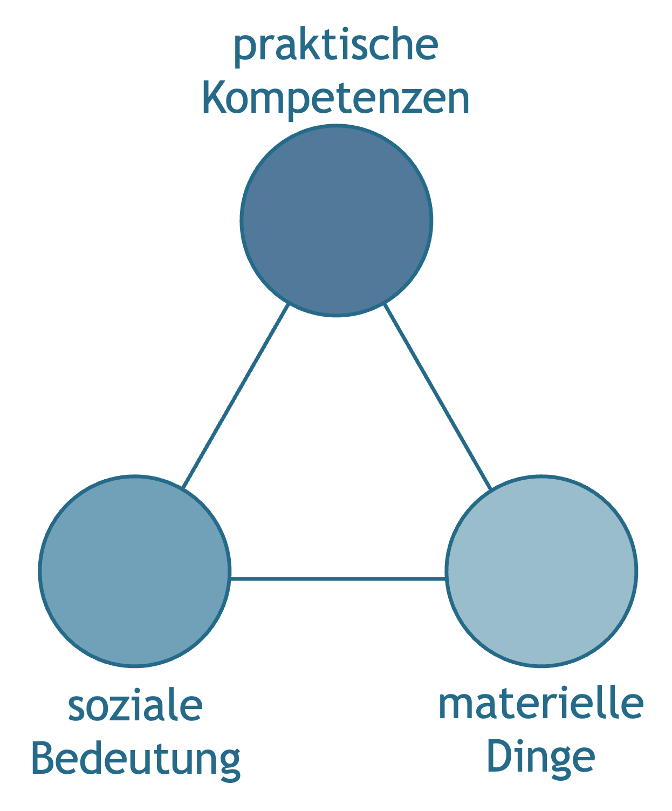
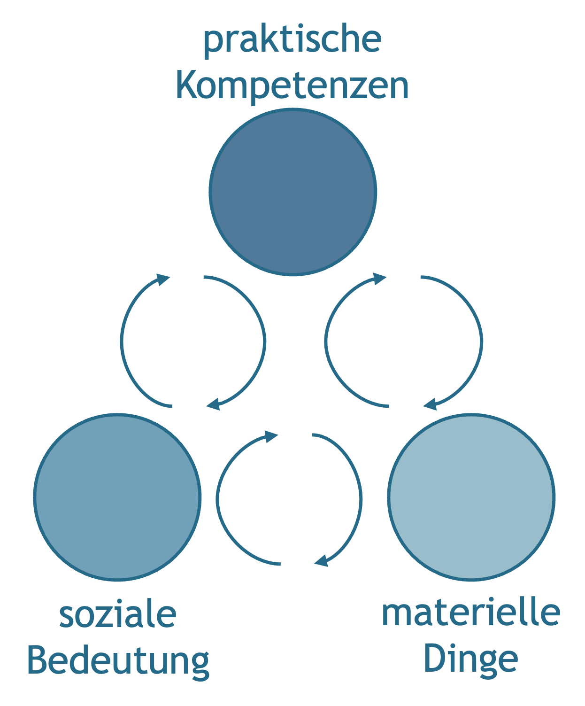
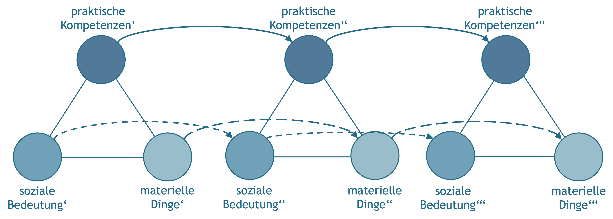
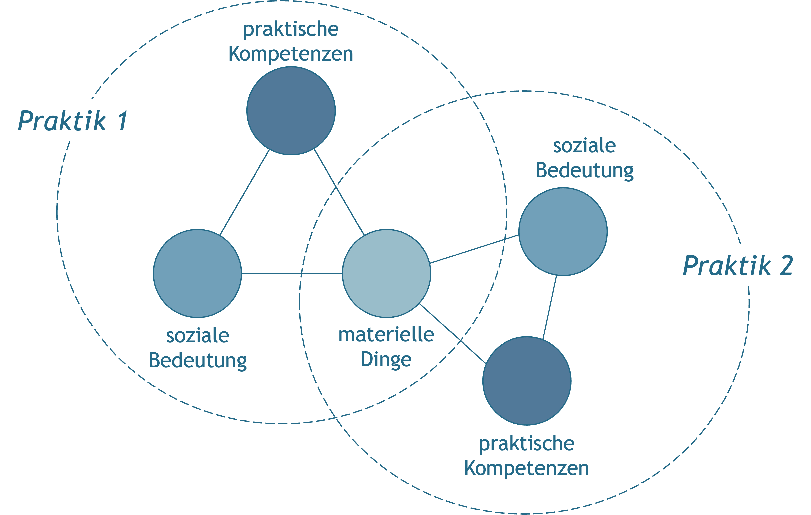
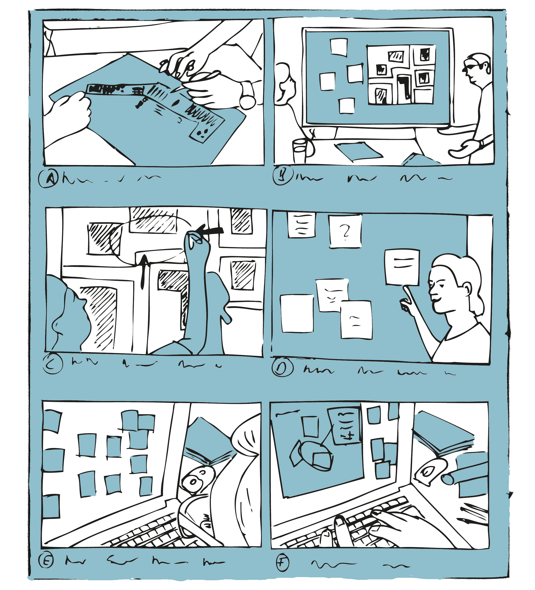

# Transformation sozialer Praktiken

Vertreter\*innen der praxistheoretischer Positionen betonen die konstitutive Verwicklung von Mensch und Technik, von Technologien und sozialen Praktiken [@horningExpertenAlltags2001; @orlikowskiUsingTechnologyConstituting2000; @schatzkiMaterialitySocialLife2010; @shoveDynamicsSocialPractice2012]. Sie folgen damit im Wesentlichen der Idee der Technikgenese als einem koevolutionären Transformationsprozess, innerhalb dessen sich soziale Praktiken und technische Dinge gegenseitig bedingen und kontinuierlich transformieren. Um die hiermit einhergehenden Vorgänge fassen zu können, haben Elisabeth Shove, Mika Pantzar & Matt Watson [@shoveDynamicsSocialPractice2012] ein Modell vorgeschlagen, mit dem sich die dynamische Veränderung sozialer Praktiken beschreiben und analysieren lässt.

Das Modell basiert auf einer bewussten Vereinfachung praxistheoretischer Grundannahmen und Konzepte, bietet damit aber zugleich die Möglichkeit Transformationsprozesse auf unterschiedlichen Abstraktionsebenen zu analysieren. Für eine weiterführende Übersicht über praxistheoretische Grundkonzepte siehe zum Beispiel Theodore Schatzki [@schatzkiPrimerPracticesTheory2012].


## Materielle Dinge, praktische Kompetenzen & soziale Bedeutungen

Shove, Pantzar und Watson [@shoveDynamicsSocialPractice2012] gehen in ihrem Modell davon aus, dass sich soziale Praktiken im Zusammenspiel **materieller Dinge** (materials), praktischer Kompetenzen (competences) und sozialer Bedeutungen (meanings) ausbilden und (weiter-)entwickeln. 

Die materiellen Dinge umfassen dabei das gesamte Spektrum an Gegenständen, Werkzeugen, Geräten und Instrumenten, die in einer Praktik zum Einsatz kommen, wie auch die materiellen Ressourcen und Infrastrukturen, die für die Durchführung einer Praktik notwendig sind oder in ihr verarbeitet werden. Zu den materiellen Dingen gehören auch die Körper derjenigen, die aktiv oder passiv an einer Praktik beteiligt sind. Technische Dinge, wie etwa ein Fahrrad, ein Smartphone, ein WLAN aber auch ein digitales Textdokument sind aus dieser Perspektive ein Teil jener materiellen Dinge, die in bestimmten sozialen Praktiken Verwendung finden.

Zu den **praktischen Kompetenzen** zählen hier all jene Fähigkeiten und Fertigkeiten, die zur aktiven Teilhabe an einer bestimmten sozialen Praktik erforderlich sind, sowie die entsprechenden Kenntnisse. Zu diesen Kenntnissen gehört insbesondere ein allgemeines Verständnis für die mit der jeweiligen Praktik verbundenen Regeln, Werte und Normen, wie auch das Wissen über die Funktion und das Zusammenspiel der einzelnen Elemente. Die Kompetenzen umfassen ebenfalls ein auf die jeweilige Praktik bezogenes Urteilsvermögen, dass es den Praktiker\*innen zum Beispiel erlaubt, eine Handlung als Teil einer Praktik zu erkennen oder auch die Qualität der Ausführung zu beurteilen. Bezogen auf den Umgang mit den technischen Dingen beinhalten die praktischen Kompetenzen auch jenes ›Know-how‹, das für den adäquaten Umgang mit den Dingen erforderlich ist. Der Umgang umfasst dabei neben dem direkten Gebrauch zum Beispiel Fragen der Anschaffung und Auswahl von Geräten wie auch deren Instandhaltung, Pflege und Reparatur.

Das dritte Element bilden schließlich die **sozialen Bedeutungen**, die mit einer sozialen Praktik verbunden sind und diese auszeichnen. Sie umfassen jene von den Praktiker\*innen geteilten sozialen Interpretations- und Deutungsmuster, die für das Verständnis des gemeinsamen Miteinandertuns grundlegend und zielbestimmend sind. Hierzu zählen unter anderem geteilte Zielhorzionte, praxisleitende Annahmen, Werte und Erwartungen, wie auch grundlegende Kategorien und Begrifflichkeiten. In Hinblick auf die technische Dimension einer sozialen Praktik umfassen die sozialen Interpretations- und Deutungsmuster zum Beispiel die an den Einsatz einer bestimmten Technologie geknüpften Erwartungen und Werte wie auch hieraus resultierende Verantwortlichkeiten Formen der Arbeitsteilung.

Zusammengenommen bilden die materiellen Dinge, praktischen Kompetenzen und sozialen Bedeutungen das Grundgerüst einer sozialen Praktik. Shove, Pantzar und Watson stellen dieses Grundgerüst in Form einer dynamischen Dreiecksbeziehung dar (siehe <span style=color:#256B89>Abb. 7.1</span>).

```{r fig4,fig.cap="Elemente sozialer Praktiken (in Anlehnung an Shove et al., 2012, S. 25).", echo=FALSE, fig.align='center', dev='png', out.width='50%'}

```

## Soziale Praktiken – Form & Veränderung

Um der Veränderlichkeit sozialer Praktiken wie auch technischer Dinge Rechnung tragen zu können, schlagen Shove, Pantzar und Watson vor, die materiellen Dinge, praktischen Kompetenzen und sozialen Bedeutungen als mehr oder weniger eigenständige ›Elemente‹ zu verstehen, die aber zugleich im Rahmen sozialer Praktiken in grundlegender Weise aufeinander verweisen und aufeinander angewiesen sind.

Dieser gedankliche Spagat macht es möglich, die sukzessive Ausbildung von Dingen, Kompetenzen und Bedeutungen wie auch ihre Verschränkung im Rahmen sozialer Praktiken in den Blick zu nehmen und damit Abhängigkeiten und Transformationen auf unterschiedlichen Ebenen nachzuzeichnen. Materielle Dinge, wie ein Computer oder ein Fahrrad, können dementsprechend Teil unterschiedlicher Praktiken sein. Gleiches gilt auch für Kompetenzen und soziale Bedeutungen, die sich einerseits im Rahmen bestimmter Praktiken ausbilden aber zugleich auch in anderen Praktiken zum Tragen kommen können. Das Erlernen grundlegender Fertigkeiten, wie etwa des Lesens, Schreibens und Rechnens, aber auch grundlegende Wertorientierungen und allgemein anerkannte Wissensbestände sind typische Beispiele hierfür. 

Vor diesem Hintergrund lassen sich drei grundlegende Transformationsdynamiken unterscheiden. Die **erste Transformationsdynamik** resultiert dabei aus den **Wechselbeziehungen der Elemente** innerhalb einer bestehenden Praktik. Da sich eine Praktik nicht in ihrer Wiederholung erschöpft, sind immer wieder Anpassungen und Veränderungen der einzelnen Elemente notwendig, um die Praktik ›am Laufen zu halten‹. Neue Praktiker\*innen kommen hinzu und müssen die notwendigen Kompetenzen erwerben, technische Geräte nutzen sich ab und müssen ersetzt und repariert werden, Vorstellungen zum angemessenen Umgang miteinander aber auch mit den Dingen verändern sich. Veränderungen einzelner Elemente wirken sich dabei für gewöhnlich auch auf das Gesamtgefüge aus (vgl. <span style=color:#256B89>Abb. 7.2</span>).

```{r fig5,fig.cap="Die wechselseitige ›Formung‹ der Elemente einer Praktik (in Anlehnung an Shove et al., 2012, S. 32).", echo=FALSE, fig.align='center', dev='png',out.width='50%'}

```


Die **zweite Transformationsdynamik** ergibt sich hingegen aus der **sukzessiven Veränderung einzelner Elemente** einer Praktik entlang eigener ›Entwicklungspfade‹ (vgl. <span style=color:#256B89>Abb. 7.3</span>). Technische Innovationen, die systematische Förderung allgemeiner Kompetenzen oder auch ein grundlegender Wertewandel, der über einzelne Praktiken hinausweist, können hierfür als Beispiele dienen. 

```{r fig6,fig.cap="Entwicklung der Elemente entlang eigener Pfade (in Anlehnung an Shove et al., 2012, S. 33).", echo=FALSE, fig.align='center', dev='png'}

```

Eine **dritte Transformationsdynamik** basiert schließlich auf der **Verknüpfung mehrerer Praktiken** durch die Bezugnahme auf ein gemeinsames Element. Veränderungen in einer Praktik können sich hierdurch auf andere Praktiken auswirken (vgl. <span style=color:#256B89>Abb. 7.4</span>). So kann beispielsweise ein Spielplatz seine Bedeutung für die Kinder einer Nachbarschaft verändern, wenn er zum Treffpunkt der Jugendlichen wird. Ebenso ändern sich beispielweise auch die Anforderungen an ein Auto, wenn dieses nicht nur als Transportmittel auf dem Weg zur Arbeit, sondern auch als Bastelobjekt, Statussymbol oder mobile Unterkunft im Urlaub dienen soll.


::: {.blackbox data-latex=""}
*Anhand welcher Beispiele lassen sich die verschiedenen ›Transformationsdynamiken‹ veranschaulichen?*
:::

&nbsp;

```{r fig7,fig.cap="Verknüpfung mehrerer Praktiken durch Bezugnahme auf ein gemeinsames Element (in Anlehnung an Shove et al., 2012, S. 37).", echo=FALSE, fig.align='center', dev='png', out.width='75%'}

```

## Szenarien

**Ziel**

Szenarien dienen der illustrativen Beschreibung prototypischer Handlungssequenzen in einem bestimmten Kontext.

**Leitgedanke**

Szenarien beschreiben einen typischen Handlungsverlauf. Sie sollen es ermöglichen, sich in eine Situation hineinzuversetzen und zu verstehen, welche Aspekte für eine Handlung relevant sind. 
Im Rahmen eines Szenarios sollte deutlich werden: **wer** an der Handlung beteiligt ist, welche **Ziele** die Akteur\*innen verfolgen, was sie **tun**, aber auch was sie **denken** und **fühlen**. Darüber hinaus sollte das Szenario über die **Kontextfaktoren** und **Ereignisse** informieren, die den Handlungsverlauf beeinflussen.

**Anwendungskontext**

Szenarien können sowohl zur zusammenfassenden Beschreibung aktueller wie auch fiktiver Handlungsabläufe verwendet werden. 

```{r, echo=FALSE, fig.align='center', dev='png'}

```

**Arbeitsschritte**

 1. Festlegung/Abgrenzung der zu beschreibenden Handlung.
 2. Sammlung von Informationen und ggf. Bildmaterial.
 3. Bestimmung des Kontexts, der beteiligten Akteur\*innen und Gegenstände.
 4. Bestimmung zentraler Handlungsschritte/Szenen.
 5. Ausarbeitung des Szenarios in Form eines narrativen Textes oder eines ›Storyboards‹.
 5. Kritische Überprüfung und ggf. weitere Ausarbeitung des Szenarios.

**Ergebnisformat**

Eine illustrative Beschreibung eines prototypischen Handlungsverlaufs, etwa in Form eines ›Storyboards‹.

**Praktische Tipps**

-   Szenarien sollen prototypische Handlungssequenzen in einem konkreten Kontext verorten, um eine Identifikation mit den Akteuren zu ermöglichen.
-   Zur Veranschaulichung bieten sich Formate wie z.B. Photos & Photomontagen an, die sich leicht modifizieren oder erweitern lassen.
-   Alternative Handlungsweisen sollten in getrennten Szenarien abgebildet werden.

**»Fallstricke«**

-   Es sollte vermerkt werden, auf welchen Informationen das Szenario basiert, ob es bspw. der eigenen Erfahrung entstammt, auf Schilderungen Dritter basiert oder auch rein fiktional ist.
-   Bei komplexen Tätigkeiten und Vorgängen, die sehr unterschiedliche Handlungsweisen zulassen, ist es wichtig, sich auf wesentliche Handlungsschritte und Alternativen zu fokussieren.

**Weiterführende Literatur zum Leittext**

Greenberg, S., Carpendale, S., Marquardt, N. & Buxton, B. (2012). *Sketching UserExperiences – The Workbook*.    San Amsterdam: Morgan Kaufmann.

Rosson, M. & Carroll, J. (2002). Usability Engineering: *Scenario-BasedDevelopment of Human-Computer Interaction*. San Francisco: Morgan Kaufmann.

