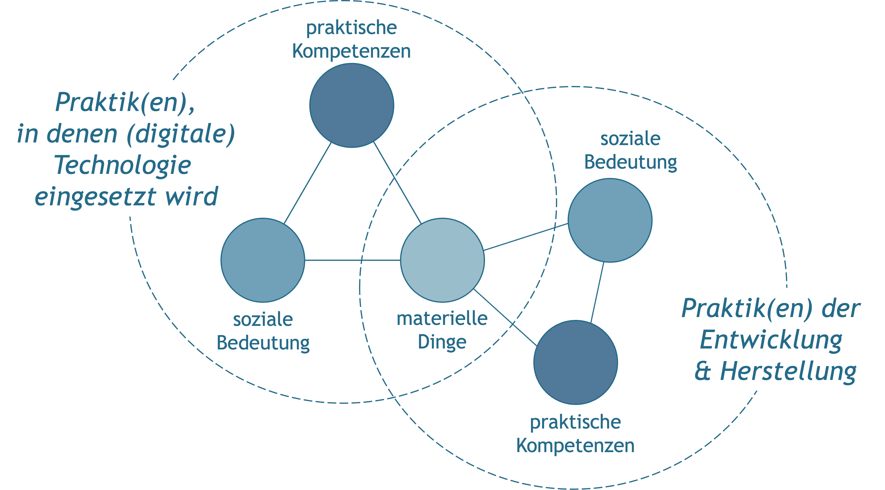
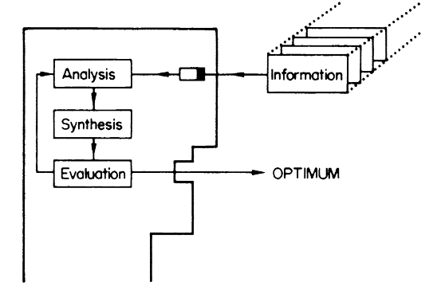
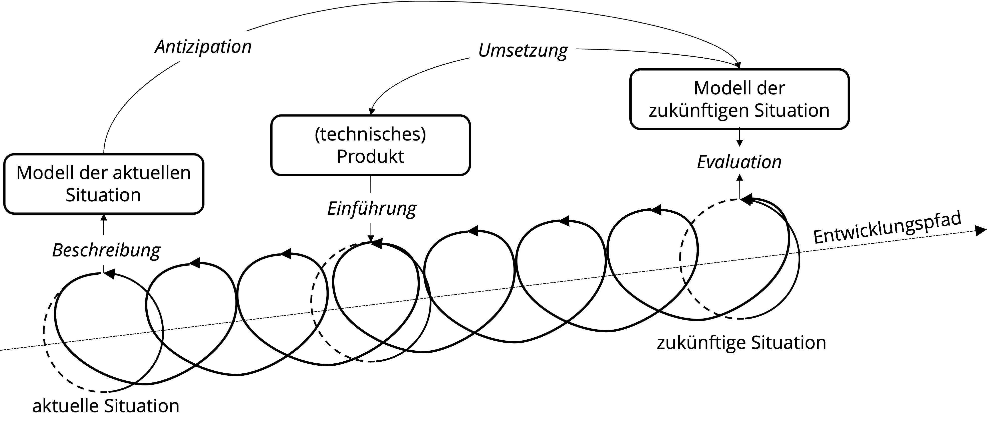
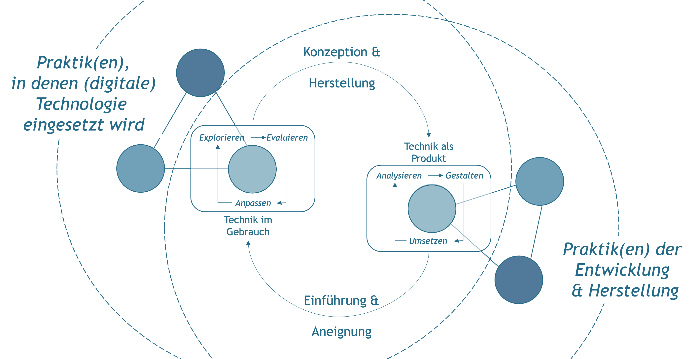
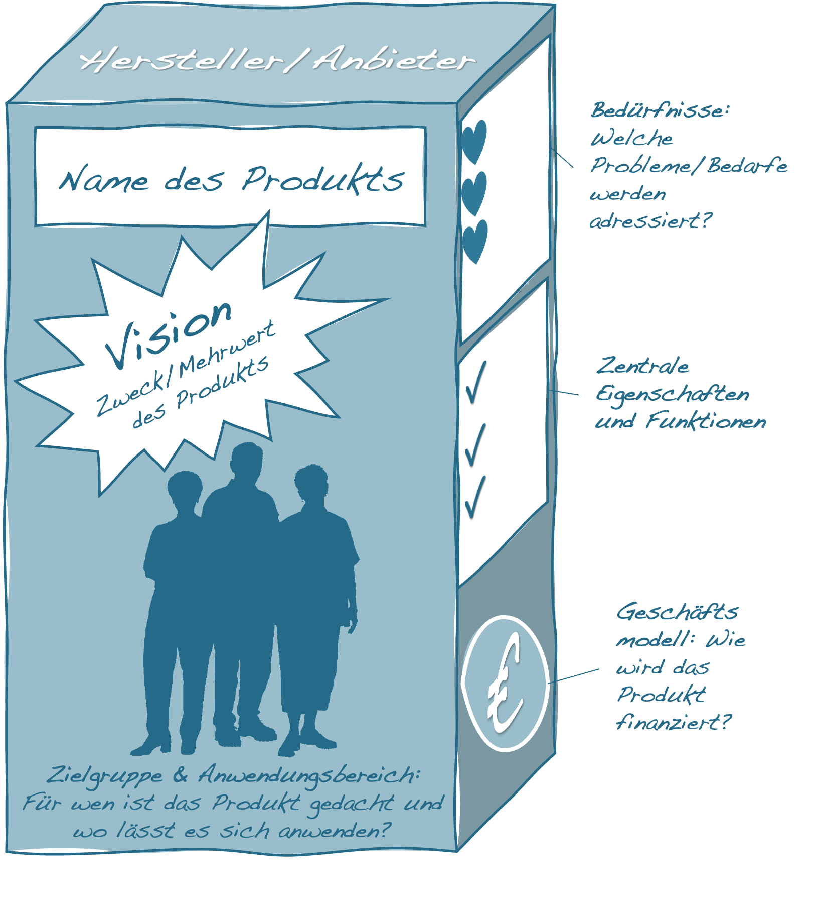

# Die Gestaltung von Technik

Ebenso wie der Umgang mit Technik lässt sich auch die Gestaltung technischer Produkte als Teil sozialer Praktiken verstehen. Je komplexer die technischen Dinge werden, desto seltener liegen Entwurf, Herstellung und Gebrauch in einer Hand. Entsprechend sind auch die jeweiligen Praktiken mehr oder minder stark voneinander entkoppelt und durch die Ausbildung spezifischer Tätigkeitsprofile gekennzeichnet, die bis zur Ausbildung spezifischer Berufsgruppen, wie etwa von Ingenieur\*innen, Architekt\*innen und Softwareentwickler\*innen, führen (vgl. <span style=color:#256B89>Abb. 8.1</span>). 


```{r fig8,fig.cap="Herstellung und Gebrauch als aneinander gekoppelte Praktiken.", echo=FALSE, fig.align='center', dev='png'}

```

## Modelle als Gestaltungsprozess

Als soziale Praktik beinhaltet die Entwicklung und Herstellung technischer Produkte immer auch Annahmen und Modelle über den Sinn und Zweck wie auch die Bedingungen gestalterischen Handelns. Entsprechende Modelle bieten einen wichtigen **Orientierungsrahmen für die Praktiker&ast;innen** und dienen gleichzeitig auch der **Vermittlung und Legitimation des eigenen Tuns gegenüber anderen**, wie etwa Auftraggeber\*innen oder Anwender\*innen [vgl. @carvalhoLegitimatingDesignSociology2009; @shoveDesignEverydayLife2007].


Die Annahmen und Modelle dessen, was die Gestaltung (digitaler Technologien) ausmacht, sind nicht nur Gegenstand soziologischer und kulturwissenschaftlicher Analysen, sondern werden auch innerhalb der Ingenieurs- und Designwissenschaften, der Informatik wie auch der Pädagogik intensiv diskutiert. Über die Grenzen der einzelnen Disziplinen hinweg sind hierbei verschiedene Modelle vorgeschlagen worden, um den Gestaltungsprozess zu systematisieren und die mit ihm verbundenen Aufgaben zu definieren. Diese Modelle unterscheiden sich nicht zuletzt hinsichtlich der Frage, **was eigentlich zu gestalten ist, wie der Gestaltungsprozess organisiert** werden sollte und **welche Personengruppen** dabei in welcher Form beteiligt sein sollen. Sie umfassen immer auch mehr oder weniger explizite **Vorstellungen darüber, wie Menschen handeln** und wie sie mit technischen Dingen umgehen. 


Gestaltung wird an dieser Stelle als **Oberbegriff** verstanden, der sowohl die Prozesse des **Entwerfens**, der **Konstruktion** wie auch der **Herstellung** oder **Realisierung** eines (technischen) Gegenstands umfasst. In Anlehnung an Victor Papanek [@papanekDesignFurReale2009] lässt sich Gestaltung dabei als »das bewusste und zugleich intuitive Bemühen um sinnvolle Ordnung« verstehen, die sich unter anderem in Form technischer Dinge manifestieren kann.

**Gestaltung als rationales Problemlösen**

Modelle der Gestaltung als Prozess des rationalen Problemlösens haben ihren Ursprung insbesondere in den Ingenieurswissenschaften. Sie gehen davon aus, dass das zu lösende Problem bereits bekannt ist und sich (im Idealfall) umfassend und präzise beschreiben lässt. Die wesentliche Aufgabe der Gestaltung besteht dementsprechend darin, unter Rückgriff auf zur Verfügung stehende Informationen eine zufriedenstellende Lösung zu finden. Eine Lösung ist dabei genau dann zufriedenstellend, wenn sie die in der Problembeschreibung festgelegten Anforderungen möglichst umfassend erfüllt. Der Gestaltungsprozess orientiert sich aus dieser Perspektive an objektiven Kriterien und ist methodisch kontrollierbar [vgl. @lowgrenApplyingDesignMethodology1995]. Individuelle Präferenzen wie auch gesellschaftliche Normen und Werte spielen für die Suche nach einer Problemlösung keine Rolle. Ausgehend von den kognitionswissenschaftlichen Modellen der 1950er und 1960er Jahre orientieren sich diese Modelle an der Idee des Menschen als einem informationsverarbeitenden System.


```{r fig9,fig.cap="»Designer as Computer« [aus @jonesDesignMethods1970].", echo=FALSE, fig.align='center', dev='png', out.width='75%'}

```


Die Vorstellung von Gestaltung als Prozess des rationalen Problemlösens gilt als weitgehend überholt, da sie nicht zuletzt die Frage nach der Definition der zu lösenden Probleme ausklammert [z.B. @rittelPlanningCrisisSystems1972]. Als handlungsleitendes Motiv spielt dieses Modell aber auch weiterhin eine wichtige Rolle [@pahlKonstruktionslehreGrundlagenErfolgreicher2007].

**Gestaltung als kreativer und ergebnisoffener Prozess**

Modelle der Gestaltung als kreativer Prozess mit offenem Ausgang haben ihre Wurzeln vor allem in der designtheoretischen Diskussion. Im Gegensatz zur Vorstellung der Gestaltung als Problemlöseprozess gehen sie davon aus, dass sich Problemstellung und Lösung nicht voneinander trennen lassen. Jeder gestalterische Eingriff und jeder Versuch, eine Lösung zu finden, verändert vielmehr die Problemlage und zieht vorab nicht vorhersehbare Folgen nach sich. Je nachdem wie die Situation, die Anlass für einen Gestaltungsprozess gibt, verstanden wird, ergeben sich unterschiedliche Vorstellungen davon, worin das Problem besteht und wie mögliche Lösungen aussehen könnten [z. B. @rittelPlanningCrisisSystems1972]. Gestaltung setzt aus dieser Perspektive ein Moment der Antizipation voraus, eine Vorstellung davon, was noch nicht ist, aber sein könnte und wünschenswert zu sein scheint (vgl. <span style=color:#256B89>Abb. 8.3</span>) [vgl. @krippendorffProductSemanticsTriangulation1989; @zamenopoulosAnticipatoryViewDesign2007]. 

Gestaltung basiert entsprechend auf modellhaften, sozial und kulturell geprägten Vorstellungen dessen, was ist, wie auch dessen, was sein beziehungsweise werden soll, und impliziert damit immer auch normative Annahmen und Setzungen bezüglich dessen, was als wünschenswert erachtet wird.

```{r fig10,fig.cap="Gestaltung als ein antizipativer Vorgang (eigene Darstellung aufbauend auf @krippendorffProductSemanticsTriangulation1989 & @zamenopoulosAnticipatoryViewDesign2007).", echo=FALSE, dev='png'}

```

**Gestaltung als koevolutionärer Prozess**

Modelle der Gestaltung als koevolutionärer Prozess finden sich in der techniksoziologischen wie auch der designtheoretischen Diskussion. Diese Ansätze erweitern den Fokus und verstehen nicht nur die Konzeption und Herstellung, sondern auch die Auswahl, Einführung und sukzessive Aneignung der jeweiligen (technischen) Produkte im Rahmen spezifischer Praktiken als Teil des Gestaltungsprozesses [vgl. @carrollCompletingDesignUse2004].

Herstellung und Gebrauch sind aus dieser Perspektive in rekursiver Weise aufeinander bezogen [vgl. @bolinHeuristicsAlgorithmBig2015]. Während die Entwickler\*innen an bereits bestehenden Praktiken, Routinen und Produkten anknüpfen und ein Modell zukünftiger Anwendungsmöglichkeiten entwerfen, eignen sich die Praktiker\*innen ihnen zur Verfügung stehende oder gestellte Produkte aktiv an, indem sie diese erproben, hinsichtlich ihrer ›Praxistauglichkeit‹ evaluieren und, soweit möglich und erforderlich, ihren jeweiligen Bedürfnissen anpassen (vgl. <span style=color:#256B89>Abb. 8.4</span>).

Aus evolutionstheoretischer Sicht produziert die Konzeption und Herstellung (technischer) Produkte in Bezug auf die Transformation sozialer Praktiken Variation: Eine Bandbreite neuer Produkte wird verfügbar, die sich aber erst noch als praxistauglich erweisen müssen (Selektion), bevor sie zu einem fixen Bestandteil einer veränderten, sozialen Praktik werden können (Re-Stabilisierung) [vgl. @jonasDesignResearchIts2007].


```{r fig11,fig.cap="Gestaltung im Wechselspiel von Konzeption, Herstellung, Einführung und Aneignung (eigene Darstellung aufbauend auf @bolinHeuristicsAlgorithmBig2015 & @shoveDynamicsSocialPractice2012).", echo=FALSE, dev='png'}

```


::: {.blackbox data-latex=""}
*Welche Beispiele für die aktive Umnutzung oder Zweckentfremdung technischer Produkte begegnen Ihnen in Ihrem Alltag? Wie kommt es dazu?*
:::


## Rekonstruktion der Produktvision

**Ziel**

Die Rekonstruktion der Produktvision dient dazu, die einem Produkt zugrundeliegenden Annahmen der Entwickler\*innen zu identifizieren. 

**Leitgedanke**

Die Rekonstruktion der Produktvision geht davon aus, dass die an der Gestaltung eines Produkts beteiligten Personen eine bestimmte Perspektive auf den Gegenstandsgegenstand entwickelt haben, auf deren Grundlage sie ihre Entscheidungen treffen. Die Produktvision umfasst dabei insbesondere Aussagen über den Zweck und Mehrwert des Produkts, die Zielgruppe und ihre Bedürfnisse wie auch zentrale Anwendungsfälle und Funktionen. Grundlage für die Rekonstruktion können u.a. Produktwebseiten, Werbematerialien, Anleitungen, Pressemitteilungen und Entwicklerblogs sein.

**Anwendungskontext**

Ausgangspunkt für die Rekonstruktion bilden die Aussagen der Entwickler*innen über ein konkretes Produkt. Die rekonstruierte Produktversion bietet einen Referenzpunkt zum Abgleich mit tatsächlichen Nutzungsformen.

```{r, echo=FALSE, fig.align='center', dev='png'}

```

**Arbeitsschritte**

 1. Auswahl des Produkts.
 2. Sammlung von Darstellungen des Produkts durch die Entwickler\*innen, z.B. Produktwebseiten, Werbematerialien, Anleitungen, Entwicklerblogs.
 3. Abgleich und Verdichtung der gesammelten Aussagen.
 4. Zusammenfassung in Form einer Produktpräsentation.
 5. Kritische Überprüfung und ggf. weitere Ausarbeitung des Szenarios.

**Ergebnisformat**

Darstellung der Produktvision in Form einer fiktiven Produktverpackung.

**Praktische Tipps**

-   Im Mittelpunkt stehen die Intentionen und Ideen der Entwickler\*innen. Ob und wie gut diese tatsächlich realisiert werden konnten, ist zunächst nicht relevant.
-   Die Rekonstruktion sollte sich soweit als möglich an den Begrifflichkeiten und Darstellungsweisen der Entwickler\*innen orientieren. 
-   Zur besseren Nachvollziehbarkeit sollten die verwendeten Quellen dokumentiert werden.


**»Fallstricke«**

-   Da die Produktvision auf Annahmen beruht, ist sie weder wahr noch falsch, sondern in erster Linie Ausdruck einer bestimmten Position oder Haltung.
-   Nicht alle produktbezogenen Annahmen müssen explizit benannt werden. Auch visuelle Darstellungen, z.B. von Anwender*innen, oder Beispiele können auf Annahmen hinweisen.

**Weiterführende Literatur zum Leittext**

Deasy, D. (2003). Non-AssumptiveResearch. In B. Laurel (ed). *Design Research –Methods and Perspectives* (pp. 172-174), MITPress.

Highsmith, J. A. (2004). *Agile project management: Creating innovative products*. Addison-Wesley.

Light, B., Burgess, J., & Duguay, S. (2018). The walkthrough method: An approach to the study of apps. *New Media & Society*, 20(3), 881–900.


