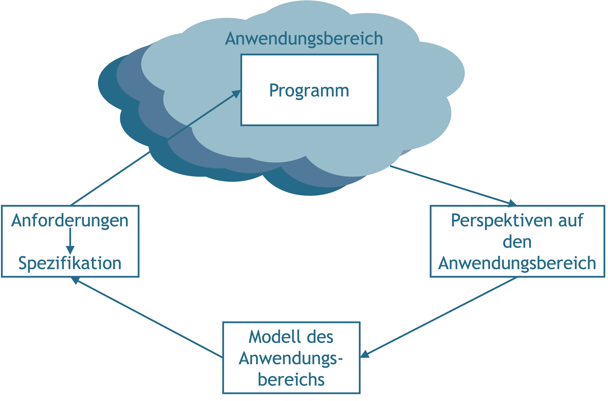
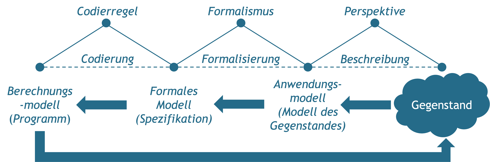
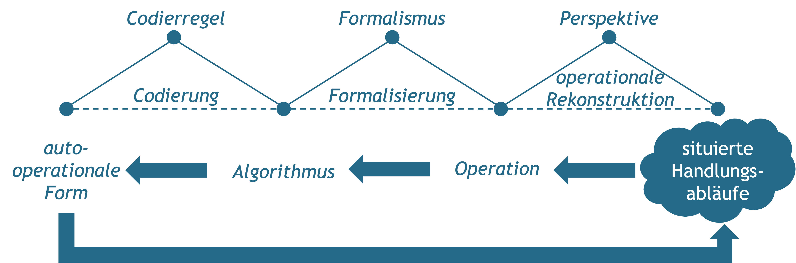
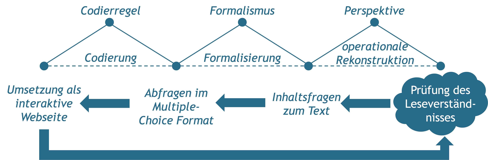
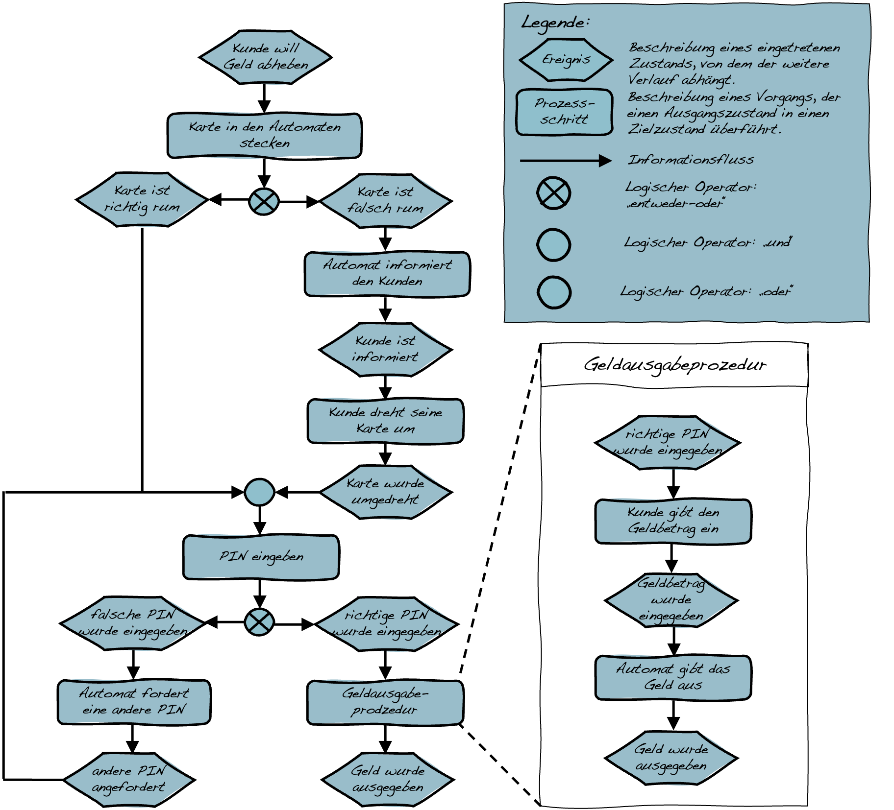

# Modellierung und Formalisierung

Ein wesentliches Moment digitaler Technologien besteht in der **automatisierten Ausführung und Steuerung praktisch relevanter Vorgänge** auf Basis von Algorithmen. Die Entwicklung digitaler Technologien setzt dementsprechend voraus, dass die zu automatisierenden Vorgänge in einer Weise beschrieben werden, die von einem Computer verarbeitet werden können. Zentrale Grundlage hierfür bildet die **formale Modellierung des jeweiligen Anwendungsbereichs**.

Diejenigen, die an der Entwicklung einer digitalen Technologie beteiligt sind, entwickeln dabei Modelle, sowohl der aktuellen Situation wie auch einer antizipierten Zukunft. Ein zentraler Gegenstand der Modellierung sind dabei jene Praktiken, innerhalb derer das jeweilige Produkt zum Einsatz kommen soll.

```{r fig12,fig.cap="»Any program is a model of a model within a theory of a model of an abstraction of some portion of the world or of some universe of discourse.« [@lehmanProgramsLifeCycles1980, S. 1061].", echo=FALSE, fig.align='center', dev='png', out.width='75%'}

```

## Modellierung und Formalisierung als Voraussetzungen der Digitalisierung


```{r fig13,fig.cap="Programmierung als ein mehrstufiger Übersetzungsprozess.", echo=FALSE, fig.align='center', dev='png'}

```

Das Programmieren und damit auch die Entwicklung digitaler Dinge lässt sich im Kern als ein **Prozess der Modellierung** verstehen (siehe <span style=color:#256B89>Abb. 9.1</span>). Das von einem Computer ausführbare Programm ist letztendlich ein Modell, eine Beschreibung für die Lösung einer Aufgabe, die so formuliert ist, dass sie von einem Computer ausgeführt werden kann [@floydModellierungHandgriffZur1998; @humbertInformatikUbergreifendeEinzigartige2002; @rechenbergInformatikHandbuch2002].

Ein **Programm** ist insofern ein **›Berechnungsmodell‹**, das darstellt, wie Daten zu verarbeiten sind, damit ein bestimmtes Ergebnis erzielt werden kann. Damit ein Programm von einem Computer verarbeitet werden kann, muss es so formuliert sein, dass die Anwendung der im Programm beschriebenen Regeln eindeutig ist und unabhängig von der Bedeutung der zu verarbeitenden Daten erfolgen kann. Ein Programm setzt somit bereits ein **formales Modell** der Aufgabe wie auch der Lösung voraus. Das, was das Programm leisten soll, muss deshalb im Rahmen einer **›Spezifikation‹** eindeutig definiert sein. Da jedoch handlungspraktische Situationen und die mit ihnen einhergehenden **›Aufgaben‹** nicht eindeutig definiert sind, sondern in unterschiedlicher Weise interpretiert und beschrieben werden können, geht (zumindest im Fall anwendungsbezogener Programme) der Spezifikation bereits eine Modellierung des Anwendungsbereichs voraus. Entsprechende **›Anwendungsmodelle‹** implizieren dabei immer auch eine bestimmte Vorstellung davon, wie der Gegenstandsbereich organisiert ist.

Der Prozess des Programmierens lässt sich dementsprechend als ein mehrstufiger Vorgang verstehen (siehe <span style=color:#256B89>Abb. 9.2</span>). Ausgehend von einem konkreten Gegenstand oder einer Situation wird zunächst ein Anwendungsmodell erstellt, aus dem hervorgeht, welche Aspekte des Gegenstandsbereichs als relevant und welche Zustände als (nicht) wünschenswert betrachtet werden. Dieses Anwendungsmodell wird dann in eine formale Spezifikation überführt, aus der hervorgeht, was ein entsprechendes Programm leisten soll, bevor dieses dann in einem Berechnungsmodell realisiert werden kann. Da die verschiedenen Modellarten nicht direkt ineinander überführt werden können, bedarf es jeweils einer **›Übersetzung‹**, mittels derer die unterschiedlichen Modelle miteinander in Beziehung gesetzt werden [siehe hierzu ausführlicher @haeusslingZurRolleEntwuerfen2016].

## Von situierten Handlungsabläufen zur ›autooperationalen Form‹

Die Vorstellung der Programmierung wie auch der Entwicklung digitaler Technologien als Prozess der Modellierung lässt zunächst offen, was eigentlich modelliert und formalisiert wird. Hiermit verbunden ist die Frage, ob es in der Informatik eine bestimmte Vorstellung davon gibt, wie der Gegenstandsbereich organisiert ist. Eine mögliche Antwort auf diese Frage liefert die von der Informatikerin Christiane Floyd aufgestellte These, dass »Informatik […] in beliebigen Bereichen menschlicher Praxis [eingreift] und […] den jeweils interessierenden Bereich als **operationale Form** [begreift]« [@floydAutooperationaleFormUnd1997, S. 238].

Unter einer operationalen Form versteht Floyd dabei »eine Struktur aus möglichen Operationen in einem interessierenden Gegenstandsbereich« [@floydAutooperationaleFormUnd1997, S. 242]. Im Gegensatz zum praktischen Vollzug ist die Operation dabei kein Prozess, sondern die Beschreibung eines Prozesses und damit ein Modell. Entsprechend lässt sich etwa ein Rezept zum Backen von Pfannkuchen oder die Bedienungsanleitung einer Waschmaschine als operationale Form verstehen. Ein wesentliches Charakteristikum der operationalen Form ist ihre Übertragbarkeit, denn »[e]s geht darum, Schritte des Vollzugs so zu charakterisieren, dass ihre Voraussetzungen und Ergebnisse sowie ihre Randbedingungen geklärt sind, um sie wiederholbar und planbar zu machen« [@floydAutooperationaleFormUnd1997, S. 242]. Die Übersetzung situierter Handlungsabläufe in operationale Formen bezeichnet Floyd als operationale Rekonstruktion. Mittels Formalisierung lassen sich operationale Formen dann zunächst in Algorithmen und mittels Codierung in **autooperationale Formen** übersetzen, die von einem Computer ausgeführt werden können (siehe <span style=color:#256B89>Abb. 9.3</span>).

Entscheidend an der Argumentation von Floyd ist, dass operationale Rekonstruktionen zugleich reduktiv wie auch produktiv sind. Operationale Rekonstruktionen sind einerseits **reduktiv**, da sie von den Details des Einzelfalls abstrahieren und sich auf das vermeintlich Wesentliche und Regelhafte konzentrieren. Andererseits sind sie **produktiv**, da sie neue und ausdifferenziertere Praktiken ermöglichen. So limitiert etwa ein Texteditor den verfügbaren Zeichensatz, macht es aber möglich ein und denselben Satz immer wieder zu verändern, ohne dabei sichtbare Spuren zu hinterlassen. Die (auto-)operationalen Formen wirken auf diese Weise auf die jeweiligen Praktiken zurück und transformieren diese.


```{r fig14,fig.cap="Übersetzungsschritte von situierten Handlungsabläufen zur autooperationalen Form.", echo=FALSE, fig.align='center', dev='png'}

```

## Beispiel & Diskussionspunkt Antolin

Die für die Entwicklung digitaler Produkte notwendigen ›Übersetzungen‹ lassen sich an [Antolin](https://antolin.westermann.de/) als einer Plattform zur Leseförderung exemplarisch veranschaulichen. Im Mittelpunkt der folgenden Rekonstruktion steht dabei die auf Antolin realisierte Überprüfung des Leseverständnisses der Schüler\*innen mittels einer Reihe von Multiple-Choice-Fragen zu den jeweils gelesenen Büchern.

Dieser Prozess ist im Kontext von Antolin zentral, da sich an ihm die Punktevergabe und damit die ›Vermessung‹ des Leseverhaltens der Schüler\*innen festmacht.

Hinsichtlich der Überführung situierter Handlungsabläufe in eine ›autooperationale Form‹, lassen sich folgende Übersetzungsschritte ausmachen:

```{r, echo=FALSE, fig.align='center', dev='png'}

```

&nbsp;

::: {.blackbox data-latex=""}
*Von welchen Aspekten des Leseverständnisses wird abstrahiert? Welche neuen Möglichkeiten eröffnen sich?*
:::


## Rekonstruktion von Prozessketten

**Ziel**

Die Rekonstruktion von Prozessketten dient dazu, die Schritte eines Vorgangs so zu beschreiben, dass die entsprechenden Prozesse geplant und wiederholt durchgeführt werden können.

**Leitgedanke**

Die Rekonstruktion von Prozessketten basiert auf der Idee, dass sich wesentliche Aspekte wiederkehrender Prozesse so beschreiben lassen, dass diese Beschreibungen als Anleitungen für andere Menschen aber auch als Grundlage für eine automatisierte Bearbeitung dienen können. Bei der Rekonstruktion werden komplexe Prozesse in einzelne voneinander unterscheidbare Operationen zerlegt, die jeweils durch spezifische Ein- und Ausgaben sowie Bearbeitungsregeln definiert sind. Da entsprechende Modelle von den Details individueller Prozesse abstrahieren, geht mit ihrer Rekonstruktion auch immer eine Unterscheidung von Wesentlichem und Unwesentlichem einher.


**Anwendungskontext**

Ausgangspunkt für die Rekonstruktion bilden wiederkehrende und regelhaft verlaufende Prozesse. Hierbei kann es sich beispielsweise um routinierte Handlungen, Methoden und Verfahren handeln.

```{r, echo=FALSE, fig.align='center', dev='png'}

```

**Arbeitsschritte**

 1. Auswahl eines wiederkehrenden Handlungsablaufs.
 2. Sammlung und Sichtung bereits bestehender Beschreibungen des fraglichen Handlungsablaufs (z.B. Anleitungen, Richtlinien, Tutorials).
 3. Identifikation und Benennung relevanter Ereignisse und Prozesse.
 4. Organisation und Visualisierung der Ereignisse und Prozesse in einer Prozesskette.

**Ergebnisformat**

Ein grafische Darstellung als Prozesskette.

**Praktische Tipps**

-   Am Anfang und Ende einer Prozesskette steht jeweils ein Ereignis, das den Ausgangs- beziehungsweise Endzustand beschreibt.
-   **Zwischen zwei Ereignissen liegt immer ein Prozess**, der von einem zum nächsten Ereignis führt.
-   Prozesse können sowohl von Menschen wie auch von einem technischen Gerät ausgeführt werden.


**»Fallstricke«**

-   Die Rekonstruktion von Prozessketten ist kein Abbildungs-, sondern ein Übersetzungsprozess, der ein kreatives Moment beinhaltet.
-   Prozessmodelle lassen sich in unterschiedlichster Form darstellen, wichtig ist, dass alle Elemente definiert sind und konsistent verwendet werden.
-   **Auf ein Ereignis darf keine ›entweder-oder‹-Operation folgen.**


**Weiterführende Literatur zum Leittext**

Floyd, C. (2002). Developing and Embedding Auto-Operational Form. In Y. Dittrich, C. Floyd, & R. Klischewski (Hrsg.), *Social Thinking—Software Practice* (S. 5–28). MIT Press.

Floyd, C. (1997). Autooperationale Form und situiertes Handeln. *CognitioHumana- XVII. Deutscher Kongreß für Philosophie*, 237
252. https://doi.org/10.1515/9783050073651

Keller, G., Nüttgens, M., & Scheer, A.-W. (1992). *Semantische Prozeßmodellierung auf der Grundlage »Ereignisgesteuerter Prozeßketten (EPK)*« (Nr. 89; Veröffentlichungen des Instituts für Wirtschaftsinformatik (IWi)). Universität des Saarlandes. https://web.archive.org/web/20190109111105/http://www.unisaarland.de/fileadmin/user_upload/Fachrichtungen/fr13_BWL/professuren/PDF/heft89.pdf


