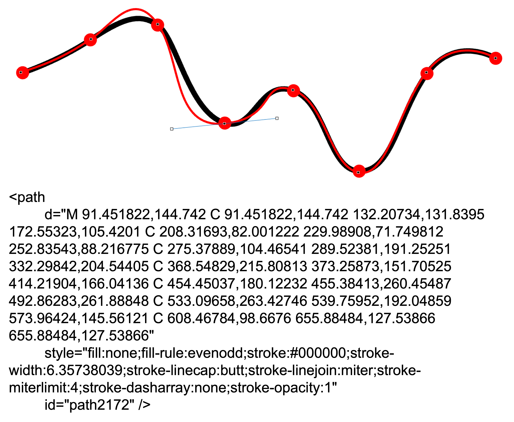
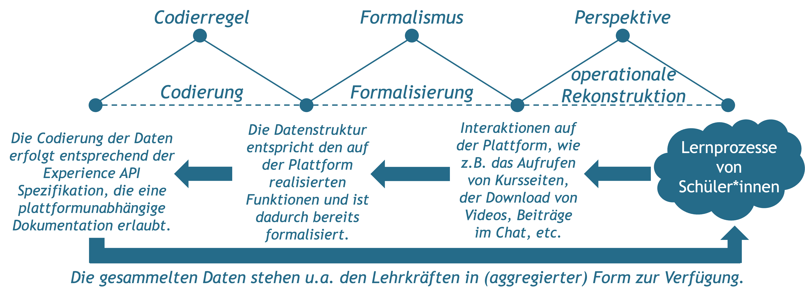
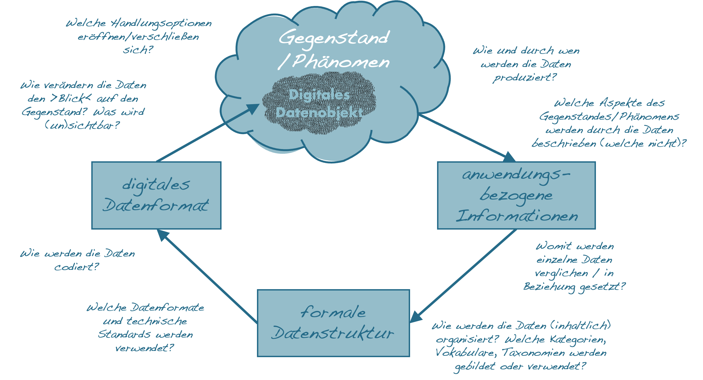

# Daten und Informatisierung

Die automatisierte Ausführung und Steuerung praktisch relevanter Vorgänge mittels digitaler Technologien setzt neben der operationalen Rekonstruktion von Prozessen immer auch die **Übersetzung relevanter Phänomene in Daten** voraus. Das, was in einem bestimmten Gegenstandsbereich als relevant erachtet wird, muss zunächst in Form von Daten verfügbar gemacht werden, bevor es von einem Programm verarbeitet werden kann.

»In solving a problem with or without a computer it is necessary to choose an abstraction of reality, i.e., to define a set of data that is to represent the real situation. This choice must be guided by the problem to be solved.« [@wirthAlgorithmsDataStructures1976]

```{r fig15,fig.cap="Die Übersetzung eines Linienzugs in ein digitales Datenobjekt.", echo=FALSE, fig.align='center', dev='png'}

```

## Die Datafizierung des Gegenstandsbereich als Voraussetzung der Digitalisierung

Informationen können nur dann von digitalen Technologien verarbeitet werden, wenn sie in Form eindeutig bestimmter Daten vorliegen. Daten können dabei aus informatischer Sicht als eine **»reinterpretable representation of information in a formalized manner suitable for communication, interpretation, or processing«** [@iec23822015InformationTechnologyVocabulary2015] verstanden werden, die in diskreten Datenobjekten organisiert sind.

Entgegen der etymologischen Bedeutung des Wortes Datum als dem **Gegebenem**, sind Daten im informationstechnischen Sinne vielmehr etwas *Gemachtes*. Sie werden in einer Weise erzeugt, die für die automatisierte Kommunikation, Interpretation und Verarbeitung geeignet ist. Damit dies möglich wird, muss ihre Verarbeitung **vollkommen unabhängig von der Interpretation durch einen Menschen** sein [vgl. @nakeAlgorithmischeZeichen2001] . Daten existieren dementsprechend nicht nur an und für sich, sondern müssen mit Hilfe entsprechender praktischer Vorkehrungen und Instrumente erzeugt werden [vgl. z.B. @gitelmanIntroduction2013; @giessmannWasIstDatenkritik2014]. Da analoge, kontinuierliche Ereignisse zum Zweck der digitalen Verarbeitung in diskrete Datenobjekte überführt werden müssen, impliziert die Generierung immer auch den Rückgriff auf entsprechende Datenmodelle und eine hiermit einhergehende explizite oder implizite Kategorisierung. Die Entwicklung digitaler Technologien bedingt insofern immer auch eine **»Informatisierung des Gegenstandsbereichs«** [@floydAutooperationaleFormUnd1997, S. 245]. Alles, was sich nicht in Daten überführen lässt, entzieht sich somit der digitalen Verarbeitung.

Parallel zum Prozess des Programmierens lässt sich auch die ›Datafizierung‹ als ein **mehrstufiger Vorgang** verstehen (siehe <span style=color:#256B89>Abb. 10.2</span>). Hierbei wird zunächst ein Gegenstand im Anwendungsbereich mittels einer Sammlung relevanter Informationen überführt, die dann in eine formale Datenstruktur und schließlich in ein digitales Datenobjekt übersetzt werden.


```{r fig16,fig.cap="Datafizierung als ein mehrstufiger Übersetzungsprozess.", echo=FALSE, fig.align='center', dev='png'}
knitr::include_graphics('Figures/10-02-Übersetzung.png')
```

## Wesentliche Ideen

**(Digitale) Daten sind Zeichen, die Informationen darstellen -** Daten repräsentieren Informationen über einen Gegenstand. Sie sind eine Form der Beschreibung, die zu einem bestimmten Zweck vorgenommen wird. Damit Daten automatisiert verarbeitet werden können, müssen sie formalisiert werden, sodass ihre Bedeutung eindeutig definiert ist. Im Sinne einer Beschreibung sind Daten nicht gegeben, sondern gemacht. Daten sind insofern niemals ›roh‹ (d.h. unverarbeitet) und können strenggenommen als solche auch nicht gesammelt oder erfasst werden [vgl. @gitelmanIntroduction2013].

**Die Produktion (digitaler) Daten kann selbst in unterschiedlichem Maße automatisiert sein -** (Digitale) Daten können auf unterschiedliche Weise produziert werden. Neben der direkten und gezielten Eingabe durch einen Menschen (z.B. beim Ausfüllen eines Formulars am Bildschirm), können Daten auch durch automatisierte Messgeräte (z.B. Thermometer, GPS, Bewegungssensoren, …) erzeugt werden. Darüber hinaus können digitale Daten auch in der unmittelbaren Interaktion mit einem digitalen Produkt automatisch generiert werden (z.B. Logfile- und Interaktionsdaten). Je nach Art und Weise der Datenproduktion verlagern sich die Kontrollmöglichkeiten für die Anwender\*innen.

**Als Beschreibungen sind Daten reduktiv -** Wie alle anderen sprachlichen Beschreibungsformate sind auch Daten reduktiv, da sie von der Komplexität realweltlicher Phänomene abstrahieren und entsprechend der jeweiligen Zwecksetzung Wesentliches von Unwesentlichem trennen [vgl. @floydAutooperationaleFormUnd1997; @nakeAlgorithmischeZeichen2001]. Als Beschreibungen abstrahieren Daten insbesondere von der Einzigartigkeit und Überschüssigkeit der Dinge und fokussieren die Gemeinsamkeiten und Beziehungen zwischen den Dingen, die bereits bekannt sind (und sich in Daten fassen lassen).

**Daten sind aggegrativ -** Daten erlangen ihre Aussagekraft durch den Vergleich und die Bezugnahme auf andere Daten. Als Datenobjekte haben sie zwar einen eigenständigen Charakter, bedeutsam werden sie aber erst in Relation zu anderen Daten (z.B. steht ein geschichtliches Datum in einem chronologischen Verhältnis zu anderen Daten). Die Produktion von Daten ist dementsprechend ein auf Systematisierung und Akkumulation ausgerichteter Prozess. Daten sind somit immer auch Teil umfassender Datensammlungen [vgl. @giessmannWasIstDatenkritik2014].

**Die systematische Nutzung von Daten erfordert die Entwicklung von Kategorien und standardisierter Datenformate -** Sobald Daten gesammelt und aggregiert werden, bedarf es definierter Kategorien und standardisierter Datenformate, damit Daten verglichen und ausgetauscht werden können. Entsprechende Kategorien legen zum Beispiel fest, welche Merkmalsausprägungen einer zu beschreibenden Eigenschaft unterschieden werden sollen und wie die einzelnen Merkmalsausprägungen definiert sind. Datenformate wiederum regeln, wie die Daten codiert werden, sodass sie in automatisierter Weise verarbeitet werden können.

**Als digitale Datenobjekte intervenieren Daten in die Gegenstandsbereiche, die sie zu repräsentieren vorgeben -** Als Objekte sind Daten selbst Gegenstand sozialer Praktiken. Insofern sich in hochgradig technisierten Gesellschaften viele Phänomene erst durch komplexe Datensammlungen erschließen oder selbst das Produkt digitaler Technologien sind, haben Daten nicht nur eine repräsentierende, sondern auch eine wirklichkeitskonstitutierende Funktion. Daten werden insofern zunehmend zu einem Bezugspunkt, an dem Individuen wie auch soziale Gruppen ihr Handeln orientieren.


## Beispiel und Diskussionspunkt – Die Datafizierung von Lernprozessen in Lernmanagementsystemen

Mit der zunehmenden Verbreitung digitaler Technologien ist auch das Interesse an der Dokumentation und Analyse von Lernprozessen gestiegen. Digitale Schulbücher, Anwendungen und Lernmanagementsysteme stellen in vielen Fällen nicht mehr nur Inhalte oder Lernangebote zur Verfügung, sondern dokumentieren auch das Interaktionsverhalten der Lernenden. Anhand der gesammelten Daten können sich, je nach Konfiguration der Anwendung, die Lehrer\*innen, Eltern, und/oder Schüler\*innen über ihre Aktivitäten wie auch die jeweiligen Lernfortschritte informieren.

Die Datafizierung von Lernprozessen lässt sich, wie im Folgenden  am Beispiel eines Lernmanagementsystems dargestellt, als eine Reihe von Übersetzungsschritten auffassen.


```{r, echo=FALSE, fig.align='center', dev='png'}

```

&nbsp;

::: {.blackbox data-latex=""}
*Welche Aspekte des Lernens finden durch die verschiedenen Übersetzungen besondere Beachtung und welche werden nicht erfasst beziehungsweise ausgeblendet?*
:::


## Anwendungsbezogene Datenkritik

**Ziel**

Ziel der anwendungsbezogenen Datenkritik ist es, die mit der Produktion von Daten einhergehenden Übersetzungen nachzuzeichnen und den Einfluss der Datafizierung auf den Gegenstandsbereich zu reflektieren.

**Leitgedanke**

Die anwendungsbezogene Datenkritik basiert auf der Idee, dass wesentliche Aspekte eines Gegenstandsbereichs in Daten übersetzt werden müssen, damit sie von digitalen Technologien verarbeitet werden können. Diese ›Informatisierung des Gegenstandsbereichs‹ (Floyd, 1997) lässt sich als ein mehrstufiger und zweckgebundener Prozess verstehen, durch den spezifische Weltzugänge produziert werden. Da Daten von der Komplexität des Gegenstandsbereichs abstrahieren, liegt ihrer Verwendung auch immer eine Unterscheidung von Wesentlichem und Unwesentlichem zugrunde.


**Anwendungskontext**

Ausgangspunkt für die Datenkritik bilden die in einem bestimmten Anwendungskontext generierten und mittels digitaler Technologien verarbeiteten Daten. 

```{r, echo=FALSE, fig.align='center', dev='png'}

```

**Arbeitsschritte**

 1. Identifikation der für eine Anwendung relevanten digitalen Daten.
 2. Identifikation des durch die Daten dargestellten Gegenstandes/Phänomens.
 3. Rekonstruktion der zugrundeliegenden Übersetzungsschritte.
 4. Analyse impliziter Annahmen und Verzerrungen.


**Ergebnisformat**

Erläuterte Illustration grundlegender Übersetzungsschritte.

**Praktische Tipps**

-   Jeder Übersetzungsschritt basiert auf einer Perspektive anhand derer zwischen Wesentlichem und Unwesentlichem unterschieden wird.
-   Zum besseren Verständnis bietet es sich an, die einzelnen Übersetzungsschritte anhand eines Beispiels zu illustrieren.

**»Fallstricke«**

-   Die anwendungsbezogene Datenkritik ist kein Abbildungs-, sondern selbst ein Übersetzungsprozess, der ein kreatives Moment beinhaltet.
-   Gerade dann, wenn Daten als gegeben und ihre Verwendung als alternativlos erscheint, sollte dies die Aufmerksamkeit wecken.

**Weiterführende Literatur zum Leittext**

Dander, V. (2014). Von der ‹Macht der Daten› zur ‹Gemachtheit von Daten›. Praktische Datenkritik als Gegenstand der Medienpädagogik. *Mediale Kontrolle unter Beobachtung*, 3(1), 0–21.

Floyd, C. (1997). Autooperationale Form und situiertes Handeln. *CognitioHumana - XVII. Deutscher Kongreß für Philosophie*, 237–252. https://doi.org/10.1515/9783050073651


