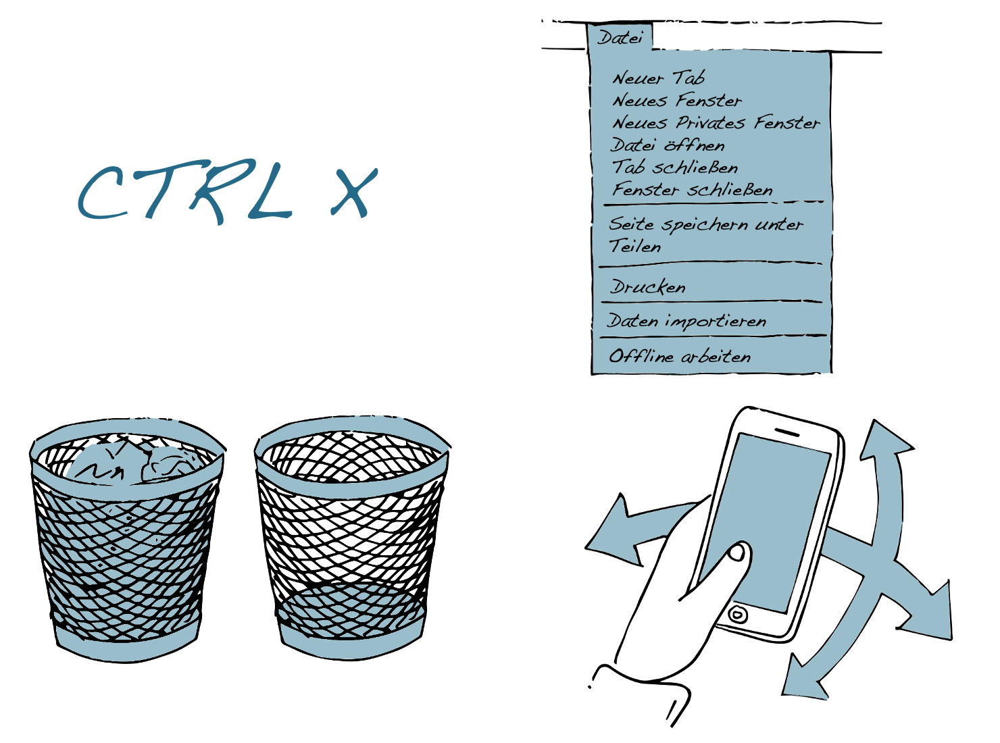
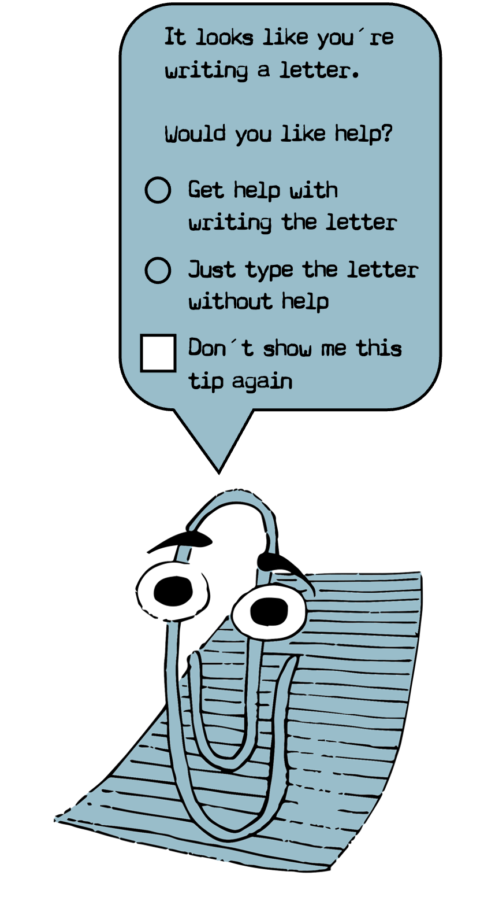
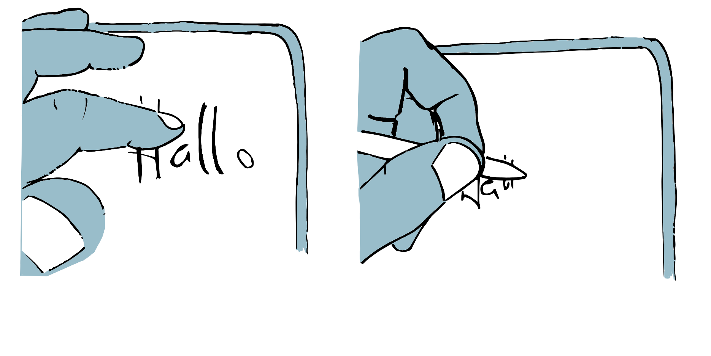
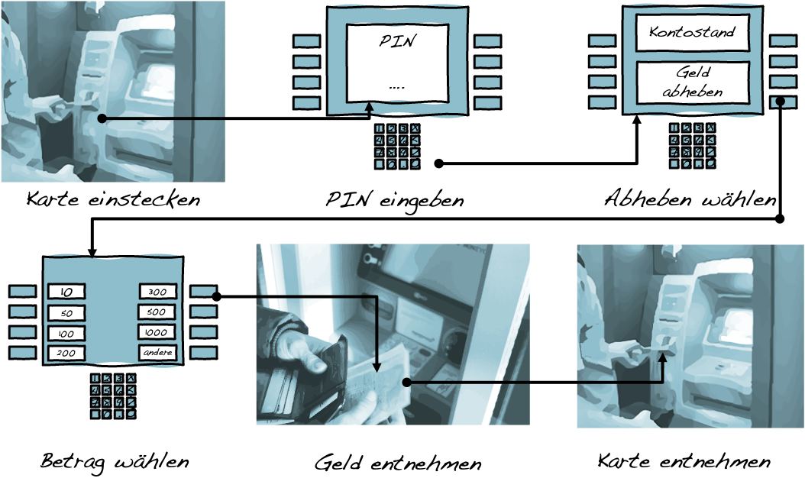

# Schnittstellen

Digitale Technologien sind neben den in ihnen realisierten Algorithmen und Datenstrukturen auch durch die Schnittstellen zu ihrer Umgebung definiert. Diese **Schnittstellen** umfassen sowohl **technische Schnittstellen**, über die eine Verbindung und ein Austausch zu anderen technischen Dingen möglich wird, wie auch die **Benutzungsschnittstellen**, durch die Mensch und Maschine miteinander interagieren.

Benutzungsschnittstellen bestimmen die Möglichkeiten der Mensch-Maschine-Interaktion und sind die Voraussetzung einer praktischen »Kopplung zwischen Mensch und Computer« [@herczegSoftwareergonomie2005, S. 4].

```{r fig17,fig.cap="Beispiele unterschiedlicher Interaktionsformen; vom Befehl über Menüs und grafischen Benutzungsoberflächen zu Gesten.", echo=FALSE, fig.align='center', dev='png'}

```

## Die Einbindung der digitalen Dinge in ihre Umgebung

Damit digitale Dinge, wie etwa ein Textverarbeitungsprogramm, eine Anwendung zur Aufnahme von Fotos mit dem Smartphone oder auch eine Messenger-App, ›funktionieren‹ können, müssen sie sowohl **in ihre technische wie auch nicht-technische Umgebung eingebunden** sein. Hierzu bedarf es vielfältiger **Schnittstellen (Interfaces)**, die eine Verbindung zwischen den verschiedenen digitalen Dingen, aber auch zwischen den digitalen Dingen und ihren Anwender\*innen herstellen.

Eine Schnittstelle lässt sich dabei sehr allgemein als eine **gemeinsame Grenze zwischen zwei funktionalen Einheiten** verstehen, die durch eindeutig definierte Funktionen, physische Verbindungen oder Formate zum Informationsaustausch charakterisiert ist [vgl. @iec23822015InformationTechnologyVocabulary2015]. Schnittstellen ermöglichen die Interaktion bzw. Kommunikation zwischen unterschiedlichen Dingen. Durch die eindeutige Definition der Schnittstelle wird die Interaktion bzw. Kommunikation über die gemeinsame Grenze hinweg möglich, ohne dass die hieran beteiligten Dinge oder Akteur\*innen wissen müssen, wie eine bestimmte Funktion auf der anderen Seite der Grenze realisiert ist oder wie die übermittelten Informationen dort konkret verarbeitet werden. Voraussetzung für eine funktionierende Schnittstelle ist vielmehr die ›Passfähigkeit‹ der durch die Schnittstelle verbundenen Dinge.

Neben **Hardwareschnittstellen**, über die verschiedene Geräte physisch miteinander verbunden werden (z.B. USB-Anschluss), regeln **Softwareschnittstellen** den Austausch von Daten und die Synchronisation bzw. Steuerung von Prozessen zwischen unterschiedlichen Programmen oder Programmkomponenten. Die sogenannten **Benutzungsschnittstellen** (user interfaces) markieren wiederum die Grenze, bzw. die Punkte, eines technischen Gerätes, an denen menschliche Akteur\*innen mit diesem interagieren. Auch die Benutzungsschnittstellen können sowohl hardware- (z.B. Maus, Touchscreen, Mikrofon) wie auch softwaretechnisch (z.B. virtueller Desktop) realisiert sein. Benutzungsschnittstellen umfassen sowohl **Eingabe-** (z.B. per Tastatur, Gesten, Sprache, etc.) wie auch **Ausgabemöglichkeiten** (z.B. per Bildschirm, Lautsprecher, Drucker etc.), mittels derer menschliche Akteur\*innen mit einer digitalen Technologie interagieren können.

```{r fig18,fig.cap=" Der digitale Assistent ›Karl Klammer‹ in Microsoft Office 2000.", echo=FALSE, fig.align='center', dev='png', out.width='50%'}

```

##  Formen der Mensch-Maschine-Interaktion

Im Unterschied zu anderen Schnittstellen lässt sich bei Benutzungsschnittstellen nur die technische Seite formal festlegen. Die menschliche Seite bleibt zumindest in Teilen unbestimmt; unerwartetes und spontanes Verhalten ist möglich. Zudem ist der Umgang mit technischen Dingen immer auch von den individuellen Erfahrungen und Erwartungen der Anwender\*innen geprägt, die nur bedingt den tatsächlich realisierten technischen Bedingungen entsprechen müssen. Eine zentrale Herausforderung bei der Gestaltung besteht deshalb darin, Interaktionsformen zu finden, die die technischen Gegebenheiten mit den Gewohnheiten und Erwartungen der Anwender\*innen in Einklang bringen.

Im Laufe der Zeit sind verschiedene Formen der Mensch-Maschine-Interaktion entwickelt worden. Das Spektrum reicht von der Interaktion durch **›Befehle‹**, über die **menübasierte Steuerung** von Programmen und **grafische Benutzeroberflächen**, in denen Interaktionselemente bildlich dargestellt und z.B. mittels einer Maus bedient werden, bis hin zur Steuerung digitaler Technologien durch **Sprache, Gesten oder der direkten Manipulation der physischen Umwelt**, etwa mittels gegenständlicher Benutzungsschnittstellen (tangible user interfaces). Die Benutzungsschnittstellen setzen dabei jeweils ein entsprechendes Vorwissen der Anwender\*innen voraus. Während Befehle explizit gelernt werden müssen, erfordern sowohl grafische wie auch gegenständliche Benutzungsschnittstellen oft ein praktisches Erfahrungswissen [vgl. z.B. @schelhoweTechnologieImaginationUnd2007]. Einen Grenzfall bilden sogenannte **unsichtbare Benutzungsschnittstellen**, die keine bewusste Interaktion voraussetzen, sondern vielmehr menschliches Verhalten automatisiert registrieren und auf dieses eigenständig reagieren, wie etwa bei automatischen Türöffnern oder Schrittzählern im Smartphone.

Ebenso vielfältig wie die Formen der Eingabe sind auch die Ausgabemöglichkeiten, mittels derer die Anwender\*innen über den jeweiligen Zustand des digitalen Systems und die verfügbaren Handlungsoptionen informiert werden. Die Möglichkeiten reichen hierbei von optischen, akustischen oder taktilen **Hinweisreizen** über die Ausgabe von **Fehlermeldungen** und spezifischen **Eingabeaufforderungen** bis zur **Sperrung bestimmter Funktionen**.

Die Ausgestaltung der Benutzungsschnittstelle impliziert auch immer eine Form der Führung der Anwender\*innen im Interaktionsprozess. Während es bei ›kritischen‹ Prozessen oft zu einer **direkten Steuerung** des Interaktionsprozesses, etwa durch die Aufforderung zu zwingend erforderlichen Eingaben, kommt, haben die Anwender\*innen in anderen Fällen die **Möglichkeit, den Interaktionsprozess ihren eigenen Vorstellungen und Bedürfnissen anzupassen**. Eine Grauzone tut sich dort auf, wo die Benutzungsschnittstellen so angelegt sind, dass sie den Anwender\*innen formal eine Wahl lassen, aber zugleich aufgrund ihrer Gestaltung bestimmte Handlungsoptionen nahelegen oder die Wahl alternativer Optionen erschweren [vgl. z.B. @dieterDarkPatternsInterface2015].

Benutzungsschnittstellen sind darüber hinaus immer auch **Gegenstand kultureller Codierungen** [@manovichLanguageNewMedia2001]. Sie haben Einfluss darauf, wie Anwender\*innen den Computer und die medialen Objekte, auf die sie mittels digitaler Technologien zugreifen, wahrnehmen und verstehen. Indem Schnittstellen eine bestimmte Organisation der (digitalen) Welt nahelegen und bestimmte Interaktionsformen erfordern, bilden sie die jeweiligen Verhältnisse nicht bloß ab, sondern schreiben bestehende kulturelle Muster und Ideen fort. 


::: {.blackbox data-latex=""}
*Welche Formen der Interaktion erleben Sie in Ihrem Alltag als besonders hilfreich oder problematisch?*
:::

&nbsp;

```{r, echo=FALSE, fig.align='center', dev='png'}

```


::: {.blackbox data-latex=""}
*Was ist eigentlich die ›natürlichste‹ Art, in einem digitalen Medium zu schreiben?*
:::

##  Kartierung von Benutzungsflüssen

**Ziel**

Benutzungsflüsse dienen der Darstellung der Interaktionen, die Anwender\*innen bei der Durchführung einer Handlung mit einem technischen Artefakt durchlaufen.

**Leitgedanke**

Die Kartierung von Benutzungsflüssen basiert auf der Idee, dass Anwender\*innen bei der Nutzung digitaler Technologien für gewöhnlich eine Reihe von Schritten durchlaufen müssen, um die von ihnen intendierten Handlungen auszuführen. Bei jedem dieser Schritte müssen sie mit der Technologie über die jeweils vorhandenen Benutzungsschnittstellen interagieren. Die für die einzelnen Schritte notwendigen Interaktionen basieren auf den Gestaltungsentscheidungen der Entwickler\*innen wie auch auf (kulturellen) Konventionen und Erwartungen der Anwender\*innen.


**Anwendungskontext**

Benutzungsflüsse eignen sich sowohl zur Beschreibung aktueller wie auch antizipierter Interaktionsprozesse.

```{r, echo=FALSE, fig.align='center', dev='png'}

```

**Arbeitsschritte**

 1. Auswahl des zu kartierenden Prozesses.
 2. Identifikation zentraler Handlungsschritte und hiermit einhergehender Interaktionen.
 3. Dokumentation der einzelnen Prozessschritte mit Hilfe von Fotos, Screenshots oder Entwurfszeichnungen der jeweiligen Benutzungsschnittstellen.
 4. Kurzbeschreibung der einzelnen Prozessschritte und Visualisierung des Verlaufs.


**Ergebnisformat**

Ein Diagramm des Benutzungsflusses anhand von Fotos, Screenshots oder Entwurfszeichnungen der jeweiligen Benutzungsschnittstellen.

**Praktische Tipps**

-   Benutzungsflüsse sollen die zur Durchführung einer Handlungen notwendigen Interaktionen möglichst detailliert darstellen.
-   Es soll deutlich werden, welche Fähigkeiten und Kenntnisse für die jeweilige Interaktion erforderlich sind.

**»Fallstricke«**

-   Bei der Dokumentation der Interaktionen ist zu überlegen, wie sich diese am besten darstellen lassen. Screenshots reichen hier unter Umständen nicht aus.

**Weiterführende Literatur zum Leittext**

Vang, D. (2018, 22. April. User Journey v. User Flow - Dan Vang. Medium. 
https://medium.com/@danvang/user-journey-vs-user-flow-d5f32ae6c555

