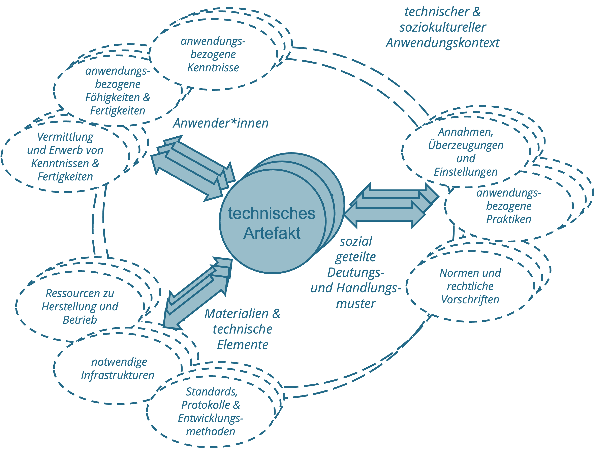
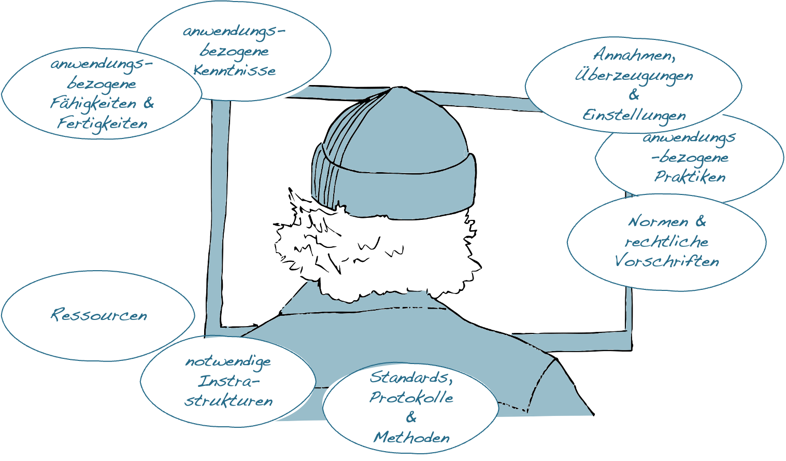
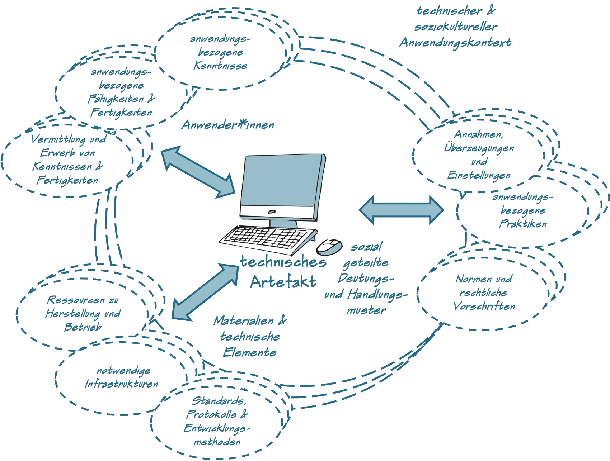

# Soziotechnische Milieus & Subjektivierung

Wie bei allen technischen Dingen ist auch die Existenz und Funktion digitaler Technologien an spezifische und auf sie abgestimmte Rahmenbedingungen gekoppelt. Neben geeigneten Ressourcen, Infrastrukturen und Produktionsbedingungen bedarf es hierfür sowohl entsprechender Fertigkeiten und Kenntnisse der Anwender\*innen wie auch sozial geteilter Deutungs- und Handlungsmuster, die den praktischen Einsatz der technischen Artefakte ermöglichen und zugleich regulieren.

```{r fig19,fig.cap="Strukturelemente soziotechnischer Milieus.", echo=FALSE, fig.align='center', dev='png'}

```

## Digitale Technologien und ihre assoziierten soziotechnischen Milieus

Obwohl es weitgehend unstrittig ist, dass technische und damit auch digitale Artefakte nicht aus sich selbst heraus existieren und funktionieren, so unterscheiden sich doch die Vorstellungen hinsichtlich der Beziehung zwischen den technischen Dingen und ihrer ›Umwelt‹.

Während klassische ingenieurswissenschaftliche Ansätze diese Beziehung vor allem im Sinne einer Anpassung der technischen Artefakte an gegebene Umweltbedingungen konzipieren, unterstellen insbesondere kulturwissenschaftlich orientierte Ansätze komplexe und reziproke Anpassungsprozesse zwischen den Dingen und ihrer Umwelt [vgl. z.B. @akrichDescriptionTechnicalObject1992]. Kulturwissenschaftlich orientierte Ansätze gehen insofern davon aus, dass die Entwicklung und der Gebrauch technischer Artefakte nicht nur durch die jeweiligen Umweltbedingungen (mit-)bestimmt ist, sondern dass die Artefakte selbst Einfluss auf die Umwelten nehmen, in denen sie eingesetzt werden.

Der französische Technikphilosoph Gilbert Simondon hat diesen Gedanken zugespitzt, indem er davon ausgeht, dass die Entwicklung anwendungsfähiger technischer Artefakte immer auch mit der Ausbildung ›assoziierter Milieus‹ einhergeht. Aus der von Simondon entwickelten Perspektive erlangen die technischen Dinge ihre Funktion und Bedeutung erst mit der Ausbildung entsprechender Milieus, die zwar mit der Technikentwicklung einhergehen aber nicht gezielt hergestellt werden können [@simondonExistenzweiseTechnischerObjekte2012].

Wie verschiedene Autor\*innen im Anschluss an Simondon argumentieren, haben die mit einer Technologie assoziierten Milieus nicht nur eine technische und natürliche, sondern immer auch eine soziale und kulturelle Dimension [vgl. z.B. @delitzGilbertSimondonsTheorie2012; @hoelOntologicalForceTechnicity2013; @huiWhatDigitalObject2012; @mackenzieProblematisingTechnologicalObject2005]. Eine ähnliche Überlegung findet sich in Christiane Floyds Konzept der »Informatisierung des Gegenstandsbereichs« [@floydAutooperationaleFormUnd1997, S. 245] im Zuge der Entwicklung digitaler Technologien wieder.

Der **Begriff des Milieus** ist sowohl in den Natur- wie auch den Sozial- und Kulturwissenschaften weit verbreitet und wird häufig synonym mit Begriffen wie Umwelt oder Kontext verwendet. Während die Begriffe Umwelt und Kontext oftmals als eine Art Hintergrund oder Rahmen verstanden werden, vor oder in dem ein bestimmtes Objekt oder ein Organismus existiert, unterläuft der Begriff des Milieus die Unterscheidung zwischen Organismus und Umwelt, bzw. Objekt und Kontext. Der Begriff des Milieus, im hier verwendeten Sinn, betont vielmehr den Umstand, dass das Milieu, von dem ein Organismus oder auch ein technisches Objekt abhängig ist, durch den Organismus bzw. das Objekt selbst organisiert und hervorgebracht wird. Das Milieu ist insofern »a pure system of relations without supports« [@canguilhemKnowledgeLife2008, S. 103].

Die assoziierten Milieus technischer Artefakte umfassen unter anderem (a) entwicklungstechnische Konventionen und Vereinbarungen, wie **Standards, Protokolle und Methoden**, (b) **Ressourcen** zu Herstellung und Betrieb der technischen Dinge, (c) **Infrastrukturen** in bzw. auf denen sie operieren können, (d) sozial geteilte und sanktionierte **Normen und (rechtliche) Vorschriften** zum Gebrauch der Artefakte, (e) sozial geteilte **Überzeugungen und Einstellungen** zur Bedeutung und Funktion der Dinge, (f) kollektive und auf die Technologie abgestimmte **Praktiken**, (g) anwendungsbezogene **Fertigkeiten und Fähigkeiten**, (h) anwendungsbezogene **Kenntnisse** sowie (i) **Verfahren zur Vermittlung und zum Erwerb** der im Umgang mit den Artefakten notwendigen Kenntnisse und Fertigkeiten (siehe <span style=color:#256B89>Abb. 12.1</span>).

## Digitale (Medien-)Ideologien und Modelle des Menschen

Wie bereits angedeutet haben die assoziierten Milieus technischer Artefakte nicht nur eine technische und natürliche, sondern immer auch eine soziale und kulturelle Dimension. Es bedarf nicht zuletzt entsprechender sozial geteilter Überzeugungen, Einstellungen und Praktiken, damit eine Technologie ihre jeweilige Bedeutung und Funktion erlangen kann.

Die Anthropologin Ilana Gershon hat für die auf Technologien beziehungsweise Medien bezogenen Überzeugungen und Einstellungen den Begriff der ›Medienideologien‹ geprägt [vgl. @gershonMediaIdeologiesIntroduction2010]. **Medienideologien** sind für Gershon das Produkt unserer praktischen und kollektiv geteilten Erfahrungen und prägen unseren Umgang mit digitalen Technologien.

Während Gershon die Bedeutung lokaler Praktiken für die Ausbildung von Medienideologien betont, haben andere Autor\*innen darauf hingewiesen, dass sich in der Verbreitung digitaler Technologien auch grundlegendere **kulturelle Deutungsmuster** widerspiegeln. So hat etwa Christiane Floyd darauf argumentiert, dass in der Ausbildung (auto-)operationaler Formen typisch ›westliche‹ Deutungs- und Handlungsmuster zum Ausdruck kommen, in denen die Regelhaftigkeit und Formalisierbarkeit von Prozessen betont wird [vgl. @floydDevelopingEmbeddingAutoOperational2002]. In ähnlicher Weise hat etwa Bettina Heintz darauf hingewiesen, dass auch der »Erfolg der Künstlichen Intelligenz […] nicht so sehr eine technische als vielmehr eine soziale Angelegenheit [ist]« [vgl. @heintzHerrschaftRegelZur1993, S. 289], die letztlich davon abhängt, wie wir uns selbst zu diesen Technologien in Beziehung setzen und wie wir uns selbst und unsere Rolle in der Welt verstehen.

Technische Artefakte und die mit ihnen assoziierten Milieus beinhalten dementsprechend auch immer spezifische **Modelle des Menschen**. Diese Modelle umfassen etwa Annahmen darüber, wer wir als Menschen sind, was wir können und in welchem Verhältnis wir zu uns, zu anderen wie auch zur (technischen) Welt stehen. Hiermit einher gehen Fragen nach der Identität, Autonomie und Handlungsträgerschaft des Menschen, seiner ›(Un-)Berechenbarkeit‹, wie auch der (Chancen-)Gleichheit und der Verteilung von Macht [ausführlicher hierzu auch @sesinkMenschlicheUndKunstliche2012].

Auch wenn in der aktuellen wissenschaftlichen Diskussion unterschiedliche Positionen hinsichtlich der Frage vertreten werden, inwiefern entsprechende Medienideologien und Modelle des Menschen durch die Entwickler\*innen in die technischen Artefakte ›eingeschrieben‹ werden oder ob sie sich erst im praktischen Gebrauch manifestieren, so ist doch weitgehend unstrittig, dass die technischen Dinge und damit auch die digitalen Technologien keine neutralen Werkzeuge und Instrumente sind, derer wir uns nach Belieben bedienen können. Die technischen Dinge sind vielmehr immer schon Bestandteil und Ausdruck kultureller Entwicklungslinien.

Fragen nach den ›technischen Weltverhältnissen‹ [@zornSelbstWeltUnd2014] kommt dementsprechend in der (medien-)pädagogischer Diskussion eine sehr zentrale Rolle zu.


::: {.blackbox data-latex=""}
*Welche pädagogischen Implikationen ergeben sich aus der Verwicklung des Menschen in die technischen Weltverhältnisse im Kontext Schule?*
:::

&nbsp;

```{r, echo=FALSE, fig.align='center', dev='png'}

```


::: {.blackbox data-latex=""}
*Wie ist eigentlich das assoziierte Milieu einer Power-Point-Präsentation im Unterricht beschaffen?*
:::


## Kartierung assoziierter Milieus technischer Artefakte

**Ziel**

Die Kartierung assoziierter Milieus dient der Verortung technischer Artefakte und der Darstellung grundlegender Rahmenbedingungen. 

**Leitgedanke**

Die Kartierung assoziierter Milieus dient dazu, die für die praktische Einsatzfähigkeit eines technischen Artefakts grundlegenden Rahmenbedingungen zu identifizieren. Die assoziierten Milieus sind dabei zugleich Voraussetzung wie auch Produkt des jeweiligen Artefakts. Neben der Benennung und ›Verortung‹ des technischen Artefakts, gehen hierbei auch die anwendungsbezogene Fertigkeiten und Kenntnisse der Nutzer\*innen, materielle Voraussetzungen sowie kollektive Deutungs- und Handlungsmuster in die Kartierung mit ein.

**Anwendungskontext**

Die Kartierung assoziierter Milieus eignet sich zum Abstecken eines Gegenstandsbereichs und bietet einen Ausgangspunkt für weiterführende Analysen. 

```{r, echo=FALSE, fig.align='center', dev='png'}

```

**Arbeitsschritte**

 1. Auswahl des technischen Artefakts, dessen Milieu kartiert werden soll.
 2. ›Verortung‹ des Artefakts: In welchem technischen und kulturellen Anwendungskontext wird das Artefakt analysiert?
 3. Beschreibung und ggf. Illustration wesentlicher Strukturelemente, die für die praktische Einsatzfähigkeit des Artefakts existenziell sind.
 4. Ggf. Überarbeitung oder Erweiterung der Karte.

**Ergebnisformat**

Eine grafische, evtl. mit Bildern oder Verweisen angereicherte Darstellung der wesentlichen Strukturelemente.

**Praktische Tipps**

-   Die Karte sollte Außenstehenden eine Idee von den für den praktischen Gebrauch der jeweiligen Technologie notwendigen Voraussetzungen vermitteln.
-   Die Beschreibung sollte sich an den Begrifflichkeiten der beteiligten Akteur\*innen orientieren.

**»Fallstricke«**

-   Die technischen Artefakte und ihre Milieus sind keine fixen Entitäten, sondern unterliegen permanenten Veränderungen. Eine entsprechende Kartierung stellt deshalb bestenfalls eine lokale Momentaufnahme dar.
-   Die Strukturelemente der assoziierten Milieus technischer Artefakte ähneln denen sozialer Praktiken. Dies ist darin begründet, dass soziale Praktiken zum Milieu technischer Artefakte gehören und umgekehrt.

**Weiterführende Literatur zum Leittext**

Hui, Y. (2012). What is a digital object? Metaphilosophy, 43(4), 380–395.

Shove, E.,Pantzar, M., & Watson, M. (2012). The Dynamics of Social Practice — Everyday Life and how it Changes. Los Angeles: Sage.


