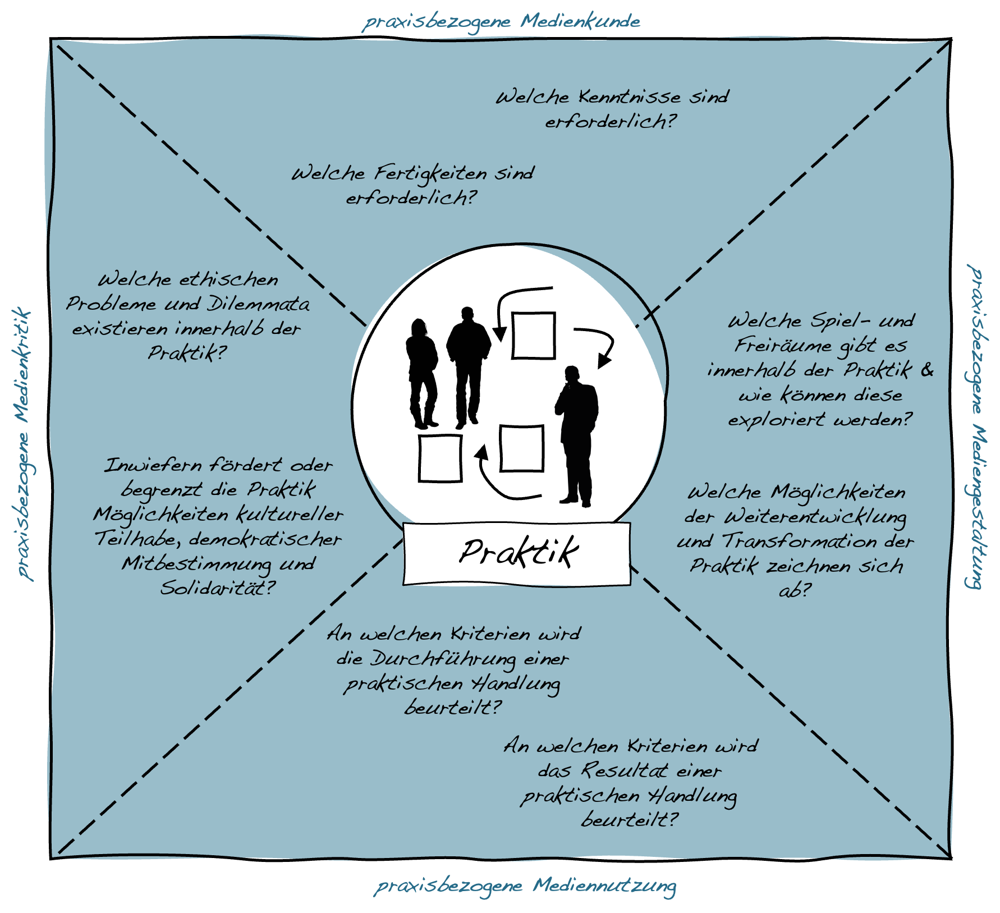

# Schulische Medienbildung & Kompetenzen

Mit der zunehmenden Digitalisierung privater, öffentlicher und beruflicher Lebenswelten wie auch der Möglichkeiten zum Einsatz digitaler Technologien im Unterricht, stellt sich die Frage nach dem Beitrag, den die Institution Schule zu einer zeitgemäßen digitalen Medienbildung leisten kann und soll. Hierbei geht es sowohl um den Einsatz digitaler Technologien als Werkzeuge und Medien im Unterricht wie auch die Auseinandersetzung mit Prozessen der Digitalisierung als Unterrichtsgegenstand.

Im Folgenden werden anhand der »Ergänzungen zu den Fachanforderungen Medienkompetenz — Lernen mit digitalen Medien« [@ministeriumfurbildungwissenschaftundkulturdeslandesschleswig-holsteinErganzungenFachanforderungenMedienkompetenz2018] die Verankerung der ›digitalen Medienbildung‹ als Teil des schulischen Bildungsauftrags sowie die Grundstruktur des hiermit einhergehen Kompetenzrasters dargestellt. Dem hiermit verbundenen funktional-pragmatischen Kompetenzbegriff wird anschließend ein sozial-kollektives Verständnis von Kompetenzen gegenübergestellt. 

```{r, echo=FALSE, fig.align='center', dev='png'}

```

## Digitale Medienbildung als Teil des schulischen Bildungsauftrags

Die curriculare Einbindung der digitalen Medienbildung in den Schulunterricht ist in Schleswig-Holstein durch die »Ergänzungen zu den Fachanforderungen Medienkompetenz — Lernen mit digitalen Medien« [@ministeriumfurbildungwissenschaftundkulturdeslandesschleswig-holsteinErganzungenFachanforderungenMedienkompetenz2018] geregelt. Die Fachanforderungen orientieren sich dabei an dem von der Kultusministerkonferenz 2016 verabschiedeten Strategiepapier »Bildung in der digitalen Welt« [@kultusministerkonferenzBildungDigitalenWelt2016] und konkretisieren dieses.

Ausgangspunkt dieser Dokumente bildet hierbei die **Diagnose einer umfassenden ›Digitalisierung aller Lebensbereiche‹**, der auch die Schule Rechnung tragen muss, wenn sie ihrem Bildungs- und Erziehungsauftrag gerecht werden will, der darin besteht:

<span style=color:#256B89>»Schülerinnen und Schüler angemessen auf das Leben in der derzeitigen und künftigen Gesellschaft vorzubereiten und sie zu einer aktiven und verantwortungsvollen Teilhabe am kulturellen, gesellschaftlichen, politischen, beruflichen und wirtschaftlichen Leben zu befähigen.« [@kultusministerkonferenzBildungDigitalenWelt2016, S. 10]</span>

Digitale Technologien bzw. Medien sind aus schulischer Perspektive dabei sowohl in Bezug auf ihren Einsatz zur **Unterstützung von Lernprozessen** (digitale Technologien als Werkzeuge und Mittel des Unterrichts) und wie auch als **Thema von Unterricht** (digitale Technologien als Unterrichtsgegenstand) von Bedeutung. In den Fachanforderungen des Landes Schleswig-Holstein wird der diesbezügliche **Zielhorizont** wie folgt definiert:

<span style=color:#256B89>»Schülerinnen und Schüler lernen selbstbestimmt, sachgerecht, sozial verantwortlich, kommunikativ, produktiv und kreativ gestaltend mit digitalen Medien umzugehen. Sie reflektieren ihren eigenen Umgang mit den Medien und setzen sich kritisch mit Inhalten der digitalen Welt auseinander. Hierbei ist verantwortliche, auf demokratischem Grundverständnis basierende Mitgestaltung und Auseinandersetzung mit den kontinuierlich entstehenden Inhalten und Strukturen wesentlich.« [@ministeriumfurbildungwissenschaftundkulturdeslandesschleswig-holsteinErganzungenFachanforderungenMedienkompetenz2018, S. 4]</span>

Der hierfür notwendige Erwerb von Kenntnissen und Fähigkeiten sowie damit verbundener Kompetenzen wird hierbei als eine fächerübergreifende Aufgabe verstanden, die keinem »isolierten Lernbereich oder Unterrichtsfach zugeordnet werden [kann]« [@ministeriumfurbildungwissenschaftundkulturdeslandesschleswig-holsteinErganzungenFachanforderungenMedienkompetenz2018, S. 10], sondern »integraler Bestandteil eines jeden Fachs ist« [@ministeriumfurbildungwissenschaftundkulturdeslandesschleswig-holsteinErganzungenFachanforderungenMedienkompetenz2018, S. 4]. Die Auseinandersetzung mit Fragen der Digitalisierung ist insofern in die einzelnen Unterrichtsfächer zu integrieren.

Aufbauend auf diesen Überlegungen hat die Kultusministerkonferenz mit ihrem Strategiepapier »Bildung in der digitalen Welt« einen **Kompetenzrahmen** erstellt, der auf den oberen Abstraktionsebenen die folgenden sechs Kompetenzbereiche umfasst:

<span style=color:#256B89>**K1: Suchen, Verarbeiten, Aufbewahren**</span>

<span style=color:#256B89>**K2: Kommunizieren und Kooperieren**</span>

<span style=color:#256B89>**K3: Produzieren und Präsentieren**</span>

<span style=color:#256B89>**K4: Schützen und sicher Agieren**</span>

<span style=color:#256B89>**K5: Problemlösen und Handeln**</span>

<span style=color:#256B89>**K6: Analysieren und Reflektieren**</span>

Für die weitere Ausdifferenzierung und die Abbildung auf die unterschiedlichen Schulstufen siehe die Fachanforderungen für Schleswig Holstein [@ministeriumfurbildungwissenschaftundkulturdeslandesschleswig-holsteinErganzungenFachanforderungenMedienkompetenz2018].

## Funktional-pragmatische und sozial-kollektive Modelle der Medienkompetenz

Modelle der Medienkompetenz, wie sie auch den ›Fachanforderungen Medienkompetenz‹ [@ministeriumfurbildungwissenschaftundkulturdeslandesschleswig-holsteinErganzungenFachanforderungenMedienkompetenz2018] zu Grunde liegen, orientieren sich an einem individuumsbezogenen, funktional-pragmatischen Kompetenzbegriff. Sie gehen davon aus, dass (Medien-)Kompetenzen im Wesentlichen auf explizit lehr- und lernbaren Wissensbeständen beruhen, die weitgehend kontextunabhängig gültig sind, allgemeinen Gütekriterien genügen und sich als Besitz oder Eigenschaft einer Person verstehen lassen [@alkemeyerBefahigenPraxistheoretischeUberlegungen2017; @blohRekonstruktiveEvaluationsforschungIm2022].

Ungeachtet seiner weiten Verbreitung im bildungspolitischen und erziehungswissenschaftlichen Diskurs, bringt ein derartiger Kompetenzbegriff jedoch eine Reihe theoretischer wie auch pädagogischer Herausforderungen mit sich. So stellt sich beispielsweise die Frage, inwieweit ein kontextunabhängiges Verständnis von Medienkompetenz und die Festlegung standardisierter Bewertungskriterien sowohl der Heterogenität medialer Praktiken als auch deren schnellem Wandel Rechnung tragen kann und wer darüber bestimmt, welche Kompetenzen es letztlich auszubilden gilt [@kammerlEnkulturationshilfenDigitalenGesellschaft2014].  Ebenso besteht die Gefahr, dass Fragen der Medienkompetenz individualistisch verkürzt und die überindividuelle, gesellschaftliche und kulturelle Dimension medialer und digitaler Transformationsprozesse aus dem Blick gerät [@baackeMedienkompetenzBegrifflichkeitUnd1996]. Darüber hinaus wirft die funktional-pragmatische Verkürzung des Kompetenzbegriffs die Frage auf, wie neben der Befähigung zu Teilhabe an bestehenden Praktiken auch die Möglichkeit zur kritischen Reflexion, aktiven Mitgestaltung und nachhaltigen Transformation eben dieser Praktiken gefördert werden kann.

Vor diesem Hintergrund finden sich in der pädagogischen Diskussion vermehrt Positionen, die einen sozial-kollektiven Kompetenzbegriff vertreten und (Medien-)Kompetenzen als Produkt sozialer Praktiken zu verstehen, das sich im wiederholten und gemeinsamen miteinander ausbildet und infolgedessen kontextuell gebunden ist. Kompetenz ist aus dieser Perspektive immer schon sozial und kulturell vermittelt, beinhaltet immer auch inkorporiertes und implizites Wissen und bedarf der sozialen Anerkennung durch andere [@blohRekonstruktiveEvaluationsforschungIm2022; vgl. @huggerMedienkompetenz2022]. Die Ausbildung entsprechender Kompetenzen ist hierbei nicht lediglich ein affirmativer Prozess der Anpassung an gegeben kulturelle Formen, sondern ein Prozess der aktiven Aneignung, in dem die Kompetenzen produktiv genutzt werden, um die jeweiligen Praktiken fortzusetzen und auch zu transformieren [@lochEnkulturationAlsAnthropologischer1968].

Die Entwicklung von (Medien-)Kompetenz ist aus dieser Perspektive immer schon bezogenen auf die konkreten (Medien-)Praktiken, in denen jeweiligen Akteur\*innen, seien es Schüler\*innen oder Lehrkräfte agieren. An die Stelle eines statischen Verständnisses vordefinierter (Medien-)Kompetenzen rückt damit ein dynamischer Zugang, der unter anderem danach fragt, (a) welche Kenntnisse, Fertigkeiten und Haltungen im Rahmen der jeweiligen Praktiken von Bedeutung sind, (b) an welchen Normen und Werten sich ein ›praktisch angemessenes‹ Tun festmacht, aber auch (c) wie diese Normen und Werte zu beurteilen sind und (d) welche Möglichkeiten zur Weiterentwicklung und Transformation der Praktiken sich auftun.


::: {.blackbox data-latex=""}
*Wie gestaltet sich der ›kompetente‹ Umgang mit ChatGPT beim Schreiben der nächsten Hausarbeit?*

```{r fig20, echo=FALSE, fig.align='center', dev='png'}

```

\begin{center}
*Stable Diffusion: »a robot reading its own mind, hieronymus bosch style."*
\end{center}

:::

&nbsp;


## Erstellung praxisbezogener Kompetenzprofile

**Ziel**

Die Erarbeitung praxisbezogener Kompetenzprofile dient dazu, individuelle und kollektive Entwicklungshorizonte in Bezug auf eine bestimmte mediale Praxis zu identifizieren und zu bewerten.

**Leitgedanke**

Die Erstellung praxisbezogener Kompetenzprofile basiert auf einem sozial-kollektiven Kompetenzbegriff, der davon ausgeht, dass Kompetenzen ein Produkt sozialer Praktiken sind und infolgedessen nur in Bezug auf die jeweiligen Praktiken definiert werden können. Als Produkt sozialer Praktiken unterliegen Kompetenzen zudem einem permanenten Veränderungsdruck, da letztlich immer wieder neu von den Praktiker\*innen in gegenseitiger Abstimmung entschieden werden muss, was als ›angemessen‹ bzw. ›kompetent‹ erachtet wird, beziehungsweise erachtet werden soll. Die Grundstruktur der Kompetenzprofile orientiert sich dabei grob an der von Dieter Baacke vorgeschlagenen Ausdifferenzierung der Medienkompetenz in Medien-Kritik, Medien-Kunde, Medien-Nutzung und Medien-Gestaltung, wobei diese Dimensionen hier jedoch praxistheoretisch interpretiert werden.

**Anwendungskontext**

Die Erstellung praxisbezogener Kompetenzprofile eignet sich sowohl als Vorarbeit zur Festlegung pädagogischer Ziele wie zur kollaborativen Reflexion und Evaluation unter Praktiker\*innen.

```{r, echo=FALSE, fig.align='center', dev='png'}

```

**Arbeitsschritte**

 1. Auswahl und Konkretisierung der Praktik, für die ein Kompetenzprofil erstellt werden soll.
 2. Sammlung von Informationen über die jeweilige Praktik, einschließlich von Beispielen guter und schlechter Praxis.
 3. Vergleich mit angrenzenden und/oder ähnlichen Praktiken.
 4. Austausch mit den Praktiker\*innen über das erstellte Kompetenzprofil und eventuelle Überarbeitung.


**Ergebnisformat**

Eine Übersicht des Kompetenzprofils.

**Praktische Tipps**

-   Die Erstellung der praxisbezogenen Kompetenzprofile sollte in enger Abstimmung mit den Praktiker\*innen erfolgen und auf ihre Beschreibungen und Begriffe Bezug nehmen.
-   Die einer sozialen Praktik zugrunde liegenden Normen und Werte sind oft impliziter Art. Eine vergleichende Betrachtung verschiedener Praktiken kann hilfreich sein, um Differenzen sichtbar werden zu lassen.

**»Fallstricke«**

-   Die Anforderungen an praxisbezogene Kompetenzen unterliegen einem kontinuierlichem Wandel und können aufgrund ihres in Teilen impliziten Charakters nur ansatzweise beschrieben werden. Die Profile sollen entsprechend nicht den aktuellen Zustand festschreiben, sondern zu einer reflexiven Auseinandersetzung einladen und anregen.

**Weiterführende Literatur zum Leittext**

Baacke, D. (1996). Medienkompetenz – Begrifflichkeit und sozialer Wandel. In A. von Rein (Hrsg.), *Medienkompetenz als Schlüsselbegriff* (S. 112–124). Klinkhardt.

Bloh, T. (2022). Rekonstruktive Evaluationsforschung im Kontext praxeologischer Kompetenzdiskurse. Kritische Reflexionen und konzeptionelle Überlegungen zur Dokumentarischen Evaluationsforschung. *Zeitschrift für Evaluation*, 21(2), 193–215.


