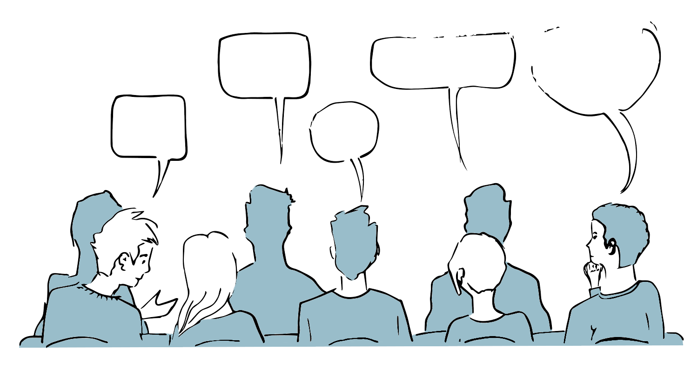
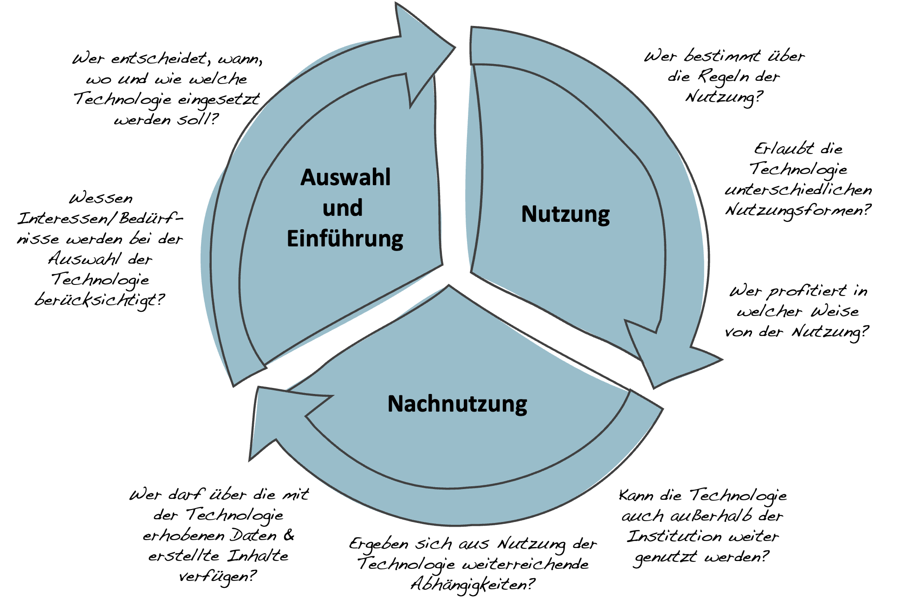

# Schulische Medienbildung & digitale Transformation

Die Vorstellung von der Digitalisierung als einem kulturellen Transformationsprozess, in dem digitale Technologien einen tiefgreifenden Einfluss auf unsere Erfahrungs- und Handlungsmöglichkeiten haben, wirft nicht nur die Frage auf, welche Kompetenzen in der Schule vermittelt werden sollen, sondern auch, wie mit digitalen Technologien in der Schule umgegangen werden soll und in welcher Form sie zum Gegenstand von Unterricht werden können.

Ohne an dieser Stelle eine abschließende Antwort auf diese Fragen geben zu können, sollen stattdessen einige Einsatzpunkte und Gedanken skizziert werden, die einerseits versuchen sich der Digitalisierung im Sinne eines ›epochaltypischen Schlüsselproblems‹ [@klafkiNeueStudienZur2007] als Gegenstand von Unterricht zu nähern und die andererseits den Umgang mit digitalen Technologien in der Schule in Hinblick auf Fragen von Macht, Mitbestimmung und Teilhabe thematisieren. Als Stichwortgeber dient in beiden Fällen eine Auswahl der vom Land Schleswig-Holstein beschriebenen Kompetenzen für Schüler\*innen [@ministeriumfurbildungwissenschaftundkulturdeslandesschleswig-holsteinErganzungenFachanforderungenMedienkompetenz2018].

```{r, echo=FALSE, fig.align='center', dev='png'}

```

## Digitale Technologien als Gegenstand von Unterricht – Einsatzpunkte und Fragestellungen

Im Sinne eines epochaltypischen Schlüsselproblems markiert die Digitalisierung keinen fixen Zustand, sondern ein ergebnisoffenes Problem- und Handlungsfeld, das gesellschaftlicher Aushandlungen wie auch individueller Positionsbestimmungen bedarf. Aus dieser Perspektive verbergen sich hinter vielen der postulierten Kompetenzen weiterreichende Fragestellungen, wie an den folgenden einigen Beispielen aufgezeigt werden soll:

<span style=color:#256B89>*2.4.1 Die Schülerinnen und Schüler können um Regeln der Online-Kommunikation wissen und diese beachten. Sie können die Verhaltensregeln der realen und der virtuellen Welt in Beziehung setzen und diese gleichermaßen beachten.*</span>

Kommunikations- und Verhaltensregeln erscheinen in dieser Darstellung als objektive Größen, die es zu beachten gelte. Offen bleibt jedoch die Frage, woher diese Regeln eigentlich kommen und woher sie ihre normative Kraft beziehen. Inwiefern sind entsprechende Regeln universell gültig oder doch kulturell geprägt? Basieren sie auf dem Konsens der Nutzer\*innen, staatlichen Vorgaben oder den Ideen & Inter-essen der Unternehmen, die die jeweiligen Plattformen betreiben?

<span style=color:#256B89>*3.3. Die Schülerinnen und Schüler können Chancen und Risiken sowie rechtliche Grundlagen im Umgang mit Medien/ medialen Angeboten analysieren und berücksichtigen (z.B. Datenschutz, Datensicherheit, Urheberrecht, Lizenzrecht).*</span>

Die Chancen, Risiken und rechtlichen Grundlagen erscheinen hier als fixe Größen, die es zu berücksichtigen gelte. Ausgeklammert wird in dieser Perspektive jedoch das gesellschaftliche Ringen um eben jene rechtlichen Grundlagen. Standards zum Datenschutz und zur Datensicherheit mussten kollektiv errungen werden und sind immer noch Gegenstand kontroverser Debatten hinsichtlich ihrer Auslegung. Ebenso verhält es sich mit der Frage, ob das gegenwärtige Urheber- und Lizenzrecht den Bedingungen einer digitalisierten Gesellschaft angemessen ist und wessen Interessen es dient. 

<span style=color:#256B89>*5.5.2 Die Schülerinnen und Schüler können abschätzen, welche Abläufe sich für eine Automatisierung eignen.*</span>

Auch hier entsteht der Eindruck, dass sich eindeutig bestimmen ließe, welche Abläufe sich für eine Automatisierung eignen. Die Frage danach, welche Abläufe sich zur Automatisierung eigenen, beruht aber nicht zuletzt auf unseren gesellschaftlichen Vorstellungen bezüglich der Regelhaftigkeit der zu automatisierenden Vorgänge [@heintzHerrschaftRegelZur1993]. Ob wir davon ausgehen, dass sich Autos selbständig im Verkehr bewegen, die Erfolgsaussichten einer Person in einem bestimmten Ausbildungsberuf vorausberechnet werden oder Emotionen mittels Künstlicher Intelligenz erkannt werden können, basiert immer auch auf unseren Vorstellungen über uns selbst und ist insofern niemals eine rein technische Frage.

<span style=color:#256B89>*6.2.5 Die Schülerinnen und Schüler können die Bedeutung digitaler Medien für die politische Meinungsbildung und Entscheidungsfindung benennen.*</span>

Die Beschreibung legt nahe, dass es eindeutige Modelle zur Analyse des Medieneinflusses auf die politische Meinungsbildung gäbe. Gerade im Zuge der Digitalisierung sehen wir jedoch, dass sich die Formen der Meinungsbildung ebenfalls wandeln. Von Influencern über Bot-Armeen und Fake-News bis hin zur Bildung von Filterblasen und Echokammern sind wir mit einer Vielzahl neuer Formen und Mechanismen der Meinungsbildung konfrontiert, ohne dass wir ein gefestigtes Wissen über Ausmaß und genaue Wirkung hätten.

## Zum Umgang mit Digitalen Technologien im Unterricht - Fragen von Macht, Mitbestimmung und Teilhabe

Jenseits der Auseinandersetzung mit Aspekten der Digitalisierung als Gegenstand von Unterricht stellen sich aus einer kulturtheoretischen Perspektive aber auch Fragen von Macht, Mitbestimmung und Teilhabe beim Einsatz und Umgang mit digitalen Technologien im Unterricht. Dies gilt insbesondere dann, wenn der Lern- und Bildungsort Schule eine »verantwortliche, auf demokratischem Grundverständnis basierende Mitgestaltung und Auseinandersetzung mit den kontinuierlich entstehenden neuen Inhalten und Strukturen« [@ministeriumfurbildungwissenschaftundkulturdeslandesschleswig-holsteinErganzungenFachanforderungenMedienkompetenz2018, S. 4] befördern will.

<span style=color:#256B89>*2.5.1 Die Schülerinnen und Schüler können sich aktiv in virtuellen Räumen beteiligen und als selbstbestimmte Bürgerin/selbstbestimmter Bürger agieren (z.B. E-Government, Online-Banking, Online-Shopping).*</span>

Welche konkreten Möglichkeiten bieten sich den Schüler\*innen, im Kontext von Schule und Unterricht in die Rolle selbstbestimmter Bürger\*innen hineinzuwachsen und zum Beispiel darüber mitzubestimmen, welche Daten über ihr digitales Lernverhalten gesammelt, analysiert und zur Grundlage von Entscheidungen gemacht werden, die den ihren individuellen Bildungsweg beeinflussen können?

<span style=color:#256B89>*5.4.1 Die Schülerinnen und Schüler können zur Unterstützung des schulischen Lernens geeignete Online-Lernumgebungen identifizieren, erproben und zur Wissensaneignung, -generierung oder Zusammenarbeit nutzen.*</span>

Auch hier stellt sich die Frage nach der praktischen Umsetzung im Kontext von Schule und Unterricht. Wie und in welchem Ausmaß werden die Schüler\*innen in die Identifikation, Auswahl und Erprobung digitaler (Lern-)Technologien im Schulalltag tatsächlich mit einbezogen? Wie können sie diese Kompetenz erwerben und von ihr Gebrauch machen, wenn sie z.B. ihr Smartphone nicht im Unterricht benutzen dürfen? Wer bestimmt darüber, ob die Suche nach Informationen in der Wikipedia, eine Anfrage in einem Expertenforum, oder die Verwendung von Anwendungen wie ChatGPT als ›geeignet‹ zu betrachten ist?

<span style=color:#256B89>*6.2.5 Die Schülerinnen und Schüler können sich reflektiert mithilfe von Kommunikationsmedien an politischen Entscheidungs- und Meinungsbildungen beteiligen (z. B. Online-Petition).*</span>

Auch an dieser Stelle kann die Schule als ein besonderes Lernfeld für die Schüler\*innen fungieren, in dem sich, auch unterstützt von digitalen Systemen wie beispielsweise [›Aula‹](https://www.aula.de/), Schüler\*innen die Möglichkeit bietet, sich aktiv an der politischen Entscheidungs- und Meinungsbildung im Kontext der Schule zu beteiligen.

<span style=color:#256B89>*6.2.6 Die Schülerinnen und Schüler können Potenziale der Digitalisierung im Sinne sozialer Integration und Teilhabe erkennen und diese detailliert analysieren.*</span>

Neben den Potenzialen der Digitalisierung im Sinne sozialer Integration und Teilhabe sind unter dem Schlagwort der digitalen Spaltung vielfältige Formen der Desintegration und digitaler Bildungsungleichheiten in der Literatur beschrieben und empirisch belegt worden [@kutscherDiskussionsfelderMedienpaedagogikMedien2021; @verstandigZeroLevelDigitalDivide2016]. Hieraus ergibt sich die Frage, ob der Einsatz konkreter Technologien tatsächlich den unterschiedlichen Erfahrungen und Möglichkeiten aller betroffenen Schüler\*innen gerecht wird, oder ob er bestehende Ungleichheiten verstärkt oder neue schafft.


::: {.blackbox data-latex=""}
*Wie lassen sich Fragen der Digitalisierung als einem epochaltypischen Schlüsselproblem im Rahmen des Fachunterrichts thematisieren?*
:::  

&nbsp;

::: {.blackbox data-latex=""}
*Wie könnten Möglichkeiten der Mitbestimmung und Teilhabe von Schüler&ast;innen bezüglich des Einsatzes und des Umgangs mit digitalen Technologien in Ihrem Unterricht aussehen?*
:::


## Partizipationsorientierter Technikeinsatz

*(Autor&ast;innen: Isabelle Simon & Christoph Richter, 2023)*

**Ziel**

Der partizipationsorientierte Technikeinsatz 
dient der Identifikation von Mitbestimmungs- und Gestaltungsmöglichkeiten bei der Nutzung digitaler Technologien in institutionellen Kontexten.

**Leitgedanke**

Insbesondere in institutionellen Kontexten, wie der Schule, erfolgen Entscheidungen über die Auswahl und den Umgang mit digitalen Technologien oftmals ohne die direkte Einbindung aller Nutzer\*innen, wie etwa den Schüler\*innen. Vor dem Hintergrund einer digitalen Medienbildung, die zu einer demokratischen Mitbestimmung und Mitgestaltung im Kontext der Digitalisierung befähigen soll, erscheint es deshalb notwendig, die mit dem Einsatz digitaler Technologien verbundenen Möglichkeiten einer partizipativen Teilhabe systematisch zu erkunden und umzusetzen. Ein solcher Schritt impliziert dabei immer auch eine Sensibilisierung für die in institutionellen Kontexten implizierten Machtverhältnisse, sowie eine möglichst umfassende Betrachtung der mit dem Einsatz digitaler Technologien verbundenen Formen der In- und Exklusion bestimmter Erfahrungs- und Handlungsmöglichkeiten für die verschiedenen Personengruppen.

**Anwendungskontext**

Der Anwendungsbereich umfasst alle Phasen des Technikeinsatzes, von der Auswahl- und Einführung über die Nutzung bis hin zur Nachnutzung. 

```{r, echo=FALSE, fig.align='center', dev='png'}

```

**Arbeitsschritte**

 1. Identifikation der von dem Technikeinsatz betroffenen Personengruppen.
 2. Klärung der vorhandenen Gestaltungs- und Entscheidungsspielräume.
 3. Einladung der betroffenen Personengruppen zur Mitbestimmung und -gestaltung.
 4. Gemeinsame Exploration realisierbarer Optionen.
 5. Aushandeln einer verbindlichen Entscheidung.
 6. Umsetzung und gemeinsame Evaluation der Entscheidung.

**Ergebnisformat**

Gemeinsam getragene Entscheidungen zum Einsatz digitaler Technologien unter Berücksichtigung der Interessen aller Betroffenen.

**Praktische Tipps**

-   Die vorhandenen Gestaltungs- und Entscheidungsspielräume sollten möglichst klar umschrieben werden, um den Prozess zu fokussieren und irreführende Erwartungen zu vermeiden.
-   Bei der Planung eines partizipativen Entscheidungs- bzw. Gestaltungsprozesses sind sowohl die Bereitschaft der Betroffenen wie auch ihre Vorerfahrungen und Kompetenzen mit zu berücksichtigen.
-   Für den Partizipationsprozess sollte ein ausreichender Zeitrahmen eingeplant werden, damit sich alle Betroffenen einbringen können und Gehör finden.

**»Fallstricke«**

-   Ein partizipatives Vorgehen bedeutet nicht, dass allen Ideen und Wünschen Rechnung getragen werden kann oder sollte. Ziel ist vielmehr die Aushandlung tragfähiger Entscheidungen unter der Prämisse eines demokratischen und solidarischen Miteinanders.
-   Ein partizipatives Vorgehen ist nicht geeignet, wenn keine realen Möglichkeiten zur Mitentscheidung und –gestaltung bestehen. Dies gilt insbesondere dann, wenn ein partizipatives Vorgehen nur dazu dienen soll, bereits getroffene Entscheidungen zu legitimieren.

:::: {.licencebox data-latex="{licencebox}"}

Der Leittext ›Partizipationsorientierter Technikeinsatz‹ wurde 2023 von Isabelle Simon und [Christoph Richter](mailto:richter@paedagogik.uni-kiel.de) erstellt und ist unter einer Creative Commons [CC BY-SA 4.0](https://creativecommons.org/licenses/by-sa/4.0/) Lizenz veröffentlicht.

::::


