# Anhang {-}

Die beiden folgenden Beispiele wurden von Helena Hintz und Jamila Becker erstellt. Sie setzen sich anhand der minimalen Leitexte mit dem digitalen ›Referatedienst‹ Blinkist sowie mit der Verwendung von WhatsApp zur Gruppenarbeit im Studium auseinander.

Die Beispiele sollen mögliche Zugänge zur eigenen Auseinandersetzung mit digitalen Technologien und den mit ihnen verbundenen Praktiken aufzeigen. Darüber hinaus können die Reflexionen der Autorinnen als Einsatzpunkte für weiterführende Diskussionen genutzt werden. Die Beispiele erheben keinen Anspruch auf Vollständigkeiten, sondern markieren vielmehr Durchgangspunkte in den Auseinandersetzungen ihrer Autorinnen.


## Beispiel Blinkist {-}
:::: {.licencebox data-latex="{licencebox}"}

Das Beispiel ›Blinkist‹ wurde 2022 von [Helena Hintz](mailto:hel.hintz@gmail.com) erstellt und ist unter einer Creative Commons [CC BY-SA 4.0](https://creativecommons.org/licenses/by-sa/4.0/) Lizenz veröffentlicht.

::::


### Kartierung sozialer Praktiken (Kapitel 5) {-}


```{r, echo=FALSE, fig.align='center', dev='png'}
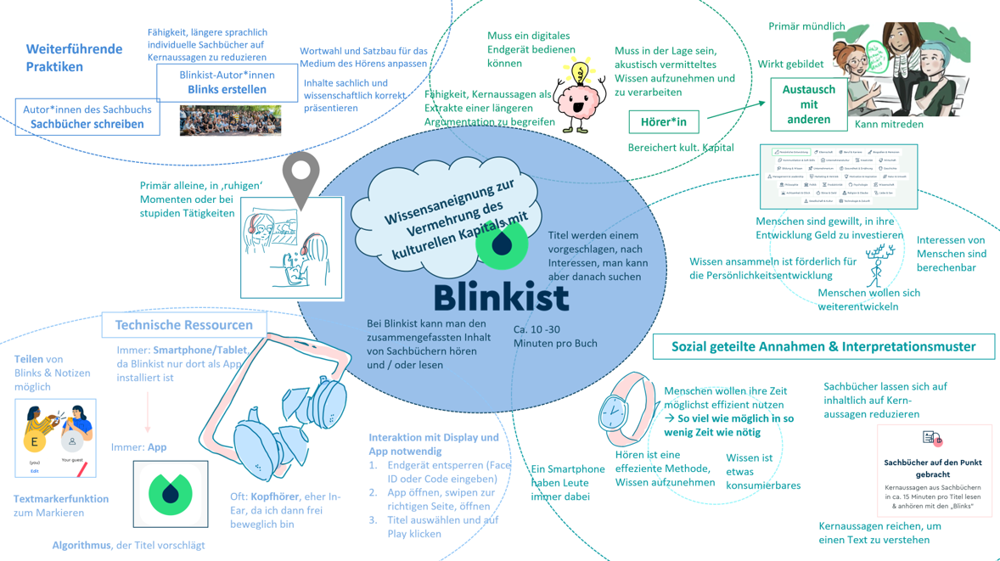
```


**Reflexion**

Bezüglich der technischen Ressourcen fand ich sehr spannend, dass meine Praxis mit einem digitalen mobilen Endgerät und der darauf installierten App Blinkist eng verzahnt ist (in meinem Fall mein Smartphone), ohne welches ich keine Blinks hören kann. Im Gegensatz zu einem Sachbuch (das wäre in meinem Fall das Äquivalent zu Blinks) muss ich nicht nur in der Lage sein, mir ein Buch zu beschaffen und lesen zu können, sondern auch dazu fähig sein, ein digitales Gerät zu bedienen etc. 
In Hinblick auf sozial geteilte Annahmen und Interpretationsmuster sind mir primär zwei Punkte besonders aufgefallen. 

Zum Ersten unterwirft sich das Modell von Blinkist durch seine auf Minuten verkürzten Buchthesen einem gesellschaftlichen Konsum-System, in welchem davon ausgegangen wird, dass ich als Nutzerin so viel wie möglich in so wenig Zeit wie nötig zu mir nehmen möchte. Wissen wird konsumierbar, was für mich in ein System passt, das Schüler\*innen in immer kürzerer Zeit immer mehr Stoff vermitteln möchte. Zeit für Auseinandersetzung mit den Inhalten, ein Innehalten zwischen Buchseiten oder Kapiteln, wie ich es mir beim Lesen erlaube, fällt weg.
Stattdessen kann ich jetzt abwaschen UND mir Wissen aneignen gleichzeitig. 

Eine zweite entscheidende Erkenntnis, die sich aus der Auseinandersetzung ergibt, und auf die ich im Abschnitt zur Rekonstruktion operationaler Formen zurückkommen werde, ist die Annahme, dass Sachbücher sich inhaltlich auf Kernaussagen reduzieren lassen. Bei der ‚Umwandlung‘ in Blinks entstehen völlig neue Texte, die sprachlich mit dem Original wenig zu tun haben. Die Blinks nutzen als optische Anker trotzdem die Cover des Buches. Aus literarischer und linguistischer Perspektive stellen sich für mich die Fragen: Wann ist ein Text ein Text? Wie definiert sich Autorschaft? Was macht es mit einem Text, wenn man nur mit seinem Inhalt arbeitet?


### Szenarien (Kapitel 7) {-}

**Szenario 1: Wissensaneignung heute**

```{r, echo=FALSE, fig.align='center', dev='png'}
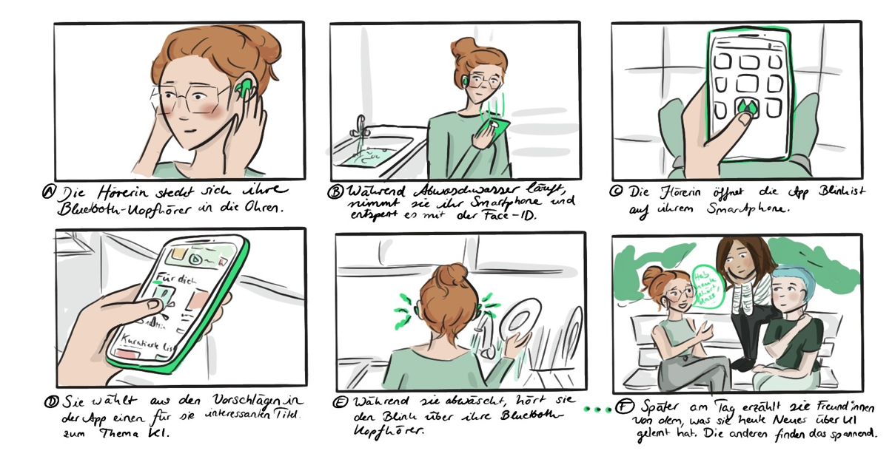
```

**Szenario 2: Wissensaneignung früher**

```{r, echo=FALSE, fig.align='center', dev='png'}
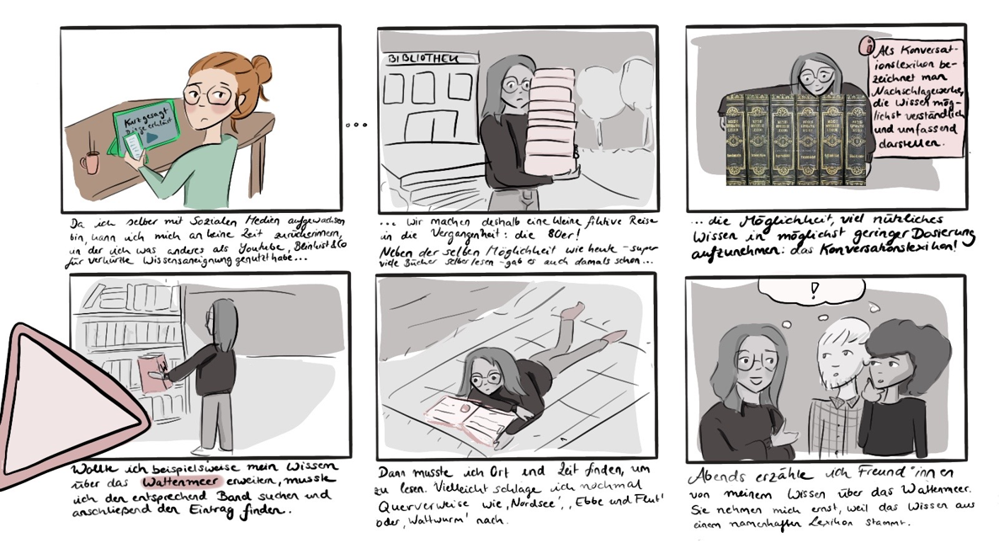
```

**Reflexion**

Ich habe die Wissensaneignung mit Blinkist zur Vermehrung meines kulturellen Kapitals mit einem fiktiven vor-digitalen Szenario verglichen. Die zwei großen Unterschiede lagen hierbei in der Form der Aneignung (hören vs. lesen) sowie in der Form der Kommunikation meines neu erworbenen Wissens.

<span style=color:#256B89>**a) Form der Aneignung**</span>

Blinkist ist praktisch. Ich wähle einen Blink zu einem Thema, das mich interessiert, stecke mir meine Kopfhörer in die Ohren, drücke auf meinem Smartphone auf Play und mache den Abwasch, während mir in 15 Minuten die wichtigsten Thesen eines Sachbuchs zusammengefasst werden. Der Abwasch ist zu Ende. Der Blink ist zu Ende. Ich habe etwas erledigt und etwas gelernt. Check.

Wie hätte ich mir in kurzer Zeit Wissen angeeignet, bevor es sowas wie Blinkist auf dem Markt gab? Da gab es natürlich verschiedene Möglichkeiten, in diesem Beispiel habe ich mich für die Nutzung eines Konversationslexikons entschieden. Das sind Nachschlagewerke, die Wissen möglichst verständlich und umfassend darstellen. Erstmal musste ich natürlich irgendwo hingehen und mir einen der Bände des Konversationslexikons aussuchen mit einem Thema, das mich interessierte. Wenn ich dann das Buch hatte, musste ich irgendwo hingehen und darin den Text zu dem Thema meiner Wahl lesen. Dabei konnte ich nichts nebenbei machen, aber dafür vielleicht weiterblättern und mich zu anderen Themen treiben lassen. Das geht bei Blinkist durch Vorschläge natürlich auch, aber kurz einen Text überfliegen geht nur im Lexikon. Ein Punkt, der das Lexikon problematisch macht, ist, dass die einzelnen Beiträge, besonders in Hinblick auf bestimmte Themen, ideologisch gefärbt sein konnten. Ohne weitere Quellen miteinzubeziehen, könnten manche Definition und Erläuterungen damit sehr problematisch sein. Bei Blinkist habe ich die Möglichkeit, die Namen der Original-Autor\*innen einzusehen und über eine Suchmaschine mehr über dieselben herauszufinden.

<span style=color:#256B89>**b) Kommunikation**</span>

In meinem Blinkist-Szenario erzähle ich zwei Freund\*innen von meinem neuen Wissen über KI, welches ich mir über Blinkist erworben habe. Ich schreibe, dass sie es spannend finden. Da sie selber auch Teil einer Welt sind, in denen jede Information nur einen Klick mit dem Finger entfernt ist, sind sie aber auch nicht beeindruckt, sondern stellen vielleicht selber kritische Fragen. Falls sie Nachfragen zum Buch haben, kann ich nicht wirklich darauf eingehen. Ob mir das Buch gefallen hat? Keine Ahnung, aber die Thesen fand ich spannend.

In meinem Konversationslexikons-Szenario sind meine Freund\*innen etwas beeindruckter. Ich habe mir Wissen angeeignet in einer Zeit, in der meine Aussagen nicht mittels einer Google-Suchanfrage negiert oder bestätigt werden können. Ich stelle mir vor, dass ich mit meinem Wissen aus einem dicken Buch ernst genommen werde, schließlich war ich ja extra in der Bibliothek, statt nur jemand anderen zu fragen oder ähnliches.

Das Ganze ist mit einem Augenzwinkern gemeint, aber ich möchte damit darauf anspielen, dass Sachwissen heutzutage zugänglicher ist denn je. Natürlich ist es heute auch umso schwieriger, die Seriosität von Quellen zu beurteilen und zu bewerten, wie relevant welche Information ist. Man hat ständig das Gefühl, jedes neue Wissen ins Verhältnis zu anderem zu setzen. Ich stelle mir vor, dass das vor der Dominanz der Internets anders war. Dass man Wissen aus einem Buch mehr angenommen hat, statt es in zwanzig Foren mit anderen Aussagen zu vergleichen.

### Rekonstruktion der Produktvision (Kapitel 8) {-}

```{r, echo=FALSE, fig.align='center', dev='png'}
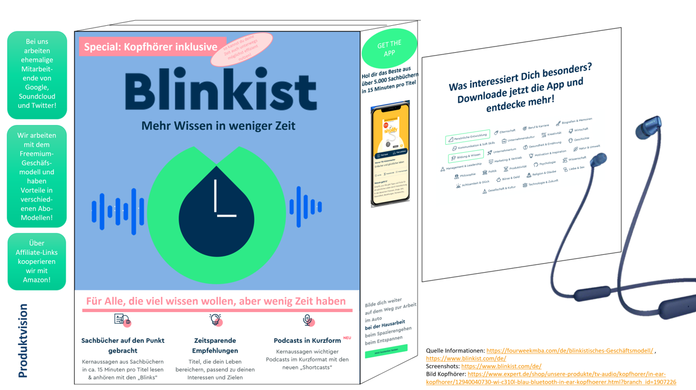
```

**Reflexion**

Blinkist macht es einem recht leicht, wenn man versucht, die Produktvision nachzuvollziehen. Ich habe als Slogan für das Produkt „Mehr Wissen in weniger Zeit“ gewählt, um die Idee der Effizienz der Anwendung aufzugreifen. Meine Produktverpackung soll die potentielle Zielgruppe vielbeschäftigter, in sich selbst investierender Bürger\*innen ansprechen, eben „Alle, die viel wissen wollen, aber wenig Zeit haben“. 

Bei der Auseinandersetzung mit der Produktvision wurde mir dieser Aspekt der Effizienz besonders bewusst. Die Gestaltung des Interfaces und der Werbung für die App, die ich in meiner Produktvision rekonstruiere, machen diesen Gedanken zu etwas Attraktivem, vielleicht sogar Hilfreichem. Dass man für die Nutzung der App Geld bezahlt, wird zu Beginn nicht kommuniziert, erst wird ein nützliches Lifestyle-Produkt vermarktet. Das hat mir gezeigt, wie die Ästhetisierung  von einer Applikation zu deren Vermarktung beitragen kann. Einem wird vermittelt, dass man mit der App etwas ‚für sich tut‘, womit Blinkist sich letztendlich mit anderen Konsumgütern gleichstellt. Mit der Bewerbung von Büchern ist das nicht vergleichbar.

### Rekonstruktion operationaler Formen (Kapitel 9) {-}

```{r, echo=FALSE, fig.align='center', dev='png'}
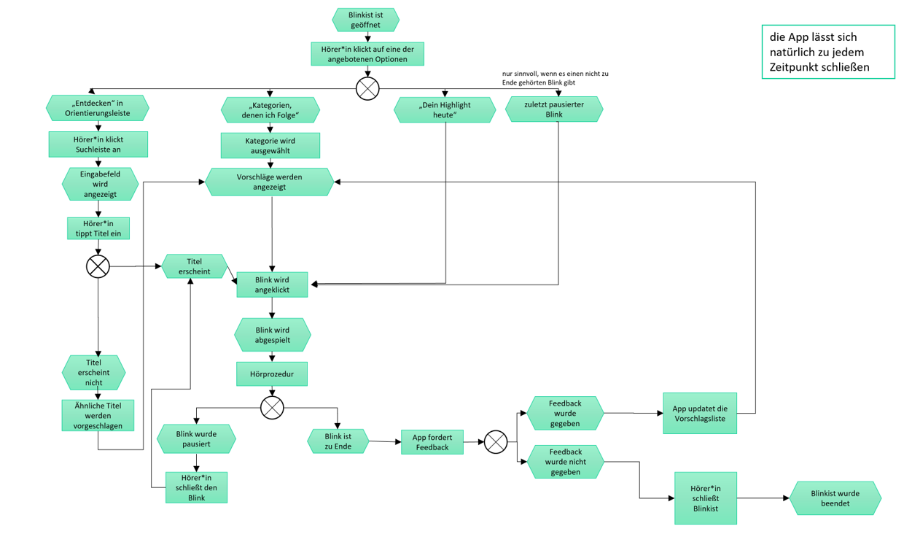
```

**Reflexion**

Die Rekonstruktion der operationalen Formen fiel mir erst ziemlich schwer, aber die Auseinandersetzung mit der Kartierung der Benutzungsflüsse hat dabei geholfen, einen Zugang zu den von der Applikation vorgeschlagenen Handlungsoptionen zu erhalten. Ich war überrascht, wie simpel sich die Flüsse ausgestalten. Spannend fand ich weiterhin, dass es immer wieder Feedbackschleifen gibt, bspw. wenn ein gesuchter Titel nicht gefunden wird, kann immer wieder auf die angebotenen Optionen der App zurückgegriffen werden. Die Entwickler\*innen der App scheinen gut vorgesorgt zu haben, dass Nutzer\*innen möglichst bei jedem Öffnen dazu kommen, einen Blink anzuhören, indem das Nichtfinden eines Blinks einen zu neuen Vorschlägen weiterleitet, die man entweder in Anspruch nehmen kann oder eben zurück zur Startseite kehrt. Ich glaube, es war am schwierigsten für mich, mich von der Perspektiv der Nutzerin zu lösen und wirklich darauf zu gucken, was genau in der Anwendung passiert und was diese vorgibt.

Um es gut nachzuzeichnen, muss man das menschliche Denken wirklich verlassen und schauen, was auf eine Interaktion mit der Anwendung wirklich folgt. Das fand ich sehr anspruchsvoll, hat mir aber auch Unterschiede zwischen meinem Denken und der Konstruktion der Abläufe verdeutlicht.

### Anwendungsbezogene Datenkritik (Kapitel 10) {-}

```{r, echo=FALSE, fig.align='center', dev='png'}
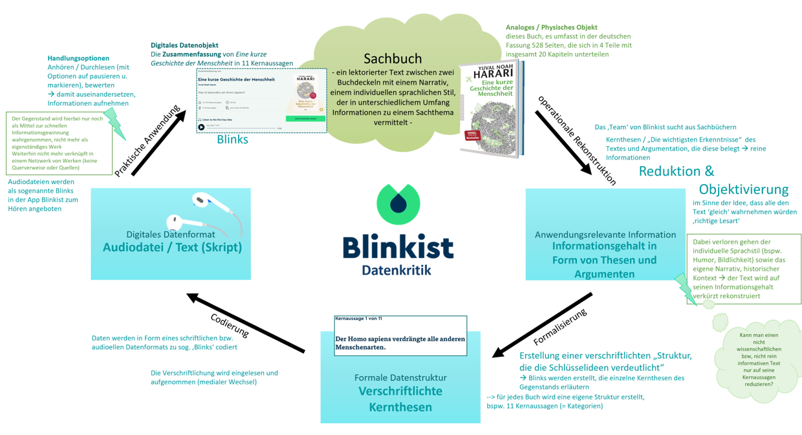
```

**Reflexion**

In der Datenkritik empfinde ich vor allem die operationale Rekonstruktion und die Formalisierung als  spannend. Dass bei Blinkist Sachbuchtexte mit einem eigenen sprachlichen Stil auf ihre Kernthesen reduziert werden und damit eine Objektivierbarkeit dieser Werke impliziert wird, indem der Text auf eine ‚richtige Lesart‘ reduziert wird, empfinde ich als problematisch. Ich frage mich, ob es überhaupt möglich ist, einen nicht-wissenschaftlichen Text derart zu reduzieren, ohne ihn dabei zu verlieren? Blinkist beschreibt Blinks als eigene Werke, wodurch eine Distanzierung zum Original stattfindet, aber sie werben mit den Covern der Bücher, als würde man das Originalwerk einfach in verkürzter Form kriegen. Dabei folgt die Formalisierung einem scheinbar festen Konzept von Blinkist. 

Es wird eine verschriftlichte Struktur erstellt, die die „Schlüsselideen“, also die Kernthesen, verdeutlicht. Jedes Buch erhält dabei eine eigene Struktur. Was bleibt hierbei über vom Text? Kann ich mich als Hörerin darauf verlassen, dass der Inhalt des Textes ‚richtig verstanden‘ und ‚richtig wiedergegeben‘ wurde? Vielleicht hätte ich das Original anders aufgefasst. Die entstandenen neuen Strukturen werden eingelesen und in Audiodateien umgewandelt. Der Gegenstand wird zum Blink und kann angehört werden. Er wird auf seinen Informationsgehalt reduziert wahrgenommen und vermutlich dahingehend bewertet, wie nachvollziehbar die Thesen dargestellt werden. So kann ein 528 seitiges Buch auf 11 Kernaussagen reduziert angehört werden.

### Kartierung von Benutzungsflüssen (Kapitel 11) {-}

```{r, echo=FALSE, fig.align='center', dev='png'}
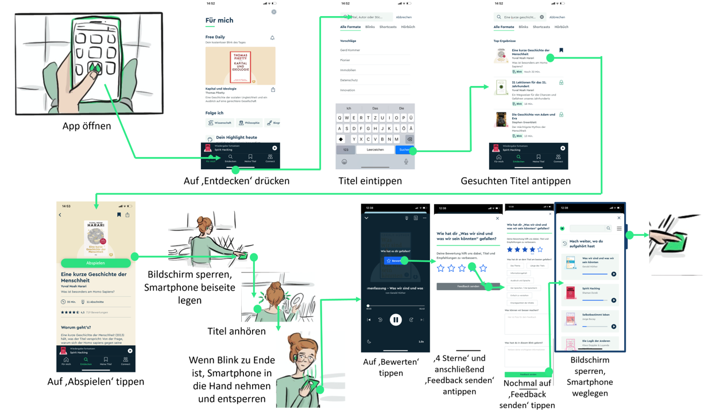
```

**Reflexion**

Ich fand es spannend, mir mit der Kartierung der Benutzungsflüsse bewusst zu machen, welche Angebote mir das Interface der App Blinkist macht, sobald ich mich für eine der angebotenen Handlungsoptionen entscheide. Ich tippe beispielsweise auf das Icon für ‚Suchen‘ und habe dann durch das Interface das Angebot, einen Titel, Autor oder Stichwort in die Suchleiste einzutippen oder einen Vorschlag auszuwählen, den ich durch weiteres Tippen noch im Format eingrenzen kann. Bevor ich die Benutzungsflüsse kartiert habe, war mir nicht bewusst, wie sehr die Gestaltung einer Applikation meinen Umgang mit derselben steuert. Dadurch, dass mir verschiedene Handlungsoptionen zur Verfügung gestellt werden, entsteht bei mir ein Gefühl der mehr oder weniger eingeschränkten Wahlfreiheit in meinem Umgang (hier wäre beispielsweise eine Beschränkung auf das Hören eines Audioformats gegeben, ich habe in der Anwendung nicht die Option, gebrauchte Möbel zu kaufen). Dass aber eigentlich die App meinen Benutzungsfluss ‚bestimmt‘, indem sie diejenige ist, die mir Optionen anbietet, wird aber erst in dieser ausdifferenzierten Betrachtung des Prozesses bewusst. Spannend finde ich noch, dass das Hören selber außerhalb der Nutzung des Smartphones stattfindet. Zwar läuft der Sound natürlich über die Applikation, aber ich kann das Smartphone aus der Hand legen und mich in der außerdigitalen Welt bewegen und dort handeln, während ich den Blink höre.

### Kartierung des technischen Milieus (Kapitel 12) {-}

```{r, echo=FALSE, fig.align='center', dev='png'}
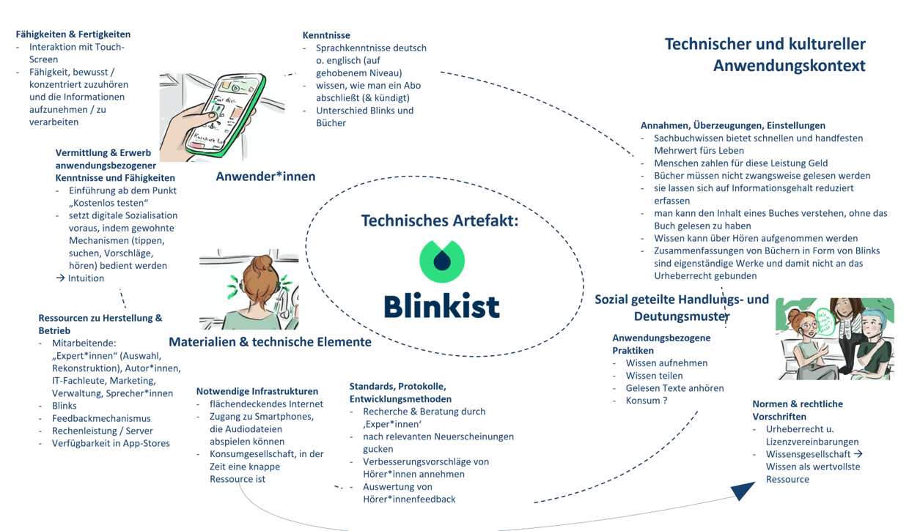
```

**Reflexion**

Aus der Kartierung soziotechnischer Milieus nehme ich vor allem mit, dass Blinkist einige sozial geteilte Handlungs- und Deutungsmuster voraussetzt, die vor allem stark an das sozioökonomische System der ständigen Selbstoptimierung gekoppelt sind. Mehr Wissen in weniger Zeit – das setzt voraus, dass ich dieses Ziel als erstrebenswert erachte. Ich erachte es als erstrebenswert in einer Gesellschaft, in der ich wenig Zeit habe, aber viel Wissen als hohes Gut angesehen wird. Die Standards und Protokolle, die hinter der Entstehung von Blinks stehen, finde ich dabei nicht transparent. Bei der Datenkritik lässt sich zwar nachvollziehen, wie Blinks generell entstehen, allerdings ist meine Annahme, dass jeder Vorgang immer individuell an das Werk angepasst werden muss, da diese unterschiedlich komplex sind. Bezüglich meiner mit Blinks verbundenen Praktik, der Bereicherung des kulturellen Kapitals, sehe ich mittlerweile ein deutliches Zusammenwirken mit dem System der Wissensgesellschaft. Statt in die Tiefe zu gehen, mich mit einzelnen Sätzen und Gedanken auseinanderzusetzen, wie einem Buch, ermöglicht Blinkist mir, viel aufzunehmen, mir viel Wissen anzueignen, es zu konsumieren. Damit scheint Blinkist gut auf den Markt zu passen, gut in unser Bildungssystem zu passen und ich glaube, dass man diese Anwendung gut für sich nutzen kann, aber reflektieren sollte, was dahinter steht. Die Auseinandersetzung hat mir gezeigt, wie wichtig es ist, sich mit den Praktiken, die mit einer Anwendung verbunden sind, kritisch-reflektierend auseinanderzusetzen. Hinter attraktiven Interfaces und meinem Umgang mit diesen versteckt sich oft viel mehr, als auf den ersten Blick sichtbar ist.


## Beispiel WhatsApp {-}
:::: {.licencebox data-latex="{licencebox}"}

Das Beispiel ›Blinkist‹ wurde 2022 von Jamila Becker erstellt und ist unter einer Creative Commons [CC BY-SA 4.0](https://creativecommons.org/licenses/by-sa/4.0/) Lizenz veröffentlicht.

::::
### Kartierung sozialer Praktiken (Kapitel 5) {-}


```{r, echo=FALSE, fig.align='center', dev='png'}
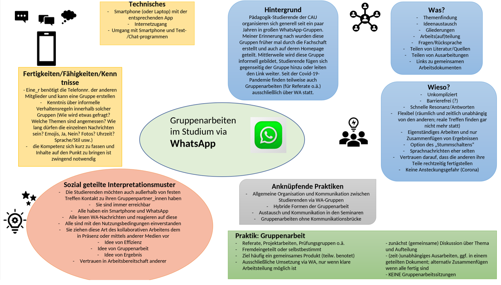
```


**Reflexion**

Die Voraussetzungen für eine soziale Praxis, die eine Technologie integriert/beinhaltet/über diese praktiziert wird/etc., sind viel mehr als nur das Verfügen über diese Technologie. Zwar ist die Technologie als solche elementar, jedoch funktioniert die Praxis nicht ohne entsprechende Fertigkeiten bzw. Kenntnisse und vor allem die sozial geteilten Interpretationsmuster. Ohne die entsprechenden geteilten Vorstellungen, die Bereitschaft, die Technologie zu integrieren, kann eine Technologie keine soziale Praxis ändern. Dies bedeutet ggf. auch eigene Vorstellungen oder Moral zu verändern. So müssen sich zum Beispiel nicht nur alle damit einverstanden erklären, die Gruppenarbeit über WhatsApp stattfinden zu lassen sondern sich auch auf die sozial geteilten Interpretationsmuster wie ständige Verfügbarkeit und Verzicht auf engeren sozialen Kontakt bei der Gruppenarbeit einlassen.

### Szenarien (Kapitel 7) {-}

**Szenario 1: Gruppenarbeit in Präsenz (eigene Erfahrungen)**&ast;

```{r, echo=FALSE, fig.align='center', dev='png'}
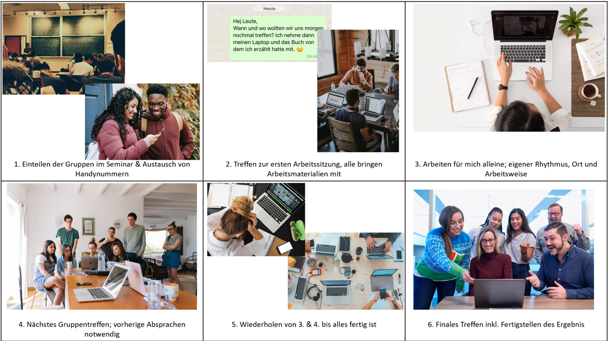
```

<span style=color:#256B89>**Zoom-In 1: Treffen mit den Anderen**</span>

```{r, echo=FALSE, fig.align='center', dev='png'}
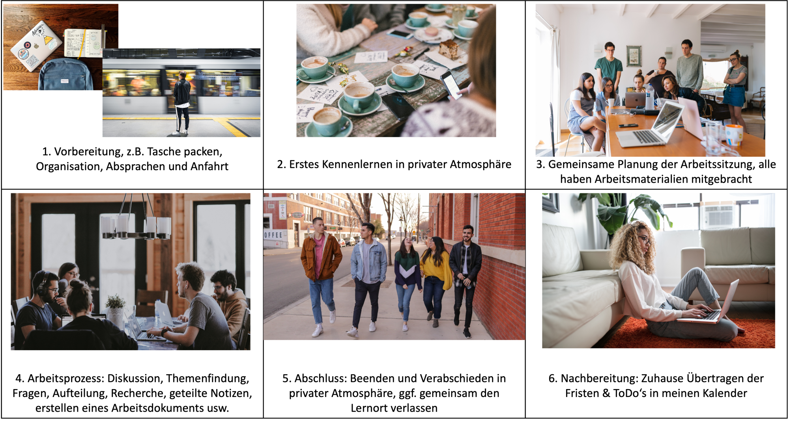
```

**Szenario 2: Gruppenarbeit via WhatsApp (eigene Erfahrungen)**

```{r, echo=FALSE, fig.align='center', dev='png'}
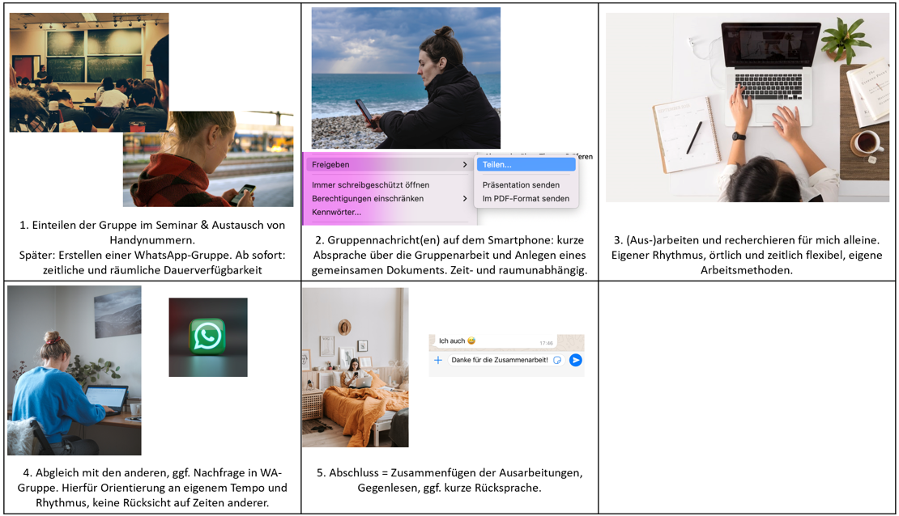
```

<span style=color:#256B89>**Zoom-In 2: Arbeitsaufteilung**</span>

```{r, echo=FALSE, fig.align='center', dev='png'}
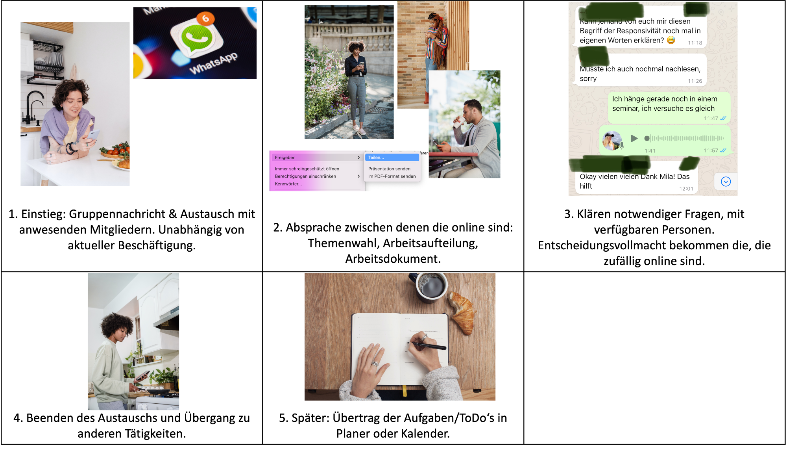
```

&ast; *Alle in diesem Szenario verwendeten Bilder stammen von den Bilddatenbanken [unsplash](https://unsplash.com) sowie [pexels](https://www.pexels.com). Das Bildmaterial ist frei lizenziert. Nähere Informationen zu den jeweiligen Lizenzen finden sich unter [https://unsplash.com/de/lizenz](https://unsplash.com/de/lizenz) sowie [https://www.pexels.com/de-de/lizenz/]([https://www.pexels.com/de-de/lizenz/).*

**Reflexion**

Finden Gruppenarbeiten via WhatsApp statt, so führt dies nicht nur zu einer Veränderung der Arbeitsweise, die nun losgelöst ist von Raum und Zeit. Alle Beteiligten können in ihrem eigenen Tempo und mit eigenen Methoden arbeiten, sofern abgesprochene Fristen eingehalten werden. Es wird zwar ggf. ein gemeinsames Arbeitsdokument angelegt und ein Endprodukt angefertigt, jedoch ist der Arbeitsprozess unabhängig voneinander. Eine weitere massive Veränderung findet auf der sozialen Ebene statt: Es ist nicht mehr notwendig, die anderen Gruppenmitglieder kennenzulernen, es findet meist kein privater Austausch statt, die Leben der anderen bleiben unbekannt, wodurch sich der persönliche Kontakt verändern kann (weniger Verständnis, Erwartungshaltung orientiert an eigener Leistungsbereitschaft, Umgang miteinander etc.).

Auch finden weniger Diskussionen sowie Austausch über die Aufgabe und angrenzende Themen statt. Die soziale Praktik der Gruppenarbeit verändert sich durch das Medium WhatsApp massiv. Neben einer ausschließlichen Nutzung der App sind auch viele verschiedene „Hybrid-Versionen“ möglich.
Die Erstellung der Szenarien machte mir deutlich, wie stark sich eine soziale Praktik durch die Einführung einer Technologie ändern kann und wie stark auch weitere, mit der einen Praktik verbundene Praktiken, einer Veränderung unterliegen. Diese Veränderungen können je nach Standpunkt als negativ oder positiv empfunden werden. 


### Rekonstruktion der Produktvision (Kapitel 8) {-}

```{r, echo=FALSE, fig.align='center', dev='png'}
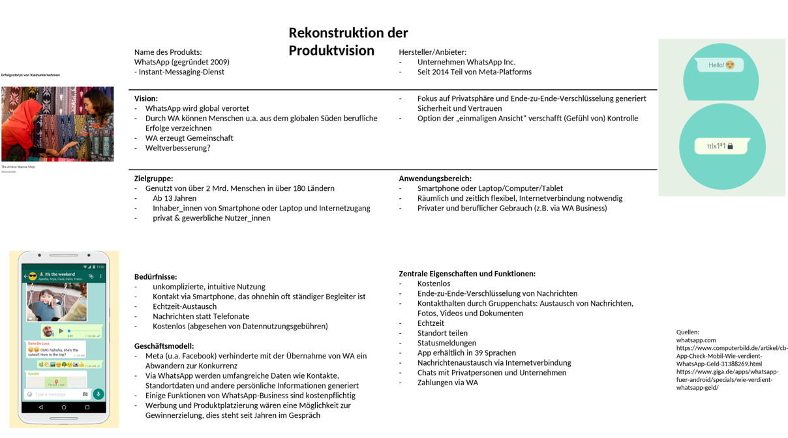
```

**Reflexion**

WhatsApp ist für den privaten Gebrauch nur auf den ersten Blick kostenlos, gezahlt wird mit Daten. Dennoch nutzen sehr viele Menschen täglich den Messenger und fühlen sich mit ihm anscheinend auch sicher, die Werbekampagnen zu End-zu-End-Verschlüsselung scheinen in der Hinsicht wirksam zu sein. Überrascht hat mich, dass WhatsApp neben einem privaten Gebrauch mittlerweile auch gewerblich genutzt werden kann und hierbei auch teilweise bezahlpflichtig ist.

Die Rekonstruktion der Produktvision machte mir deutlich, wie wichtig es ist, auch hinter Werbeplakate und Selbstdarstellung zu schauen, um zu überprüfen, welche Idee hinter einem Produkt oder Unternehmen steckt. 


### Rekonstruktion operationaler Formen (Kapitel 9) {-}

```{r, echo=FALSE, fig.align='center', dev='png'}
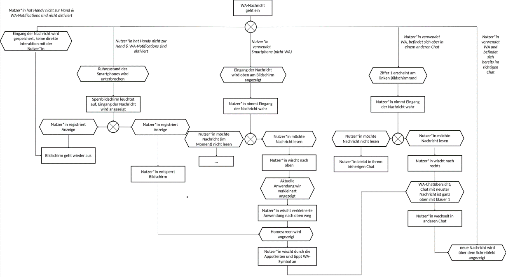
```

```{r, echo=FALSE, fig.align='center', dev='png'}
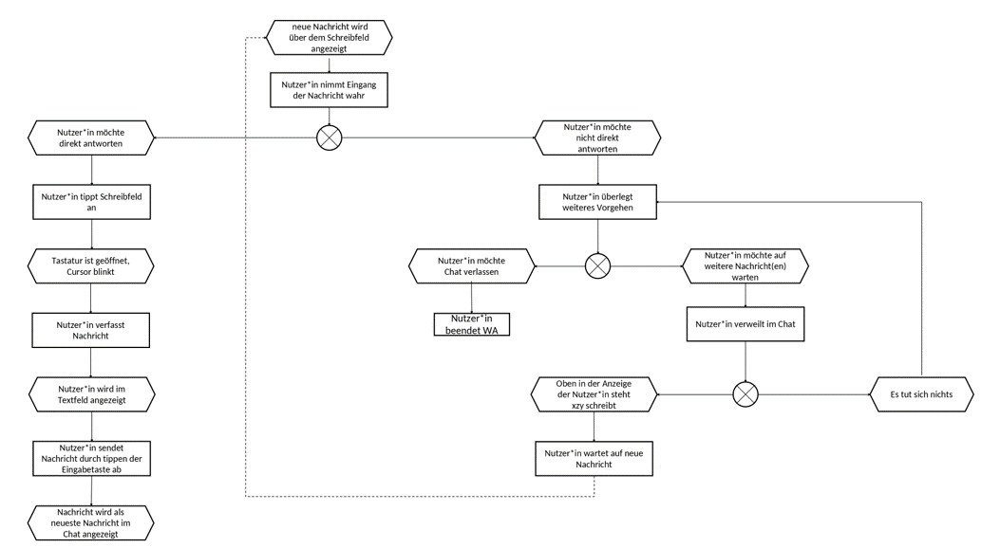
```

**Reflexion**

Das Erstellen der Prozesskette machte mir zum einen deutlich, wie stark WhatsApp in sämtliche andere Tätigkeiten eingreift. Diese müssen entweder komplett beendet werden, um sich WA zuwenden zu können oder sie werden zumindest kurz unterbrochen, indem die App durch Notifications Aufmerksamkeit zieht. Zum anderen wurde mir bewusst, wie kleinschrittig Prozessketten in ihrer Entwicklung durchdacht werden müssen. Es darf keine Lücken oder undefinierten Zustände geben und sämtliche Handlungsoptionen müssen bedacht und ggf. eingeschränkt werden.

### Anwendungsbezogene Datenkritik (Kapitel 10) {-}

```{r, echo=FALSE, fig.align='center', dev='png'}
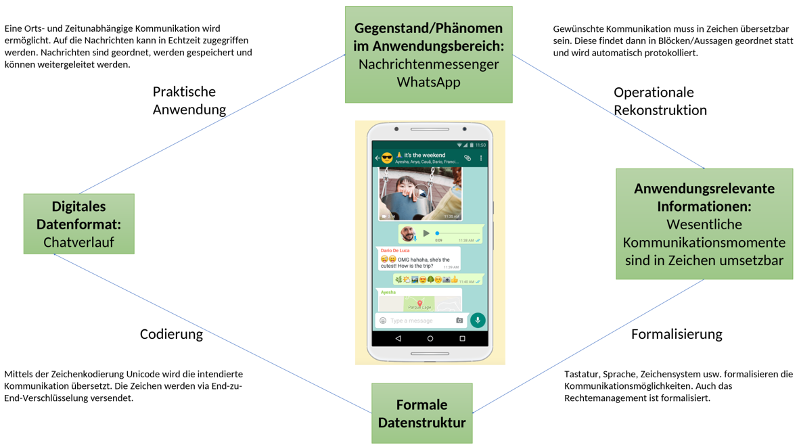
```

**Reflexion**

Die Beschäftigung mit der Formalisierung und Codierung von WhatsApp hat mir deutlich gemacht, wie vorgebend und in gewisser Hinsicht auch einschränkend diese Strukturen auf die Möglichkeiten der Kommunikation via WhatsApp wirken. So fällt von vorneherein jede Form von Kommunikation weg, die nicht in Zeichen übersetzbar ist. Auch wirkt die Dialogstruktur (geordnete Blöcke, abwechselnd) auf Kommunikationsstile ein. Unterbrechungen oder Austausch während eine Aussage im Entstehen ist, sind so nicht mehr möglich.


### Kartierung von Benutzungsflüssen (Kapitel 11) {-}

```{r, echo=FALSE, fig.align='center', dev='png'}
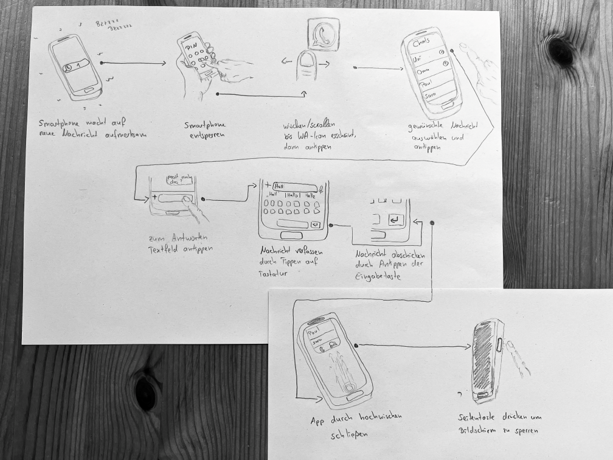
```

Wahrnehmungs- und Handlungsmodalitäten:

-   Smartphone nimmt aktiv Kontakt zum/zur Nutzer*in auf (vibriert, leuchtet, zeigt Nachricht an)
-   Touchscreen als Hauptschnittstelle
-   Tippen und Wischen als Interaktionsmöglichkeiten
-   Sicherer Umgang mit Smartphone wird als Gegeben angenommen

Kulturelle Codes und Metaphern:          

-   24/7 Erreichbarkeit durch Smartphones
-   Digitale Kommunikation ist effektiv und ausreichend (befriedigend?)
-   Zwischenmenschliche Kontakte können entschlackt werden (- Umgangsformeln, - Smalltalk, - Gestik, - Mimik,  - Stimme usw.)
-   Vibrieren + Leuchten = Alarmsignal? Aufmerksamkeit! Pager/Pieper der Feuerwehr
-   Portable
-   Datenschutz verliert gegenüber Popularität (WhatsApp finanziert sich über Datengenerierung
-   Schreibmaschinentastatur, Gestensteuerung, Umgang mit Smartphone etc. wird als intuitiv nutzbar betrachtet


**Reflexion**

Die Verwendung von WhatsApp erzwingt ein Unterbrechen jeder anderen Tätigkeit, unabhängig davon, ob sie auf dem Smartphone oder anderweitig stattfindet. Sofern diese Option nicht deaktiviert ist, informiert die App über Aktivitäten wie neue Nachrichten, Aktualisierungen, etc. 

Es scheint eine Art Herdentrieb zu geben, der Menschen dazu bringt, sich für den Messenger zu entscheiden, den möglichst viele Personen verwenden. Mögliche negative Aspekte werden hierbei in Kauf genommen. 

Es wird ein intuitiver Umgang mit einem Smartphone bzw. Touchscreen (wischen, scrollen, vergrößern, tippen, etc.) vorausgesetzt. 


### Kartierung des technischen Milieus (Kapitel 12) {-}

```{r, echo=FALSE, fig.align='center', dev='png'}
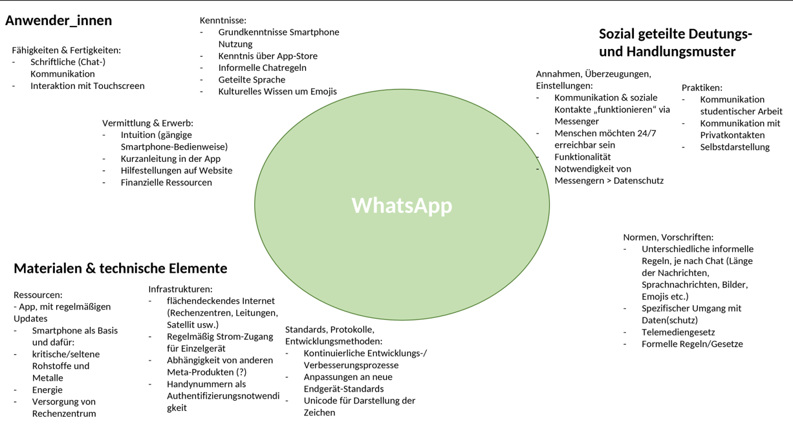
```

**Reflexion**

Im Hintergrund der Technologie (App) passiert deutlich mehr als mir als Nutzerin zunächst bewusst ist. Neben den offensichtlichen Ressourcen für die Produktion des Produkts benötigt es viele weitere, um dieses auch am Laufen zu halten und regelmäßig zu optimieren. 

Auch wenn der Zugang zunächst relativ barrierefrei erscheint (kostenlos im AppStore), so benötigt man nicht nur die entsprechenden technischen Voraussetzungen und finanziellen Ressourcen (Smartphone, Internetzugang, Strom etc.), sondern auch spezifische Fertigkeiten, um mit ihr umzugehen.


