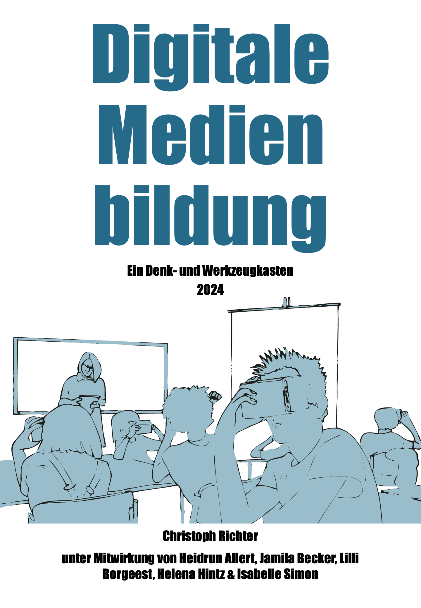

--- 
title: "Digitale Medienbildung"
subtitle: "Ein Denk- und Werkzeugkasten"
author: "Christoph Richter"
publisher: "Heidrun Allert"
contributors: "Jamila Becker, Lilli Borgeest, Helena Hintz, Isabelle Simon"
date: "2024: zuletzt kompiliert `r Sys.Date()`"
cover-image: "Figures/cover.png"
lang: de
babel-lang: "ngerman"
site: bookdown::bookdown_site
output: 
  bookdown::gitbook:
    includes:
      in_header: includeme.html
documentclass: book
bibliography: [book.bib, packages.bib]
biblio-style: "apa-good-german"
csl: apa.csl
link-citations: true
github-repo: Christoph-MP/Digitale-Medienbildung
description: "Dieses Dokument ist ein ›Denk- und Werkzeugkasten‹ zum Themenfeld der Digitalen Medienbildung. Der ›Denk- und Werkzeugkasten‹ richtet sich an Lehramtstudierende und Lehrer*innen, aber auch an Medienpädagog*innen und andere Personen, die sich in schulischen und außerschulischen Handlungsfeldern mit Fragen der Digitalisierung befassen und sich damit auseinandersetzen, in welcher Weise digitale Technologien unsere sozialen, gesellschaftlichen und kulturellen Praktiken transformieren."
---

# Vorwort {-}
```{r fig.align='center', echo=FALSE, include=identical(knitr:::pandoc_to(), 'html'), out.width='75%'}

```

Der vorliegende ›Denk- und Werkzeugkasten‹ zum Themenfeld der Digitalen Medienbildung richtet sich an Lehramtstudierende und Lehrer\*innen, aber auch an Medienpädagog\*innen und andere Personen, die sich in schulischen und außerschulischen Handlungsfeldern mit Fragen der Digitalisierung befassen und sich damit auseinandersetzen, in welcher Weise digitale Technologien unsere sozialen, gesellschaftlichen und kulturellen Praktiken transformieren.

Als Denk- und Werkzeugkasten beinhaltet dieses Dokument verschiedene theoretische und methodische Ansatzpunkte zur eigenständigen wie auch gemeinsamen Erkundung digitaler Transformationsprozesse. Jedes der 14 Kapitel nähert sich dem Themenfeld der Digitalen Medienbildung aus einer spezifischen Perspektive. Nähere Informationen zum Aufbau und den didaktischen Leitgedanken finden sich in den Abschnitten [1.3][(K)eine Gebrauchsanweisung] sowie [1.4][Inhalte der Materialsammlung].

Das Dokument steht als freie und offene Ressource zur Verfügung. Weitere Informationen zum Kopieren, Ändern oder Mitwirken am Denk- und Werkzeugkasten finden Sie weiter unten.

## Entstehungszusammenhang und Danksagung

Der Denk- und Werkzeugkasten ist in der Abteilung für Medienpädagogik/Bildungsinformatik der Christian-Albrechts-Universität zu Kiel im Rahmen des Projekts [»Entwicklungslinien digitaler Kultur, digitale Kulturtechniken und Wissenspraktiken«](https://www.medienpaedagogik.uni-kiel.de/de/profil/entwicklungslinien-digitaler-kultur-digitale-kulturtechniken-und-wissenspraktiken) unter Leitung von Frau Prof. Dr. Heidrun Allert entstanden. Das Projekt wurde aus Mitteln des Strategie- und Exzellenzbudgets des Ministeriums für Bildung, Wissenschaft und Kultur (MBWK) in Schleswig-Holstein im Zeitraum von 2021 bis 2024 gefördert. 

Die Erstellung dieses Dokuments wäre ohne den engen Austausch mit der Projektleitung wie auch den am Projekt beteiligten wissenschaftlichen Hilfkräften nicht möglich gewesen. Sowohl Jamila Becker, Lilli Borgeest, Helena Hintz und Isabelle Simon haben die Entwicklung der Texte nicht nur formal, sondern auch inhaltlich eng begleitet und durch ihr Feedback wesentlich zu deren Qualität beigetragen. Jamila Becker, Helena Hintz und Isabelle Simon haben zudem nicht nur Beispiele (siehe Anhang), sondern auch einzelne Impulse und Leittexte beigesteuert und Lilli Borgeest hat einen wesentlichen Beitrag zur digitalen Umsetzung geleistet. Darüber hinaus möchte ich mich bei Heidrun Allert für den engen und kontinuierlichen Austausch zu inhaltlichen wie auch didaktischen Fragen bedanken, die dem Dokument letztlich seine Struktur und Form gegeben haben. 

Schließlich gilt mein Dank auch den Studierenden, die sich während der Projektlaufzeit in einer Reihe von Lehrveranstaltungen mit den Inhalten und Ansätzen des Denk- und Werkzeugkastens auseinandergesetzt und hilfreiche Rückmeldungen zu dessen Weiterentwicklung gegeben haben.


## Lizenz & Autor&ast;innenschaft


<a rel="license" href="https://creativecommons.org/licenses/by-sa/4.0/"></a>

&nbsp;


Das gesamte Werk ist unter einer Creative Commons [CC BY-SA 4.0](https://creativecommons.org/licenses/by-sa/4.0/) Lizenz veröffentlicht. Diese Lizenz erlaubt unter der Voraussetzung der Namensnennung der Urheber*innen und der Angabe der Lizenzbedingungen die Bearbeitung, Vervielfältigung und Verbreitung des Materials in jedem Format oder Medium für beliebige Zwecke, auch kommerzieller Art. Bei einer Bearbeitung oder Veränderung der Originalfassung dieses Werks müssen alle neuen Version unter derselben Lizenz [CC BY-SA 4.0](https://creativecommons.org/licenses/by-sa/4.0/) veröffentlicht werden. 

Ausführlichere Informationen zu den Lizenzbedingungen finden Sie unter: [https://creativecommons.org/licenses/by-sa/4.0/deed.de](https://creativecommons.org/licenses/by-sa/4.0/deed.de).

&nbsp;

**Angaben zur Autor&ast;innenschaft**

Soweit nicht anders angegeben, wurden die Inhalte des Denk- und Werkzeugkastens von [Christoph Richter](Mailto:richter@paedagogik.uni-kiel.de) erstellt. 

Das Kapitel 1 [›Digitale Medienbildung‹][Digitale Medienbildung] wurde von Christoph Richter und Heidrun Allert verfasst.

Der Impuls [›Mein Lernkosmos‹][Mein Lernkosmos] sowie das Beispiel [›Blinkist‹][Beispiel Blinkist]  wurde von Helena Hintz verfasst.

Das Beispiel [›WhatsApp‹][Beispiel WhatsApp] wurde von Jamila Becker erstellt.

Der Leittext [›Partizipationsorientierter Technikeinsatz‹][Partizipationsorientierter Technikeinsatz] wurde von Isabelle Simon und Christoph Richter erstellt.

Soweit nicht anders angegeben, wurden alle Grafiken und Abbildungen von den jeweiligen Autor&ast;innen selbst erstellt und unterliegen derselben Lizenz wie das gesamte Dokument.


## Kopieren des Denk- und Werkzeugkastens
Dieses Dokument wurde in R-Studio unter Verwendung von R Markdown geschrieben und mit dem Bookdown-Paket in ein Webbuchformat übersetzt.

Der gesamte Quellcode für die Kompilierung des Buches ist im GitHub-Repository für dieses Buch verfügbar: https://github.com/Christoph-MP/Digitale-Medienbildung/.

Sie können dieses Repository sowohl herunterladen als auch [forken]. Laden Sie anschließend die Rproj-Datei in R-Studio und kompilieren Sie dann das gesamte Buch. Anschließend können Sie die einzelnen .rmd-Dateien für jedes Kapitel inhaltlich und stilistisch ihren eigenen Bedürfnissen anpassen. Nähere Informationen zur Arbeit mit Bookdown finden Sie unter anderem in [»Open tools for writing open interactive textbooks (and more).«](https://www.crumplab.com/OER_bookdown/) von M.J.C. Crump.


Wenn sie zu diesem Denk- und Werkzeugkasten beitragen möchten, können Sie Pull-Requests auf GitHub stellen oder Probleme und Anfragen auf der Registerkarte Probleme diskutieren.


